# 💎 Unified HFO Header Analysis: The Quest for the One

> **BLUF**: We have explored Flat Facets, Fractal Holons, and Bicameral Splits. To achieve "One to Rule Them All," we must synthesize the **Ontological Depth** of the Quadrivium with the **Human Readability** of the Dual Split.
> **Recommendation**: **Option 4 (The Holographic Cell)**.

## 📊 The Criteria Matrix

| Criterion | Definition | Why it matters for HFO |
| :--- | :--- | :--- |
| **Humanity** | Readability & Writeability | If it's annoying to write, humans will ignore it. |
| **Machinery** | Graph & Vector Ready | Must map 1:1 to Postgres/Neo4j nodes. |
| **Fractality** | Recursive Scaling | Must work for a single Script (L0) and a whole Fleet (L3). |
| **Thermodynamics** | Decay & Urgency | Must support the "Mountain" (Rot/Float) mechanics. |

---

## 🔍 Option 1: The Obsidian Facet V2 (The Flatlander) 📄
*The current "Mountain & Web" standard.*

```yaml
---
id: "uuid-v4"
type: "script"
urgency: 0.9
decay: 0.1
last_touched: "2025-11-22"
links: ["uuid-target"]
---
```

| Dimension | Score | Notes |
| :--- | :--- | :--- |
| Humanity | ⭐⭐⭐⭐⭐ | Very easy to write. Standard YAML. |
| Machinery | ⭐⭐⭐ | Flat structure loses the "Why". Hard to query complex intent. |
| Fractality | ⭐⭐ | No inherent hierarchy. Just a list of files. |
| Thermodynamics | ⭐⭐⭐⭐⭐ | Perfect for the "Mountain" (Decay/Urgency). |

**Verdict**: Good for **Files**, bad for **Systems**.

---

## 🔍 Option 2: The Fractal Holon (The Nester) 🪆
*A deeply recursive JSON-like structure.*

```yaml
---
holon:
  level: "L1"
  parent: "uuid-swarm"
  children: ["uuid-agent-1", "uuid-agent-2"]
  state:
    energy: 100
    entropy: 0.5
  intent:
    goal: "Survive"
---
```

| Dimension | Score | Notes |
| :--- | :--- | :--- |
| Humanity | ⭐⭐ | Hard to maintain manually. "JSON Hell" in YAML. |
| Machinery | ⭐⭐⭐⭐⭐ | Perfect for the "Web". Maps directly to Object Stores. |
| Fractality | ⭐⭐⭐⭐⭐ | Native support for L0-L3 scaling. |
| Thermodynamics | ⭐⭐⭐ | State is buried deep in the nest. |

**Verdict**: Good for **Machines**, bad for **Humans**.

---

## 🔍 Option 3: The Bicameral Split (The Diplomat) 🗣️
*The "Human Story / Machine Truth" split.*

```yaml
---
# HUMAN
story: "We are building a bridge."
# MACHINE
ontology: { id: "...", type: "...", links: [...] }
---
```

| Dimension | Score | Notes |
| :--- | :--- | :--- |
| Humanity | ⭐⭐⭐⭐ | Great for context. Separates concerns. |
| Machinery | ⭐⭐⭐⭐ | Clean parsing of the `ontology` block. |
| Fractality | ⭐⭐⭐ | Depends on the `ontology` schema. |
| Thermodynamics | ⭐⭐⭐ | Redundant data (Story vs Truth drift). |

**Verdict**: Good for **Hybrids**, but risks **Drift** (Story says X, Truth says Y).

---

## 🏆 Option 4: The Holographic Cell (The Synthesis) 🧬
*The "One to Rule Them All". A Unified Quadrivium.*

This option uses the **Quadrivium (Ontos, Chronos, Topos, Telos)** as the *fundamental physics*, but exposes them via **Human-Friendly Aliases** that map 1:1 to the machine layer.

It treats every file as a **Cell** in the **Holographic Hive**.

```yaml
---
# 🏛️ ONTOS (Identity)
id: "uuid-v4"
type: "intent"
title: "The Holographic Cell"

# ⏳ CHRONOS (Thermodynamics)
status: "active"
urgency: 1.0        # Energy
decay: 0.0          # Entropy

# 📍 TOPOS (Fractal Geometry)
address: "1.1.0"    # The Holonic Address (Root.Brain.Core)
links:              # The Synapses
  - { to: "uuid-target", rel: "defines" }

# 🎯 TELOS (Viral Purpose)
bluf: "Synthesize Man and Machine."
viral: 1.0          # Infectivity
---
```

### Why this is the "One":
1.  **It is Flat (Human)**: No deep nesting. Looks like Option 1.
2.  **It is Deep (Machine)**: Every key maps to a Quadrivium quadrant.
3.  **It is Fractal (Topos)**: The `address` key defines the Holarchy.
4.  **It is Alive (Chronos)**: The `urgency`/`decay` keys define the Metabolism.

### Visual: The Holographic Mapping

```mermaid
graph TD
    File[📄 File Header]

    subgraph Quadrivium
        Ontos[🏛️ Identity]
        Chronos[⏳ Time/Energy]
        Topos[📍 Space/Graph]
        Telos[🎯 Purpose/Virus]
    end

    File -->|id, type| Ontos
    File -->|urgency, decay| Chronos
    File -->|address, links| Topos
    File -->|bluf, viral| Telos

    style File fill:#fff,stroke:#333,stroke-width:4px
    style Quadrivium fill:#eee,stroke:#333
```



### Visual: The Fractal Address System (Topos)


### Visual: The Viral Propagation (Telos)

```mermaid
graph LR
    High[High Viral Factor (1.0)]
    Low[Low Viral Factor (0.1)]

    High -->|Replicates to| Cache[Fast Cache]
    High -->|Replicates to| Edge[Edge Nodes]

    Low -->|Stays in| Archive[Deep Storage]
```

## 🚀 Implementation Plan
1.  **Adopt Option 4** as the `HFO_STANDARD`.
2.  **Update Genesis**: `genesis.py` generates this 4-section header.
3.  **Update Guards**: `guard_stigmergy_headers.py` enforces the presence of the 4 quadrants (even if empty).
4.  **Update Graph**: The Assimilator maps `address` to the Fractal Tree and `links` to the Knowledge Graph.
