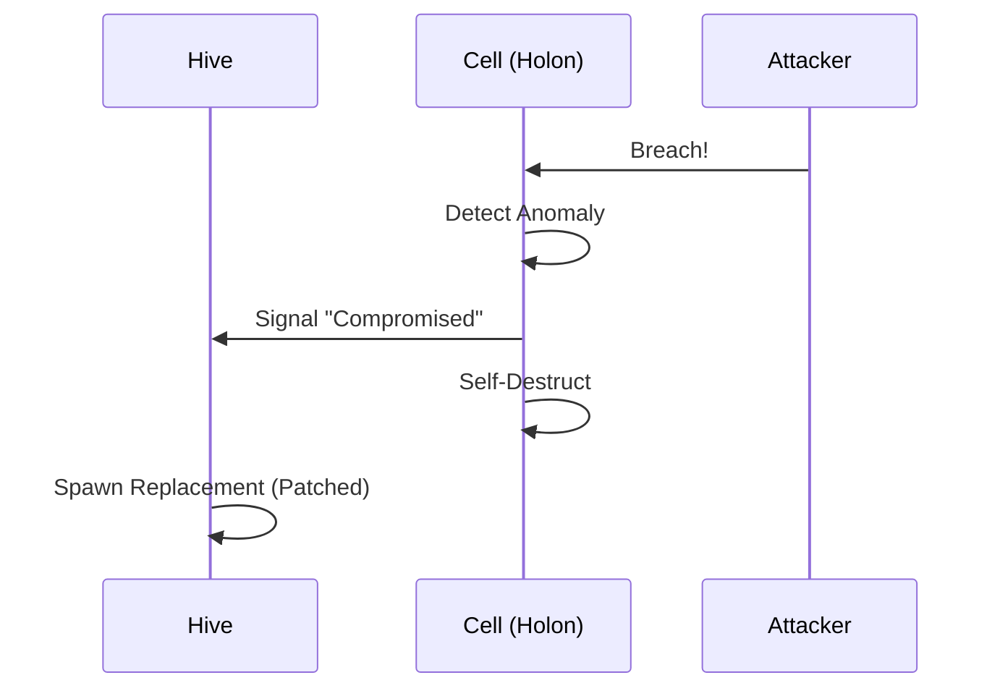
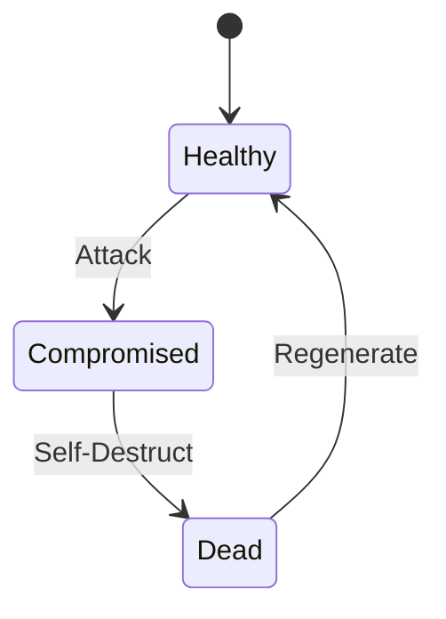
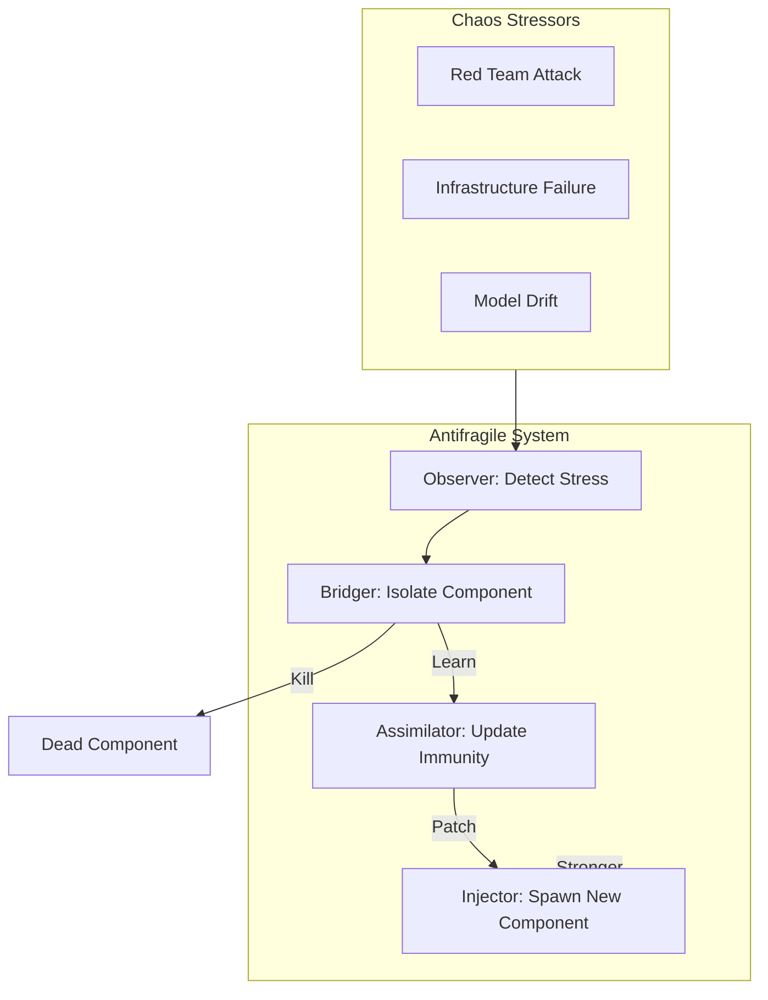

# 🛡️ Antifragile Architecture Options: The Fractal Defense

## ⚡ BLUF
This document explores the "Hydra Protocol" and "Fractal Defense" strategies to ensure the Hive Fleet Obsidian is antifragile. The core concept is "Regenerative Bulkheads" where the system can self-heal from catastrophic failure.

> **Objective**: Design a Holonic, Fractal, and Antifragile architecture for Hive Fleet Obsidian.
> **Premise**: The Red Team (Venom) *will* breach. The Blue Team (Carapace) must isolate, adapt, and evolve.
> **Status**: Proposal Phase.

## 🧬 The Core Philosophy
*   **Fractal**: The defense logic at the Swarm level is identical to the logic at the Agent level.
*   **Holonic**: Each unit (Agent) is autonomous yet part of the whole. It can survive if cut off.
*   **Antifragile**: Stress (Attacks) $\rightarrow$ Adaptation $\rightarrow$ Strength.

---

## 🕸️ Option 1: The Hydra Protocol (Regenerative Bulkheads)
> *Based on: AWS Cell-Based Architecture, Erlang "Let it Crash", Starfish Biology.*

### 🧠 Concept
**"Cut off one head, two more take its place."**
The system is divided into isolated "Cells" (Holons). Each Cell contains a full stack (Brain, Body, Memory). If a Cell detects an anomaly (or is breached), it **self-destructs** immediately. The Hive detects the vacuum and spawns a replacement with **updated immunity** (patched code/config).

### 🔄 Hydra Sequence

### ⚙️ Cell Lifecycle

### ⚙️ Mechanics
1.  **Compartmentalization**: Agents operate in strict isolation (Docker/Firecracker).
2.  **Suicide Switch**: Any violation of the "Cellular Wall" triggers immediate termination.
3.  **Rapid Cloning**: The Hive keeps "Stem Cell" agents warm to replace losses instantly.

### 📊 Tradeoffs
*   **✅ Pros**: Extremely resilient to contagion. Simple recovery logic (Reboot).
*   **❌ Cons**: High resource overhead (Redundancy). State recovery can be tricky (Data loss if not persisted).
*   **Cost**: ⭐⭐⭐ (High Compute)
*   **Complexity**: ⭐⭐ (Moderate)

---

## 🍄 Option 2: The Mycelial Web (Zero-Trust Mesh)
> *Based on: Google BeyondCorp, Istio Service Mesh, Fungal Root Systems.*

### 🧠 Concept
**"Trust nothing. Verify everything."**
There is no "inside" or "outside". Every interaction between Holons (Agents) is cryptographically verified, policy-checked, and logged. If an agent is compromised, it finds itself in a prison of its own identity—unable to move laterally because every door is locked.

### ⚙️ Mechanics
1.  **mTLS Everywhere**: Every signal is encrypted and signed.
2.  **Dynamic Policy**: Access is granted based on *current behavior*, not just identity.
3.  **Distributed Consensus**: No central brain to kill. Decisions are made by local quorum.

### 📊 Tradeoffs
*   **✅ Pros**: Best defense against lateral movement. Highly observable.
*   **❌ Cons**: High latency (Handshakes). "Chatty" network. Complex certificate management.
*   **Cost**: ⭐⭐ (Moderate Compute, High Network)
*   **Complexity**: ⭐⭐⭐⭐ (Very High)

---

## 🐙 Option 3: The Protean Shift (Polymorphic Defense)
> *Based on: Moving Target Defense (MTD), RNA Editing (Octopuses), Polymorphic Viruses.*

### 🧠 Concept
**"You cannot hit what is not there."**
The attack surface is fluid. API endpoints, variable names, and even communication protocols **rotate** periodically. By the time the Red Team maps the vulnerability, the architecture has shifted. The Blue Team constantly "refactors" the live environment.

### ⚙️ Mechanics
1.  **IP/Port Hopping**: Services change addresses dynamically.
2.  **Code Mutation**: LLMs rewrite agent code slightly (function names, structure) to break signature-based attacks.
3.  **Decoy Injection**: The system spawns "Honeypot" agents that look real but exist only to trap attackers.

### 📊 Tradeoffs
*   **✅ Pros**: Nightmare for attackers (Reconnaissance is impossible).
*   **❌ Cons**: Nightmare for debugging. High risk of breaking legitimate workflows.
*   **Cost**: ⭐⭐⭐⭐ (Very High Compute & Token Usage)
*   **Complexity**: ⭐⭐⭐⭐⭐ (Extreme)

---

## 🏆 Recommendation: The "Hydra-Mycelium" Hybrid
Start with **Option 1 (Hydra)** for the physical layer (easy to implement "Let it Crash" with Ray/Docker).
Layer **Option 2 (Mycelium)** for the cognitive layer (Zero-Trust signals via NATS).
Reserve **Option 3** for the "Crown Jewels" (Memory Core).

### 🗳️ Decision Matrix

| Feature | Hydra (Regenerative) | Mycelium (Zero-Trust) | Protean (Polymorphic) |
| :--- | :---: | :---: | :---: |
| **Resilience** | High | Very High | Extreme |
| **Implementation** | Easy (Ray) | Hard (Mesh) | Very Hard (AI) |
| **Latency** | Low | High | Variable |
| **Antifragility** | High (Evolution) | Medium (Policy) | High (Mutation) |
| **Biological Analog** | Starfish | Fungus | Octopus |

**Which path shall we evolve?**

## Visualization

