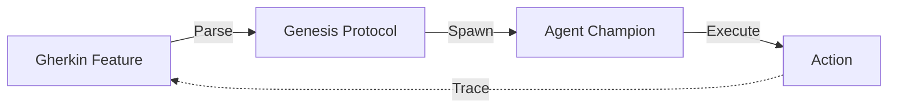
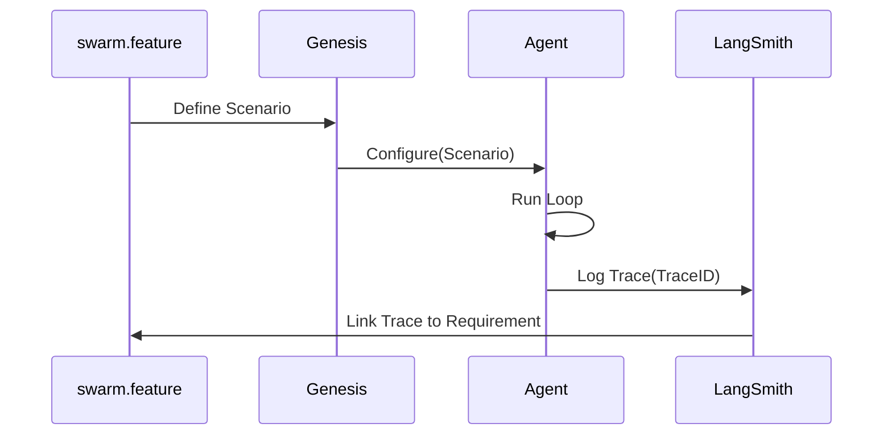

# 📜 Declarative Intent Loading

## ⚡ BLUF (Bottom Line Up Front)
**Intent-Based Engineering** is the core philosophy of Gen 51. We do not write imperative code to define behavior; we write **Declarative Gherkin Features** to define Intent. The `Genesis Protocol` then parses this intent and spawns the necessary Agents to fulfill it. The documentation *is* the code.

## 📊 Intent Matrix

| Component | File Type | Role | Example |
| :--- | :--- | :--- | :--- |
| **Intent** | `.feature` | The "What" & "Why" | `brain/swarm_workflow.feature` |
| **Implementation** | `.py` | The "How" | `body/hands/swarm_controller.py` |
| **Bridge** | `genesis.py` | The Compiler | Parses Gherkin -> Spawns Python |
| **Trace** | `langsmith` | The Verification | Links Execution -> Intent |

## 🧠 Concept Visualization

### View 1: The Genesis Flow (Conceptual)
*From Word to Flesh.*

```mermaid
graph LR
    Word[The Word (Gherkin)] -->|Genesis| Flesh[The Flesh (Agents)]
    Flesh -->|Action| World[The World]
    World -->|Feedback| Word
```

### View 2: The Loading Pipeline (Logical)
*How the system boots.*



### View 3: Traceability (Physical)
*Linking runtime to requirements.*



## 🦅 Executive Summary
**Intent-Based Engineering** means the code obeys the documentation.
*   **Source**: Gherkin Feature files (`brain/*.feature`).
*   **Loader**: `genesis.py` parses Gherkin.
*   **Target**: Spawns Agents (`body/`) configured to satisfy the Intent.
