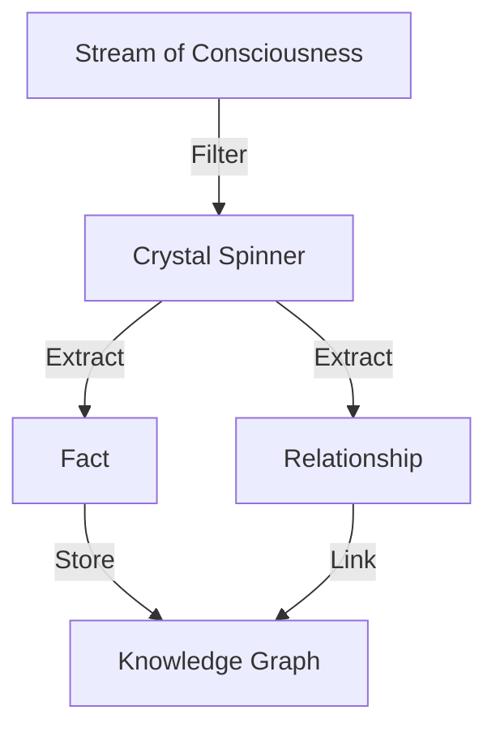
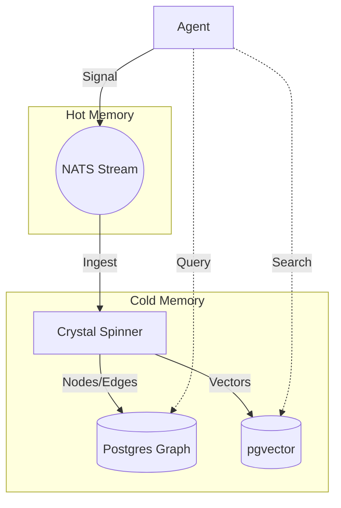
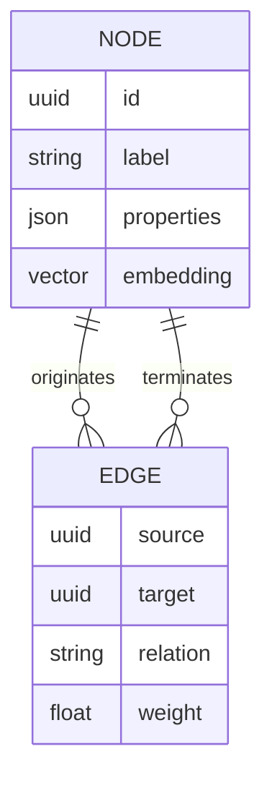

# 🧠 Hybrid Stigmergic GraphRAG Memory

## ⚡ BLUF (Bottom Line Up Front)
The **Memory Organ** is a hybrid system designed to solve the "Goldfish Memory" problem of LLMs. It combines a **Fast Loop** (NATS JetStream) for real-time "Hot" episodic memory with a **Slow Loop** (Postgres GraphRAG) for "Cold" semantic wisdom. The **Crystal Spinner** agent acts as the bridge, crystallizing fleeting signals into permanent knowledge.

## 📊 Memory Tier Matrix

| Tier | Technology | Speed | Retention | Purpose |
| :--- | :--- | :--- | :--- | :--- |
| **Hot** | NATS JetStream | <10ms | 1 Hour | Coordination & Signaling |
| **Warm** | Redis / Plasma | <1ms | Session | Context Window Extension |
| **Cold** | Postgres (Graph+Vector) | >100ms | Infinite | Wisdom & Precedents |
| **Frozen** | Markdown Files | N/A | Infinite | Documentation & Intent |

## 🧠 Concept Visualization

### View 1: The Crystallization Process (Conceptual)
*Turning noise into signal.*

### View 2: The Hybrid Architecture (Logical)
*Hot and Cold loops working together.*

### View 3: Data Schema (Physical)
*How we store the graph.*

## 🦅 Executive Summary
The **Memory Organ** is a hybrid system:
1.  **Fast Loop (NATS)**: "Hot" Episodic memory. Real-time signals.
2.  **Slow Loop (Postgres)**: "Cold" Semantic memory. Knowledge Graph + Vectors.
