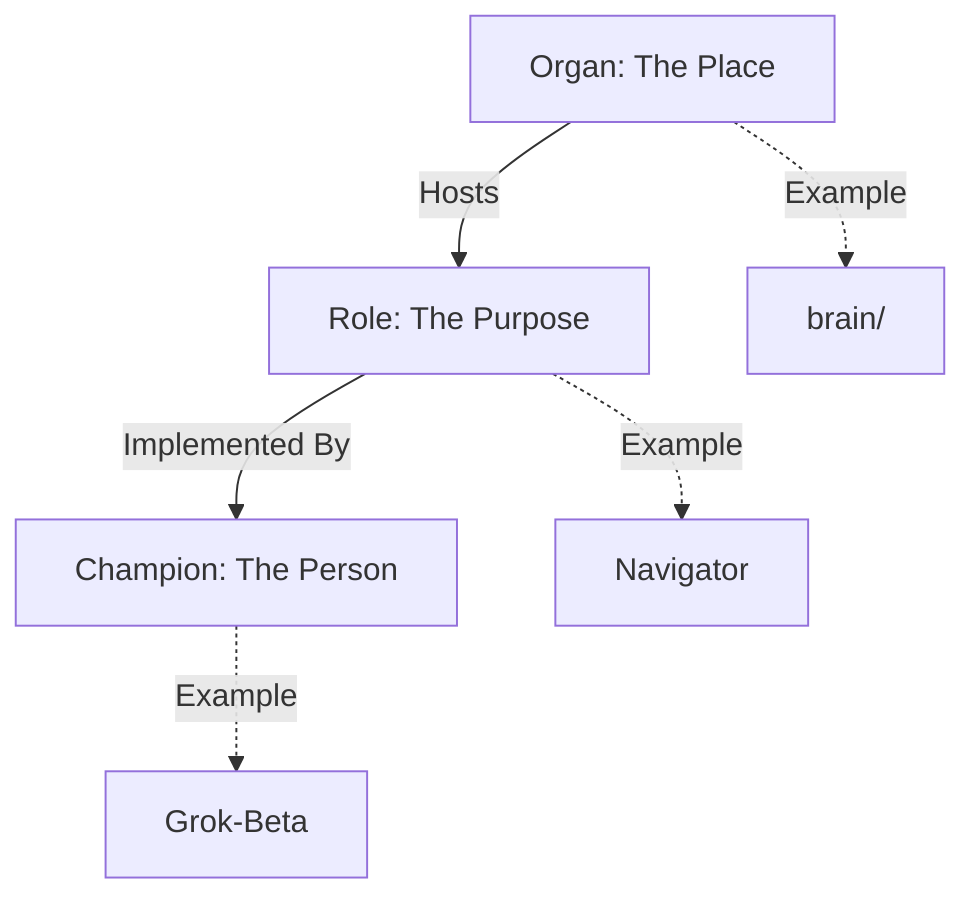
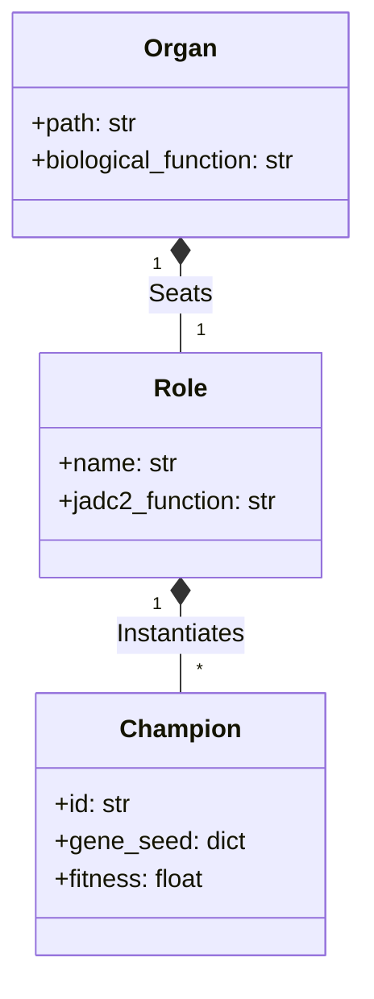
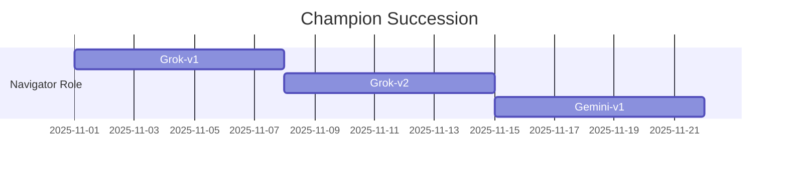

# 🧬 Organs, Roles, and Champions

## ⚡ BLUF (Bottom Line Up Front)
The Hive is structured biologically. **Organs** are the physical infrastructure (folders/code). **Roles** are the functional archetypes (jobs). **Champions** are the specific, evolved instances of an agent filling a role (individuals). This separation allows us to swap out "Grok-Navigator-v4" for "GPT-5-Navigator-v1" without changing the underlying Organ or Role definition.

## 📊 Biological Hierarchy Matrix

| Concept | Analogue | Example | Mutability |
| :--- | :--- | :--- | :--- |
| **Organ** | Body Part | `brain/` (Cortex) | Static (Hardcoded) |
| **Role** | Job Description | Navigator (Strategist) | Stable (Configured) |
| **Champion** | Individual | Grok-Nav-v4 | Volatile (Evolved) |

## 🧠 Concept Visualization

### View 1: The Trinity (Conceptual)
*The relationship between Place, Purpose, and Person.*

### View 2: Class Hierarchy (Logical)
*Object-Oriented definition.*

### View 3: Evolution of Champions (Physical)
*How Champions change over time while Roles remain.*

## 🦅 Executive Summary
The Hive is an organism.
*   **Organs**: Physical directories (`brain/`, `body/`).
*   **Roles**: Functional archetypes (Navigator, Observer).
*   **Champions**: Specific evolved instances (e.g., "Grok-Navigator-v4").
