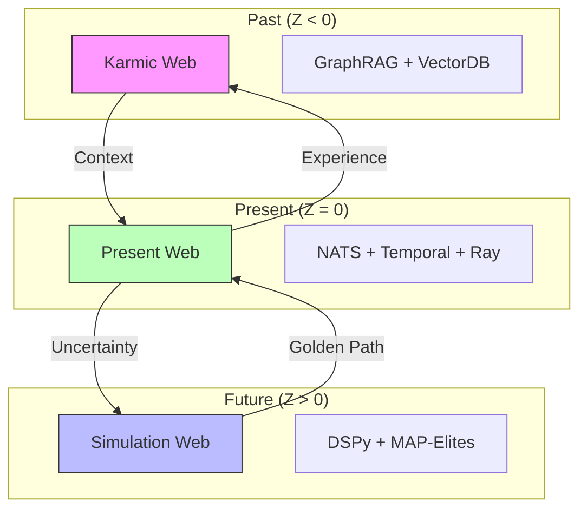
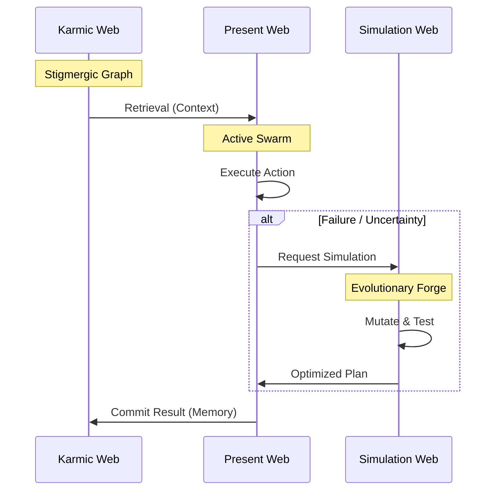
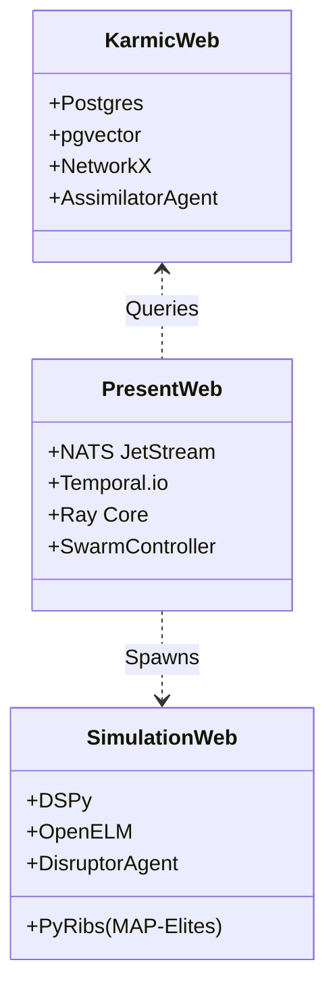

# 🕸️ The Three Webs Architecture

## ⚡ BLUF (Bottom Line Up Front)
The **Three Webs** architecture is the cognitive framework of Hive Fleet Obsidian. It divides the system's operation into three distinct temporal domains: **The Karmic Web** (Past/Memory), **The Present Web** (Action/Execution), and **The Simulation Web** (Future/Planning). This separation allows the swarm to balance "Fast" reactive behaviors with "Slow" deliberative planning and "Deep" historical wisdom.

---

## 1. The Tri-Web Topology

The spatial relationship between the three domains.

## 2. Data Flow & Transformation

How information mutates as it crosses the boundaries.

## 3. Technology Stack Mapping

The concrete technologies powering each Web.

**The Obsidian Hex-Hive**
*   *Why*: Hexagonal architecture (Ports & Adapters) meets Hive mind.

**Hyper-Heuristic Horizon (H3)**
*   *Why*: Emphasizes the "Hyper-Heuristic" nature of evolving the algorithms themselves.

**The Panarchic Loop**
*   *Why*: In ecology, "Panarchy" describes the interplay between change and persistence (Adaptive Cycles).
