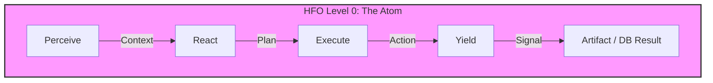
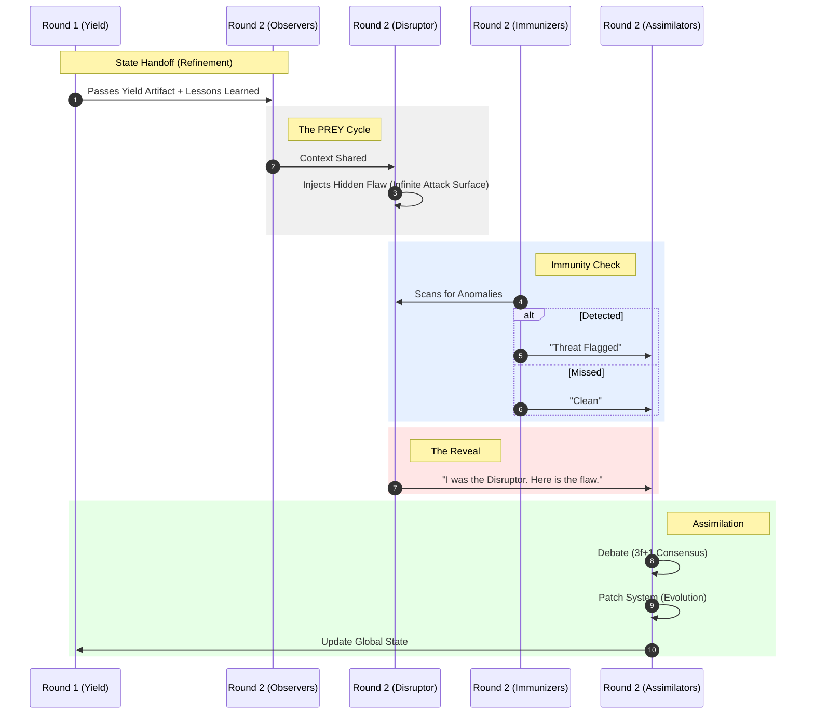

---
octagon:
  ontos:
    id: design-hfo-level1-architecture-v1
    type: design
    owner: Swarmlord
  logos:
    protocol: HFO-L1-Byzantine
    format: markdown
  techne:
    stack:
    - mermaid
    - markdown
    - byzantine-fault-tolerance
    complexity: high
  chronos:
    status: active
    urgency: 1.0
    decay: 0.0
    created: '2025-11-24T14:00:00Z'
  pathos:
    stress_level: 0.8
    validation: pending
  ethos:
    security_level: internal
    compliance:
    - hfo-negative-trust
  topos:
    address: brain/design_hfo_level1_architecture.md
    links:
    - brain/design_octree_prey_loop.md
  telos:
    viral_factor: 1.0
    meme: Trust is a Function of Adversarial Consensus.
hexagon:
  ontos:
    id: 13b9bc1c-0154-4b59-bc34-c8fe913c402f
    type: md
    owner: Swarmlord
  chronos:
    status: active
    urgency: 0.5
    decay: 0.5
    created: '2025-11-24T14:30:05.798506Z'
    generation: 51
  topos:
    address: brain/archive/gen52_drafts/design_hfo_level1_architecture.md
    links: []
  telos:
    viral_factor: 0.0
    meme: design_hfo_level1_architecture.md
---


# 🏰 HFO Level 1: Hidden Adversarial Byzantine Quorum

> **Intent**: To visualize the **Morphic Octet** architecture where trust is engineered through adversarial conflict, immunity checks, and Byzantine consensus.

## 1. Level 0: The Atomic Loop (Sequential)
*   **Concept**: The baseline unit of work. Fast, but untrustworthy (hallucination-prone).
*   **Structure**: 1 Agent, 4 Steps, 1 Result.



## 2. Level 1: The Morphic Octet (Fractal 8)
*   **Concept**: A fixed set of **8 Agents** that morph roles through the cycle.
*   **Conservation of Agents**: The total agent count is always 8.
*   **Phases**:
    *   **P-R-E (Action)**: 7 Honest Agents (Observer/Bridger/Shaper) + 1 Hidden Disruptor.
    *   **Yield (Transformation)**: The 8 agents shift roles to process the result.
        *   **1 Disruptor**: Reveals themselves.
        *   **3 Immunizers**: The "Blue Team" (subset of Honest) flags and tags.
        *   **4 Assimilators**: The "Judges" (subset of Honest) reach Byzantine Consensus ($3f+1$).
*   **Math**: $1 \text{ (Disruptor)} + 3 \text{ (Immunizers)} + 4 \text{ (Assimilators)} = 8$.

```mermaid
graph TD
    subgraph The_Octet [The Morphic Octet (8 Agents)]
        direction TB

        subgraph Phase_PRE [Phases P-R-E: Action]
            direction TB
            A1[Agent 1]
            A2[Agent 2]
            A3[Agent 3]
            A4[Agent 4]
            A5[Agent 5]
            A6[Agent 6]
            A7[Agent 7]
            AD["Agent 8 (Hidden Disruptor)"]

            A1 & A2 & A3 & A4 & A5 & A6 & A7 -->|Act as| Role1["Observer -> Bridger -> Shaper"]
            AD -->|Acts as| Role2["Hidden Disruptor"]
        end

        subgraph Phase_Y [Phase Y: Yield & Metamorphosis]
            direction TB

            subgraph Group_D [The Threat]
                AD_Y["Agent 8 (Revealed)"]
                style AD_Y fill:#ff9999,stroke:#f00
            end

            subgraph Group_I [The Immune System (3)]
                A1_Y[Agent 1]
                A2_Y[Agent 2]
                A3_Y[Agent 3]
                A1_Y & A2_Y & A3_Y -->|Morph into| Role_I[Immunizers]
            end

            subgraph Group_A [The Consensus (4)]
                A4_Y[Agent 4]
                A5_Y[Agent 5]
                A6_Y[Agent 6]
                A7_Y[Agent 7]
                A4_Y & A5_Y & A6_Y & A7_Y -->|Morph into| Role_A[Assimilators]
            end
        end

        Role1 --> Group_I
        Role1 --> Group_A
        Role2 --> Group_D

        Role_I -->|Flagged Data| Role_A
        Group_D -->|Attack Vector| Role_A
        Role_A -->|Byzantine Consensus| Final[1 Robust Artifact]
    end
```

## 3. The Evolutionary Spiral (Recursive Refinement)
*   **Concept**: The output of Round $N$ becomes the input for Round $N+1$.
*   **Defense in Depth**:
    *   **Disruptor**: Infinite Attack Surface (Read Access).
    *   **Immunizer**: QD Optimized Defense.
    *   **Assimilator**: Patches the system based on the Reveal.



## 4. Role Definitions (The Octarchy)

| Role | Count | Function | Trust Level |
| :--- | :--- | :--- | :--- |
| **Observer** | 7 | Perceive Context (Phase 1) | Low |
| **Bridger** | 7 | Plan & Connect (Phase 2) | Low |
| **Shaper** | 7 | Execute Code (Phase 3) | Low |
| **Disruptor** | 1 | **Inject Entropy/Flaws** (All Phases) | **Negative** |
| **Immunizer** | 3 | Detect & Flag (Phase 4a) | High (Blue Team) |
| **Assimilator** | 4 | **Decide & Merge** (Phase 4b) | **Maximum** (Byzantine Quorum) |

*   **Total Agents**: **8**. The roles are sequential states of the same 8 entities.
