---
octagon:
  ontos:
    id: design-hfo-level2-fractal-disruption-v1
    type: design
    owner: Swarmlord
  logos:
    protocol: HFO-L2-Rolling-Disruption
    format: markdown
  techne:
    stack:
    - mermaid
    - markdown
    - game-theory
    complexity: extreme
  chronos:
    status: active
    urgency: 1.0
    decay: 0.0
    created: '2025-11-24T14:30:00Z'
  pathos:
    stress_level: 0.95
    validation: pending
  ethos:
    security_level: internal
    compliance:
    - hfo-negative-trust
  topos:
    address: brain/design_hfo_level2_fractal_disruption.md
    links:
    - brain/design_hfo_level2_architecture.md
  telos:
    viral_factor: 1.0
    meme: The Traitor is a Feature, Not a Bug.
hexagon:
  ontos:
    id: 056297eb-bbb8-4d49-a12d-9587c77fd5f2
    type: md
    owner: Swarmlord
  chronos:
    status: active
    urgency: 0.5
    decay: 0.5
    created: '2025-11-24T14:30:05.821369Z'
    generation: 51
  topos:
    address: brain/archive/gen52_drafts/design_hfo_level2_fractal_disruption.md
    links: []
  telos:
    viral_factor: 0.0
    meme: design_hfo_level2_fractal_disruption.md
---

# 🌪️ HFO Level 2: Fractal Rolling Disruption (8 Rounds)

> **Intent**: To define the **Fractal Disruption Protocol** where an entire Squad (Octet) acts as the "Hidden Disruptor" at Level 2, rotating through all 8 dimensions over 8 rounds.

## 1. The Fractal Adversary
*   **Level 1 (Micro)**: Inside *every* Squad, 1 Agent is a hidden disruptor.
*   **Level 2 (Macro)**: Inside the *Swarm*, **1 Entire Squad** is a hidden disruptor.
*   **Total Entropy**: The system is under constant, multi-scale attack to force evolution.

## 2. The 8-Round Rotation (The Gauntlet)
Over 8 rounds, the "Disruptor Squad" role shifts. This ensures that every dimension (Ontos, Logos, etc.) is stress-tested.

| Round | Disruptor Squad | Target Dimension | Attack Vector |
| :--- | :--- | :--- | :--- |
| **1** | **Squad 1 (Ontos)** | Identity/Essence | Spoofing IDs, confusing types. |
| **2** | **Squad 2 (Logos)** | Logic/Protocol | Invalid JSON, broken schemas. |
| **3** | **Squad 3 (Techne)** | Tools/Stack | Failed imports, wrong libraries. |
| **4** | **Squad 4 (Chronos)** | Time/Status | Latency injection, stale data. |
| **5** | **Squad 5 (Pathos)** | Emotion/Stress | Toxic sentiment, panic signals. |
| **6** | **Squad 6 (Ethos)** | Ethics/Trust | Fake credentials, policy violations. |
| **7** | **Squad 7 (Topos)** | Place/Graph | Broken links, circular refs. |
| **8** | **Squad 8 (Telos)** | Purpose/Goal | Mission drift, wrong objective. |

## 3. The Architecture of Rolling Disruption

```mermaid
graph TD
    subgraph The_Gauntlet [The 8-Round Gauntlet]
        direction TB

        subgraph Round_1 [Round 1: Ontos Attack]
            S1_R1["Squad 1 (Ontos) <br/> 🔴 DISRUPTOR"]
            S2_R1["Squad 2 (Logos) <br/> 🟢 HONEST"]
            S_Rest_R1["Squads 3-8 <br/> 🟢 HONEST"]
            style S1_R1 fill:#ff9999,stroke:#f00
        end

        subgraph Round_2 [Round 2: Logos Attack]
            S1_R2["Squad 1 (Ontos) <br/> 🟢 HONEST"]
            S2_R2["Squad 2 (Logos) <br/> 🔴 DISRUPTOR"]
            S_Rest_R2["Squads 3-8 <br/> 🟢 HONEST"]
            style S2_R2 fill:#ff9999,stroke:#f00
        end

        subgraph Round_8 [Round 8: Telos Attack]
            S_Rest_R8["Squads 1-7 <br/> 🟢 HONEST"]
            S8_R8["Squad 8 (Telos) <br/> 🔴 DISRUPTOR"]
            style S8_R8 fill:#ff9999,stroke:#f00
        end

        Round_1 -->|Yield + History| Round_2
        Round_2 -->|...| Round_8
    end
```

## 4. The Level 2 Immunity (Pinpointing the Traitor)
At Level 2, we have **Level 2 Immunizers** (Super-Agents) who analyze the artifacts from all 8 Squads.
By Round 8, they have a complete matrix of behavior and can mathematically prove which dimension was compromised in each round.

*   **Input**: 8 Squad Artifacts + History of previous rounds.
*   **Logic**: "If Squad X was the Disruptor in Round Y, their output should show high entropy/divergence compared to the consensus."
*   **Certainty**: By Round 8, the pattern is undeniable.

## 5. The Fractal Truth
This architecture proves that the system can survive **Total Dimensional Collapse** (one dimension failing at a time).
If the L2 Assimilator can still produce a valid Holon despite 1/8th of the brain being toxic in every round, the system is **Antifragile**.
