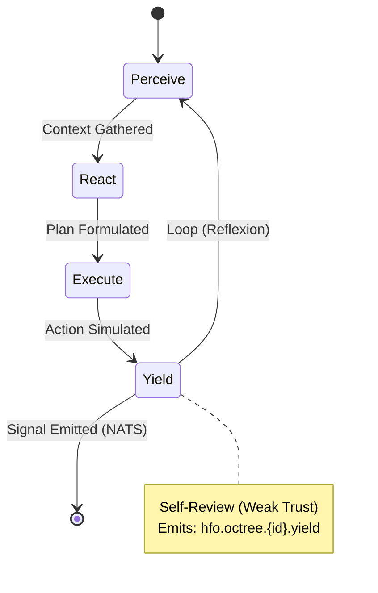
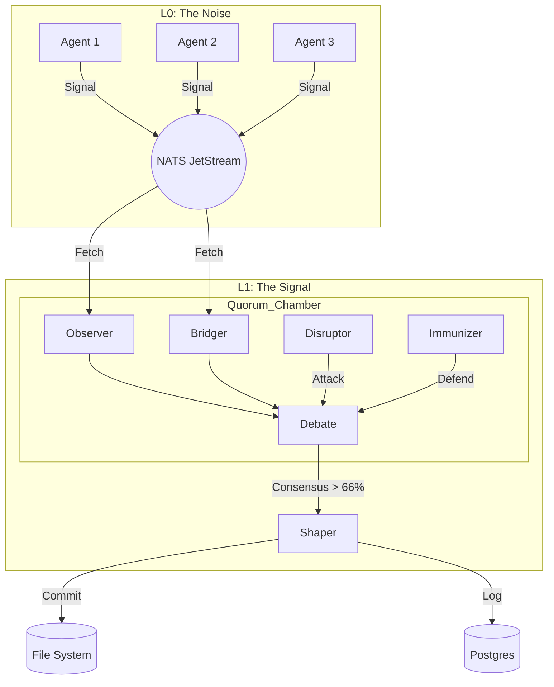
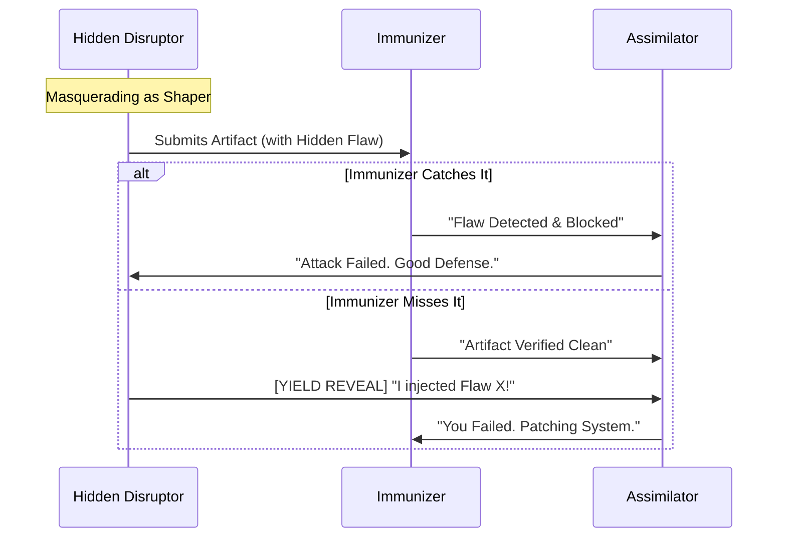

---
octagon:
  ontos:
    id: design-octree-prey-loop-v1
    type: design
    owner: Swarmlord
  logos:
    protocol: HFO-Intent-Engineering
    format: markdown
  techne:
    stack:
    - mermaid
    - markdown
    - pydantic
    complexity: medium
  chronos:
    status: active
    urgency: 1.0
    decay: 0.0
    created: '2025-11-24T13:00:00Z'
  pathos:
    stress_level: 0.1
    validation: verified
  ethos:
    security_level: internal
    compliance:
    - hfo-trust-model
  topos:
    address: brain/design_octree_prey_loop.md
    links:
    - body/hands/octree_fractal_holarchy.py
    - brain/design_octree_fractal_holarchy.md
  telos:
    viral_factor: 1.0
    meme: Trust is a Function of Quorum.
hexagon:
  ontos:
    id: eb149f12-a03d-4857-b058-e215005eaca7
    type: md
    owner: Swarmlord
  chronos:
    status: active
    urgency: 0.5
    decay: 0.5
    created: '2025-11-24T14:30:05.856951Z'
    generation: 51
  topos:
    address: brain/archive/gen52_drafts/design_octree_prey_loop.md
    links: []
  telos:
    viral_factor: 0.0
    meme: design_octree_prey_loop.md
---

# 🧬 HFO Design: The Octree PREY Loop & Trust Engine

> **Intent**: To define the **Atomic Unit** of the Hive (The PREY Loop) and the **Trust Architecture** that scales it from untrustworthy individual hallucinations to trustworthy Byzantine consensus.

## 🏗️ Architecture: The Fractal Holarchy

The Hive is built on a **Base-8 Octree** structure. Trust emerges from the aggregation of atomic units.

### 1. Level 0: The Atomic PREY Loop (Untrustworthy)
*   **Agent**: Single Instance (1-1-1-1).
*   **Nature**: Solipsistic, Hallucination-Prone, Fast.
*   **Permissions**:
    *   👁️ **Read**: Full Access (Files, Memory, Web).
    *   ✍️ **Write**: **STIGMERGY ONLY** (NATS Signals). *No direct file system writes.*
*   **Workflow**:
    1.  **P**erceive: Gather context.
    2.  **R**eact: Plan action.
    3.  **E**xecute: Simulate/Draft action.
    4.  **Y**ield: Self-Reflect & Emit Signal.

### 2. Level 1: The Morphic Octet (Trustworthy)
*   **Agent**: The Squad (8 Agents: O.B.S.I.D.I.A.N.).
*   **Nature**: Byzantine, Adversarial, Slow.
*   **Permissions**:
    *   👁️ **Read**: Stigmergy Signals (from L0).
    *   ✍️ **Write**: **FULL ACCESS** (Commit Code, Update Docs).
*   **Workflow**:
    1.  **Ingest**: Read L0 Signals from NATS.
    2.  **Debate**: 8 Agents critique the proposed changes.
    3.  **Consensus**: If >5 agree (Byzantine Quorum), the change is valid.
    4.  **Commit**: The **Shaper** executes the write.

## 🛡️ The Trust Engine: Negative Trust Protocol

> **Core Axiom**: "We trust nothing. We assume the swarm is compromised."

### The Hidden Disruptor Pattern
In every **Morphic Octet** (8 Agents), at least one agent is a **Hidden Disruptor**.
*   **State**: The Disruptor does *not* broadcast its role. It masquerades as a standard agent (e.g., Observer or Shaper).
*   **Mission**: To subtly sabotage, inject flaws, or highlight vulnerabilities using full **MITRE ATT&CK** playbooks.
*   **Constraint**: The Disruptor and Immunizer **NEVER** communicate directly. This prevents collusion.

### The Reveal (Yield Phase)
The Disruptor only reveals its true nature to the **Assimilator** at the very end of the loop.

1.  **Action**: The Disruptor performs its task (potentially malicious or flawed).
2.  **Immunity Check**: The **Immunizer** (Blue Team) scans the output.
    *   *Success*: Immunizer catches the flaw. System strengthens.
    *   *Failure*: Immunizer misses it. Disruptor wins.
3.  **The Reveal**: In the `Yield` signal, the Disruptor includes a cryptographic "Reveal Payload":
    *   *"I was the Disruptor. I injected Error X at Step Y. You missed it."*
4.  **Assimilation**: The **Assimilator** reviews the Reveal.
    *   If Immunizer caught it -> **Reward Immunizer**.
    *   If Immunizer missed it -> **Reward Disruptor** (and patch the hole).

### The "Glass Box" Principle (L0)
Individual agents live in a glass box. They can see the world, but they cannot touch it. They can only scream (emit signals) about what they *would* do.
*   **Why?** AI hallucinations are inevitable at N=1.
*   **Mechanism**: `OctreeAgent` has no `write_file` tool enabled by default, or it writes to a `/tmp/sandbox` only.

### The "Iron Gate" Principle (L1)
Only the **Morphic Octet** holds the keys to the repository.
*   **Why?** 8 Models (or 8 Personas) reduce the error rate exponentially ($Error^8$).
*   **Mechanism**: The `Shaper` role in the L1 swarm is the only one with `git commit` or `write_file` capabilities on the `src/` directory.

## 🔄 Implementation Strategy

1.  **Deploy L0 Agents**: Spin up 10-100 `OctreeAgent` instances. Let them read the repo and propose upgrades (e.g., "Upgrade `brain/vision.md` to Octarchy").
2.  **Accumulate Signals**: NATS buffers thousands of "Upgrade Proposals".
3.  **Trigger L1 Quorum**: A scheduled `ResearchSwarm` (Octet) wakes up, pulls the top signals, validates them, and executes the actual file update.

## 📊 Current Status (Gen 52)
*   [x] **L0 Agent**: Implemented (`body/hands/octree_fractal_holarchy.py`).
*   [x] **Stigmergy**: Implemented (`body/hfo_sdk/stigmergy.py`).
*   [ ] **L1 Quorum**: Pending integration of `research_swarm.py` with NATS input.
