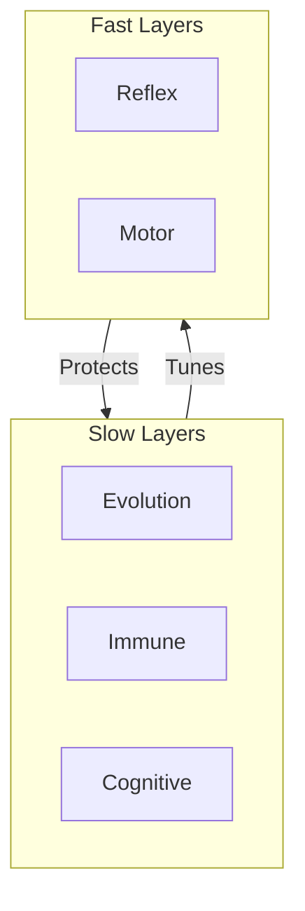
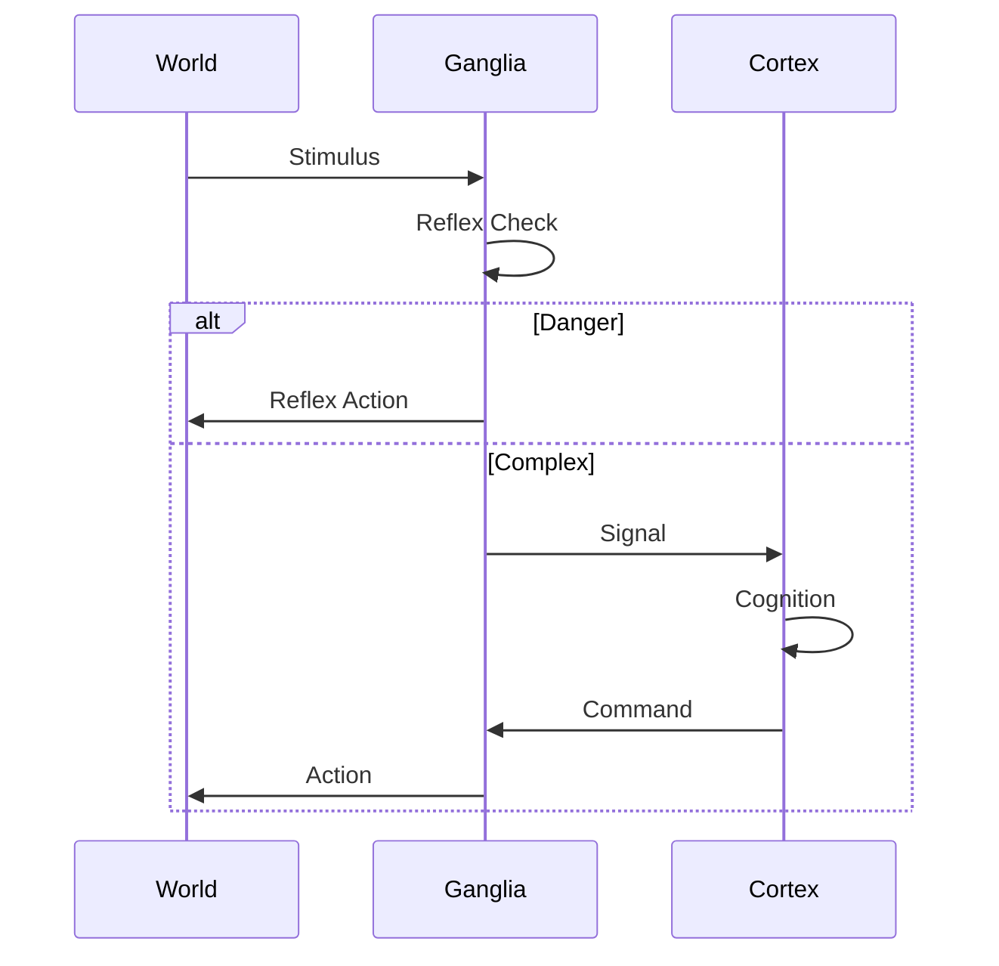

# 🔄 Physiology Loops

## ⚡ BLUF (Bottom Line Up Front)
The Hive is not a monolith; it is a collection of asynchronous loops running at different frequencies. The **Reflex Loop** handles immediate survival (ms). The **Cognitive Loop** handles complex planning (seconds). The **Immune Loop** handles long-term health (minutes/hours). This asynchronous nature prevents the "Slow Brain" from blocking the "Fast Body".

## 📊 Rhythm Matrix

| Loop | Organs Involved | Frequency | Priority | Function |
| :--- | :--- | :--- | :--- | :--- |
| **Reflex** | Ganglia, Mandibles | 100Hz (10ms) | Critical | Survival, Evasion |
| **Cognitive** | Cortex, Mycelium | 0.1Hz (10s) | High | Planning, Analysis |
| **Immune** | Carapace, Lysosomes | 0.01Hz (100s) | Background | Cleanup, Repair |
| **Evolution** | Ribs (Genetics) | 0.0001Hz (Days) | Low | Adaptation |

## 🧠 Concept Visualization

### View 1: The Speed Layering (Conceptual)
*Fast layers support slow layers.*

### View 2: The Reflex Arc (Logical)
*Short-circuiting the brain for speed.*

### View 3: Asynchronous Processing (Physical)
*Parallel execution tracks.*

```mermaid
gantt
    title Parallel Loops
    dateFormat s
    axisFormat %S

    section Reflex
    Reflex 1 : 0, 1
    Reflex 2 : 1, 1
    Reflex 3 : 2, 1

    section Cognitive
    Plan A : 0, 5

    section Immune
    Scan : 0, 10
```

## 🦅 Executive Summary
Different organs operate at different speeds.
1.  **Reflex Loop**: Ganglia/Mandibles. Fast, reactive.
2.  **Cognitive Loop**: Cortex. Slow, deliberative.
3.  **Immune Loop**: Carapace/Lysosomes. Background, maintenance.
