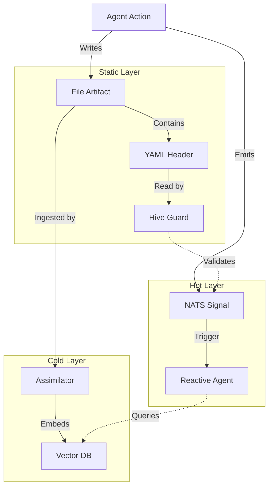
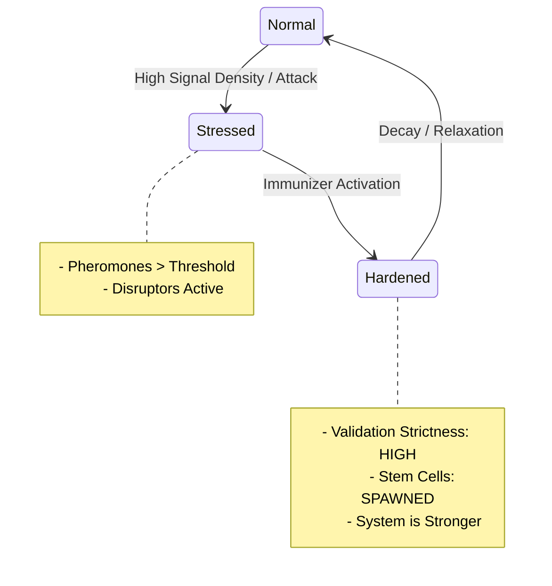
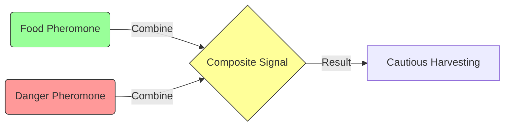

# 🧪 Pheromones & Composability: The Antifragile Stigmergy

## ⚡ BLUF (Bottom Line Up Front)
True Stigmergy in Hive Fleet Obsidian is not just NATS messages. It is a **Tri-Layered Pheromone System** that ensures **Antifragility**. By composing signals from **Static Headers** (YAML), **Hot Streams** (NATS), and **Cold Memory** (Vector), the Hive creates a "Scent Landscape" that allows complex, self-organizing behaviors to emerge. Stress on the system (high signal density) triggers hardening (Immunizer activation), making the Hive stronger.

## 📊 The Pheromone Matrix

| Layer | Type | Implementation | Time Horizon | Purpose |
| :--- | :--- | :--- | :--- | :--- |
| **Static** | **Scent Mark** | YAML Header (File) | Infinite | Machine-parsable governance, indexing, and "Slop" detection. |
| **Hot** | **Alarm/Food** | NATS JetStream | Seconds/Minutes | Real-time coordination, triggers, and immediate reaction. |
| **Cold** | **Ancestral** | Vector/Graph DB | Generations | Deep wisdom, pattern recognition, and long-term strategy. |
| **Composite**| **Complex** | Overlapping Signals | Variable | Emergent behavior (e.g., "Danger" + "Food" = "Caution"). |

## 🧠 Concept Visualization

### View 1: The Tri-Layered Stigmergy Stack
*How the three layers interact to form a complete signal.*

### View 2: Antifragile Stress Response
*How the system gets stronger when stressed (High Pheromone Density).*

### View 3: Pheromone Composability
*Complex behavior from simple signals.*

