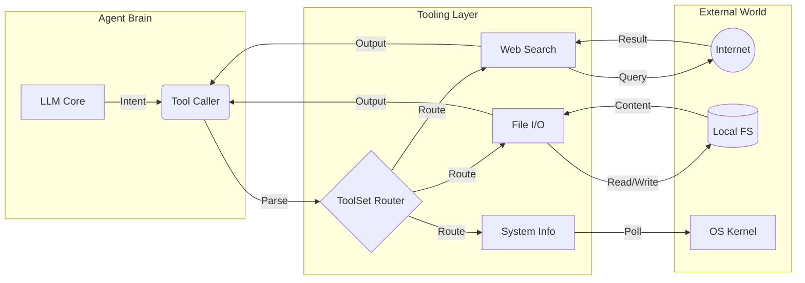
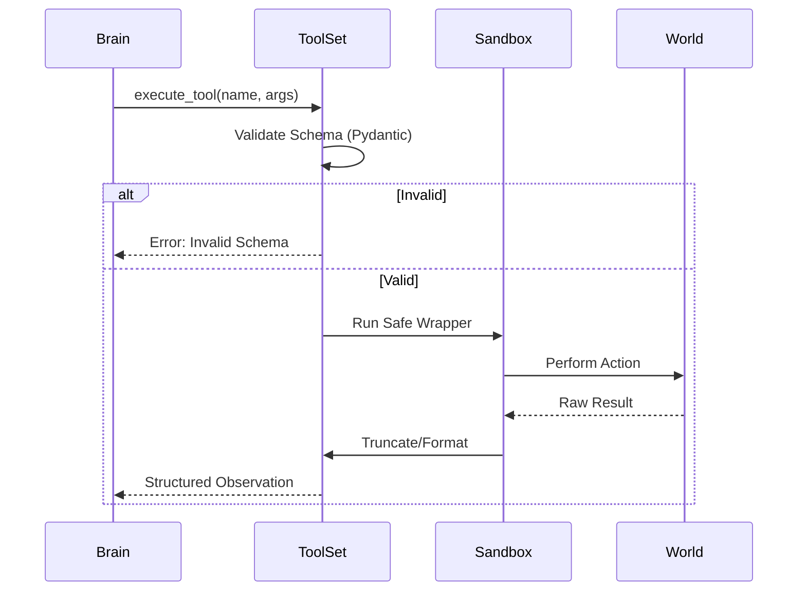
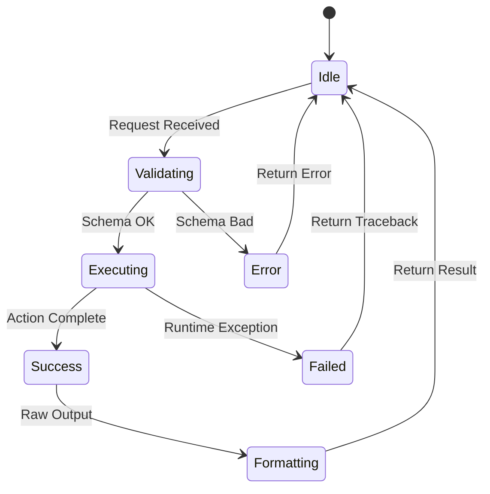

# 🛠️ External Tools Capability

## ⚡ BLUF (Bottom Line Up Front)
The **External Tools Capability** grants HFO agents agency beyond the LLM context window. It provides a standardized, secure interface for **Web Search** (DuckDuckGo/Tavily) and **File System Operations** (Read/Write). This capability is strictly governed by the **PREY Loop** (Perceive-React-Execute-Yield), ensuring that tool usage is intentional, observable, and reversible where possible. It transforms the swarm from a "Chatbot" into a "Cyber-Physical System" capable of manipulating its environment.

---

## 1. Tooling Architecture

The `ToolSet` class acts as the gateway between the Agent's cognitive logic and the external world.

## 2. Execution Flow

The safe execution path for a tool call.

## 3. Tool State Machine

How a tool transitions from request to result.

