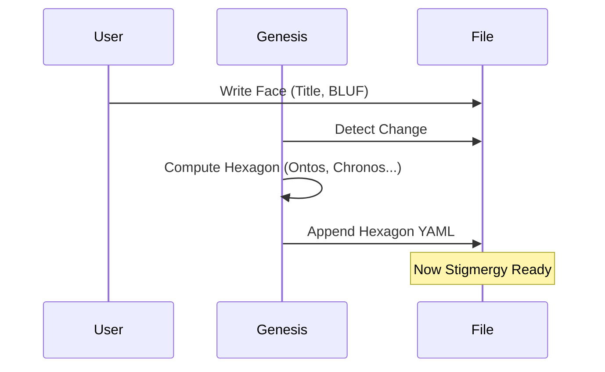

# 💎 The Hexagonal Holon Header

> **BLUF**: A unified, composable header standard.
> **Structure**: **Bicameral** (Human/Machine) + **Hexagonal** (Modular Ontology).
> **Automation**: Humans write the **Face**, Machines compute the **Hexagon**.

## 1. The Architecture: Face & Hexagon

We split the header into two distinct domains.

### 👤 The Face (Human Input)
*The "User Interface" of the file. Simple, narrative, intent-driven.*
*   **Title**: What is this?
*   **BLUF**: Why does it exist? (Bottom Line Up Front)
*   **Story**: The context or narrative intent.

### 🤖 The Hexagon (Machine Computed)
*The "System Interface". A modular container with 6 slots (4 active, 2 reserved).*
*   **North (Ontos)**: Identity & Type.
*   **South (Telos)**: Purpose & Viral Factor.
*   **East (Chronos)**: Time, Energy, Decay.
*   **West (Topos)**: Space, Address, Links.
*   **Up (Logos)**: *Reserved for Logic/Constraints.*
*   **Down (Pathos)**: *Reserved for Sentiment/Vibe.*

---

## 2. The YAML Standard

```yaml
---
# ==================================================================
# 👤 THE FACE (You write this)
# ==================================================================
title: "Mission Alpha: First Contact"
bluf: "Establish communication to verify system integrity."
story: "Before we can walk, we must speak. This mission proves the voice."

# ==================================================================
# 🤖 THE HEXAGON (The System fills this)
# ==================================================================
hexagon:
  # 1. ONTOS (Identity)
  ontos:
    id: "uuid-v4"
    type: "intent"
    owner: "Brain.Navigator"

  # 2. CHRONOS (Thermodynamics)
  chronos:
    status: "active"
    urgency: 1.0
    decay: 0.0

  # 3. TOPOS (Connectivity)
  topos:
    address: "1.1.0"
    links:
      - { to: "uuid-body", rel: "requires" }

  # 4. TELOS (Purpose)
  telos:
    viral_factor: 1.0
    meme: "First Contact"
---
```

---

## 3. The Automation Loop (Genesis)

The magic lies in the **Auto-Completion**.

1.  **User Action**: User creates a file with just the **Face**.
    ```yaml
    title: "New Script"
    bluf: "Scrapes the web."
    ```
2.  **Genesis Agent**: Detects new file.
    *   Generates `id` (Ontos).
    *   Calculates `urgency` based on BLUF keywords (Chronos).
    *   Infers `address` based on file path (Topos).
    *   Assigns `viral_factor` based on importance (Telos).
3.  **Result**: The full **Hexagon** is appended automatically.

---

## 4. Visualizing the Hexagon

```mermaid
graph TD
    subgraph "The Face (Human)"
        Face[👤 Narrative Intent]
    end

    subgraph "The Hexagon (Machine)"
        Ontos[1. Ontos (North)]
        Chronos[2. Chronos (East)]
        Telos[3. Telos (South)]
        Topos[4. Topos (West)]

        Center((Hexagon Core))

        Ontos --- Center
        Chronos --- Center
        Telos --- Center
        Topos --- Center
    end

    Face -->|Generates| Center

    style Face fill:#eef,stroke:#333,stroke-width:2px
    style Center fill:#333,stroke:#fff,stroke-width:4px
    style Ontos fill:#ddd,stroke:#333
    style Chronos fill:#ddd,stroke:#333
    style Telos fill:#ddd,stroke:#333
    style Topos fill:#ddd,stroke:#333
```

## 5. Composability (Why Hexagonal?)

Because it is a **Hexagon**, we can snap other modules onto it later without breaking the schema.

*   **Need Security?** Snap a `Kyros` (Authority) module to the "Up" slot.
*   **Need Economics?** Snap a `Oikos` (Cost) module to the "Down" slot.

```mermaid
graph LR
    Hex[Hexagon Core]

    Hex --- Ontos
    Hex --- Chronos
    Hex --- Topos
    Hex --- Telos

    Hex -.->|Future| Kyros[🛡️ Kyros (Security)]
    Hex -.->|Future| Oikos[💰 Oikos (Cost)]

    style Hex fill:#f9f,stroke:#333,stroke-width:4px
    style Kyros fill:#fdd,stroke:#333,stroke-dasharray: 5 5
    style Oikos fill:#dfd,stroke:#333,stroke-dasharray: 5 5
```

## 7. The Auto-Completion Flow



## 6. Implementation Strategy

1.  **Update `genesis.py`**:
    *   Input: File Path + Content.
    *   Logic: Parse "Face", Compute "Hexagon".
    *   Output: Write full YAML header.
2.  **Update `guard_stigmergy_headers.py`**:
    *   Validate that `hexagon` key exists and contains the Quadrivium.
3.  **Update `assimilator.py`**:
    *   Read `hexagon.topos.links` to build the graph.
