# 💎 Obsidian Facet V2: High-Density Stigmergy

> **Meme**: "The Header is the Hologram."
> **Goal**: Pack maximum cognitive context into minimum YAML space.
> **Result**: Every file becomes a self-describing neuron in the Fractal Holarchy.

## 🧠 BLUF (Bottom Line Up Front)
We are upgrading the Stigmergy Header to a **Cognitive DNA** sequence.
1.  **Holographic**: Includes `fractal_address` to reconstruct the whole from the part.
2.  **Mimetic**: Includes `meme` and `viral_factor` to drive propagation.
3.  **Weighted**: Includes `links` with weights for fuzzy logic graphs.

---

## 1. The Schema (The DNA)

We move from simple metadata to **Cognitive DNA**.

```yaml
---
# 💎 The Crystal (Identity & State)
id: "550e8400-e29b-41d4-a716-446655440100"
type: "concept"               # concept, pattern, mission, artifact
status: "active"              # active, draft, archived, germinating
title: "Obsidian Facet V2"
author: "Swarmlord"           # The Originator
owner: "Assimilator.Weaver"   # The Current Guardian (Holon)

# ⛰️ The Mountain (Temporal Stigmergy)
created: "2025-11-23T05:10:00Z"
last_touched: "2025-11-23T05:10:00Z"
urgency: 0.95                 # 0.0 - 1.0 (Intrinsic Importance)
decay: 0.1                    # 0.0 - 1.0 (Erosion Rate per Day)
score: 100.0                  # Calculated: Urgency / (Age * Decay)

# 🕸️ The Web (Holographic Context)
fractal_address: "1.4.2"      # Brain -> Architecture -> Stigmergy
links:
  - { id: "uuid-1", rel: "defines", weight: 1.0 }
  - { id: "uuid-2", rel: "implements", weight: 0.8 }
  - { id: "uuid-3", rel: "contradicts", weight: 0.5 }

# 🧬 The Virus (Mimetic Payload)
bluf: "A high-density metadata schema that turns every file into a self-describing neuron."
meme: "The Header is the Hologram."
viral_factor: 0.8             # 0.0 - 1.0 (Likelihood of replication)
---
```

### Visual: The DNA Helix

```mermaid
graph TD
    A[Obsidian Facet V2] --> B(💎 Crystal)
    A --> C(⛰️ Mountain)
    A --> D(🕸️ Web)
    A --> E(🧬 Virus)
    B --> B1[Identity]
    C --> C1[Time/Decay]
    D --> D1[Space/Links]
    E --> E1[Meaning/Meme]
```


---

## 2. The Components (Matrix)

| Component | Field | Type | Purpose |
| :--- | :--- | :--- | :--- |
| **Crystal** | `id` | UUID | Immutable Identity. |
| **Crystal** | `owner` | String | Fractal Accountability (Holon). |
| **Mountain** | `urgency` | Float | Intrinsic Importance (0-1). |
| **Mountain** | `decay` | Float | Knowledge Half-Life. |
| **Web** | `fractal_address` | String | Holographic Reconstruction. |
| **Web** | `links` | List[Dict] | Weighted Knowledge Graph. |
| **Virus** | `meme` | String | Viral Slogan for Propagation. |
| **Virus** | `viral_factor` | Float | Replication Probability. |

### Visual: Fractal Addressing


---

## 3. The Viral Mechanics

The `viral_factor` determines how aggressively the **Sherpa** broadcasts this file.

*   **High Viral (>0.8)**: Broadcast daily. "Lest we forget."
*   **Medium Viral (0.5)**: Broadcast weekly.
*   **Low Viral (<0.2)**: Passive. Only found by search.

### Visual: The Viral Loop

```mermaid
sequenceDiagram
    participant File as 🧬 File (Virus)
    participant Sherpa as 🧗 Sherpa (Vector)
    participant Web as 🕸️ Web (Host)

    File->>Sherpa: Expose viral_factor (0.9)
    Sherpa->>Sherpa: Check Threshold (>0.8)
    Sherpa->>Web: Broadcast "hfo.signal.meme.spread"
    Web->>Web: Infect other Agents
```


## 4. Implementation Strategy

1.  **Update `genesis.py`**: To generate V2 headers.
2.  **Update `Assimilator`**: To parse V2 headers and calculate `score`.
3.  **Update `Sherpa`**: To prioritize `viral_factor` > 0.8.
