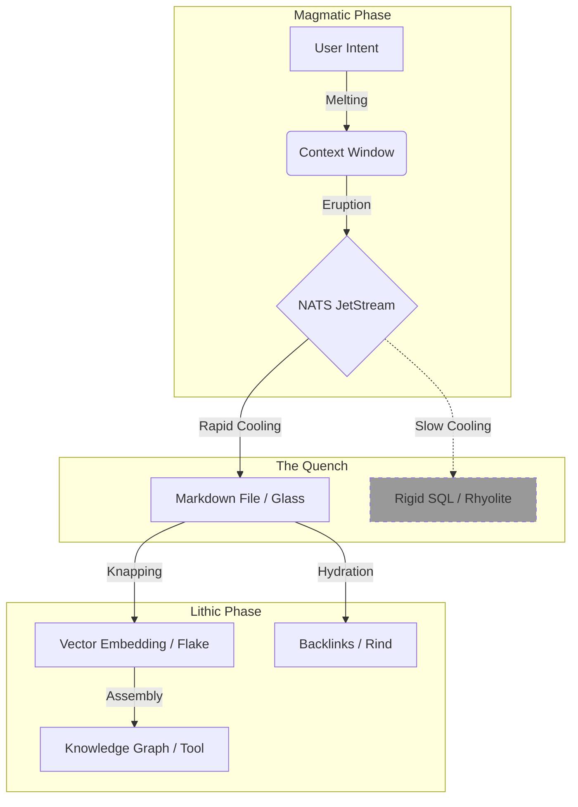

# 🌋 Design: Obsidian Thermodynamics (The Hot-to-Cold Transition)

> **Status**: Draft (Gen 52)
> **Context**: Defining the "Physics of Information" within Hive Fleet Obsidian.
> **Goal**: Map the transition from "Hot Stigmergy" (NATS) to "Cold Knowledge" (Graph) using accurate geological metaphors of Obsidian formation.

## 🧠 The Core Physics: Why Obsidian?

Obsidian is **Volcanic Glass**. It is defined by what it *lacks*: **Crystalline Structure**.
*   **Formation**: It forms when felsic lava cools **so rapidly** (Quenching) that atoms are unable to arrange themselves into a crystalline lattice.
*   **Result**: An **Amorphous Solid**. Because it has no crystal grain, it breaks with a **Conchoidal Fracture** (curved, extremely sharp edges).
*   **Metaphor**: In HFO, we prefer **Raw Context (Glass)** over **Rigid Schema (Crystal)**. We capture the "Melt" of thought instantly, then "Knap" it into tools later.

---

## 🌡️ Variation 1: The Quench Protocol (State Transition)
*Focus: Speed of Capture vs. Rigidity of Structure.*

This model posits that **Information** begins as high-energy **Magma** and must be captured before it degrades.

| State | Geological Equivalent | HFO Component | Characteristics |
| :--- | :--- | :--- | :--- |
| **Plasma / Melt** | **Magma Chamber** | **LLM Context Window** | High energy, fluid, transient, chaotic. The "Thought" before it is spoken. |
| **Eruption** | **Lava Flow** | **NATS JetStream** | The thought in motion. High velocity, dangerous, directional. "Hot Stigmergy". |
| **The Quench** | **Rapid Cooling** | **File Write / Log** | **CRITICAL STEP**. Freezing the stream *instantly* into storage. |
| **Glass** | **Obsidian Block** | **Markdown / YAML** | **Amorphous Storage**. We store the *text*, not a rigid SQL row. It retains the "flow" of the original thought. |
| **Rock** | **Rhyolite** | **Rigid SQL Schema** | *Anti-Pattern*. If we cool too slowly (force strict schema too early), the data "crystallizes" and becomes grainy/brittle. |

### 💡 The Insight
**"Don't Crystallize the Stream."**
If we try to force NATS messages immediately into a complex Relational DB (Crystals), we lose the nuance. Instead, we **Quench** them into Markdown/JSON (Glass). It's unstructured but high-fidelity.

---

## 🔨 Variation 2: The Knapping Protocol (Refinement)
*Focus: Utility and Sharpness.*

This model focuses on how we turn the "Cold" storage into "Sharp" utility.

| Component | Geological Equivalent | HFO Component | Action |
| :--- | :--- | :--- | :--- |
| **The Core** | **Obsidian Nodule** | **The Raw File** | The bulk storage. Heavy, full of potential, but blunt. |
| **The Striker** | **Hammerstone** | **Assimilator Agent** | The force that impacts the core to extract value. |
| **The Flake** | **Razor Flake** | **Vector Embedding** | A small, extremely sharp piece of the whole. Used for "cutting" (Search/Retrieval). |
| **The Tool** | **Arrowhead** | **Knowledge Graph** | A composite structure made of shaped flakes. Directed utility. |
| **Debitage** | **Waste Flakes** | **Logs / Temp Files** | The byproduct of refinement. Useful for forensics, but not for cutting. |

### 💡 The Insight
**"Knap the Glass, Don't Polish the Rock."**
We don't try to make the *entire file* perfect. We strike it (Embed it) to get **Flakes** (Vectors) that are sharp enough to solve a query. The "File" remains the "Core" (Source of Truth).

---

## ⏳ Variation 3: The Hydration Protocol (Time & Decay)
*Focus: Aging and Relevance.*

Obsidian absorbs water from the atmosphere over time, forming a "Hydration Rind". This is used for dating artifacts.

| Phase | Geological Equivalent | HFO Component | Behavior |
| :--- | :--- | :--- | :--- |
| **Fresh** | **Fresh Fracture** | **New Commit** | Zero hydration. "Hot" relevance. Immediate context. |
| **Rind Formation** | **Water Absorption** | **Backlink Accumulation** | As a file sits in the repo, other files link to it. It gathers "Mass" (PageRank). |
| **Saturation** | **Hydration Band** | **Deep Knowledge** | The file is old, but heavily linked. It is "Stable Wisdom". |
| **Devitrification** | **Spherulites** | **Bit Rot / Drift** | If the file is ignored and not linked (no hydration), it "crystallizes" into noise (outdated info). |

### 💡 The Insight
**"Hydration is Validation."**
A "Cold" file isn't dead. It is slowly absorbing "Links" (Water). A file with a thick "Link Rind" is valuable. A file with no rind is just waste glass.

---

## 🏆 Recommendation: The "Obsidian Cycle" (Unified)

Combine all three for the full **Thermodynamic Stigmergy** model:

1.  **Erupt (NATS)**: High-speed, fluid intent.
2.  **Quench (Markdown)**: Rapid capture into amorphous text (Glass). Avoid rigid SQL (Crystals).
3.  **Knap (Vector/Graph)**: Assimilators strike the Glass to create sharp Vectors (Flakes) for the DB.
4.  **Hydrate (Backlinks)**: Over time, the Glass accumulates Links, proving its worth.

