# 🌋 Design: Obsidian Thermodynamics (Stigmergy Phase Transitions)

> **Status**: Proposed (Gen 52)
> **Focus**: Mapping the "Hot-to-Cold" information lifecycle to Obsidian formation physics.
> **Constraint**: 4 Distinct Variations of the Thermodynamic Cycle.

## 🧠 The Physics of Information
In HFO, **Information is Energy**.
*   **High Temperature (Plasma)**: Active Context, NATS Streams, RAM. High Entropy.
*   **Low Temperature (Glass)**: Stored Files, Vector DBs, Disk. Low Entropy.
*   **The Transition**: How we move from Hot to Cold determines the *quality* of the Obsidian (Data).

---

## 🌡️ Variation 1: The Flash Quench (Direct Capture)
*The "Black Box" Pattern. Maximum Fidelity, Zero Structure.*

**Geology**: Lava hits water and cools instantly. No crystals form. Pure glass.
**Architecture**: Every NATS message is immediately appended to a Markdown file.

*   **Mechanism**: `NATS -> File Append`
*   **Thermodynamics**: $\Delta T \approx \infty$ (Instant cooling).
*   **Pros**: Zero data loss. Perfect historical record.
*   **Cons**: High noise. "Shattered" data (thousands of tiny files).

```mermaid
graph LR
    A((🔥 Magma/NATS)) -->|Flash Cool| B[⬛ Obsidian/Log]
    style A fill:#ff4400,stroke:#333,stroke-width:2px
    style B fill:#000000,stroke:#333,stroke-width:2px,color:#fff
```

---

## 🌡️ Variation 2: The Annealing Oven (Buffered Cooling)
*The "Write-Back" Pattern. Reduced Stress, Higher Stability.*

**Geology**: Lava cools slowly in a protected chamber. Internal stresses are relieved.
**Architecture**: NATS messages accumulate in a "Warm" buffer (Redis/Memory) and are flushed in batches.

*   **Mechanism**: `NATS -> Buffer (Warm) -> Batch Write -> File`
*   **Thermodynamics**: Controlled cooling rate.
*   **Pros**: Coherent files (Chapters instead of sentences). Less fragmentation.
*   **Cons**: Risk of data loss if the "Oven" (Buffer) crashes before flushing.

```mermaid
graph LR
    A((🔥 Magma/NATS)) -->|Flow| B{🌡️ Warm Buffer}
    B -->|Slow Cool| C[⬛ Massive Obsidian Block]
    style A fill:#ff4400,stroke:#333,stroke-width:2px
    style B fill:#ffaa00,stroke:#333,stroke-width:2px
    style C fill:#000000,stroke:#333,stroke-width:2px,color:#fff
```

---

## 🌡️ Variation 3: Porphyritic Crystallization (Hybrid Storage)
*The "Split-Brain" Pattern. Structured Metadata, Unstructured Body.*

**Geology**: Large crystals (Phenocrysts) form in the magma *before* eruption, suspended in the glass matrix.
**Architecture**: Extract structured metadata (IDs, Tags) into SQL (Crystals) while quenching the body into Markdown (Glass).

*   **Mechanism**: `NATS -> Extractor -> (SQL + Markdown)`
*   **Thermodynamics**: Two-phase cooling.
*   **Pros**: Fast search (SQL) + Rich context (File).
*   **Cons**: "Schema Drift" between the Crystal and the Glass.

```mermaid
graph TD
    A((🔥 Magma/NATS)) -->|Differentiation| B{💎 Crystal Separator}
    B -->|Structure| C[🔹 SQL Metadata]
    B -->|Matrix| D[⬛ Markdown Body]
    style A fill:#ff4400,stroke:#333,stroke-width:2px
    style C fill:#aaddff,stroke:#333,stroke-width:2px
    style D fill:#000000,stroke:#333,stroke-width:2px,color:#fff
```

---

## 🌡️ Variation 4: Pyroclastic Welding (Iterative Refinement)
*The "Compaction" Pattern. The HFO Preferred Model.*

**Geology**: Hot ash and glass fragments (Tephra) land, stay hot, and *weld* themselves back together into a solid sheet (Ignimbrite).
**Architecture**: Agents dump raw logs (Ash). A secondary "Assimilator" process re-heats them (Reads) and welds them into a cohesive Knowledge Graph.

*   **Mechanism**: `NATS -> Raw Logs (Ash) -> Assimilator (Re-Heat) -> Knowledge Graph (Welded Tuff)`
*   **Thermodynamics**: Cooling -> Re-heating -> Final Cooling.
*   **Pros**: Allows for "Reflexion". We capture everything, then make sense of it later.
*   **Cons**: High energy cost (requires active Assimilators).

```mermaid
graph TD
    A((🔥 Magma/NATS)) -->|Explosion| B[💨 Ash / Raw Logs]
    B -->|Deposition| C{🌋 Assimilator / Re-Heat}
    C -->|Welding| D[⬛ Welded Tuff / Knowledge Graph]
    style A fill:#ff4400,stroke:#333,stroke-width:2px
    style B fill:#666666,stroke:#333,stroke-width:2px,color:#fff
    style C fill:#ff8800,stroke:#333,stroke-width:2px
    style D fill:#333333,stroke:#333,stroke-width:2px,color:#fff
```

---

## 🏆 Recommendation: Variation 4 (Pyroclastic Welding)

This maps perfectly to the **PREY -> Assimilator** loop.
1.  **PREY Agents** erupt raw data (Ash/Logs) via NATS.
2.  **Assimilator Agents** sweep over the Ash, re-heating it (LLM Processing).
3.  **Result**: A "Welded" Knowledge Graph that is stronger than the sum of its parts.
