# 🌋 Design: Obsidian Thermodynamics (The Cooling Curve)

> **Status**: Proposed (Gen 52)
> **Focus**: Mapping Stigmergy to the **Temperature Gradient** of Information.
> **Core Concept**: **Hot Chaos $\to$ Cold Order**.

## 🌡️ The Temperature Gradient ($T$)

We map the lifecycle of information to the cooling of **Rhyolitic Lava** (High Silica) into Obsidian.

| Temp ($T$) | State | Physics | HFO Component | Action |
| :--- | :--- | :--- | :--- | :--- |
| **900°C** | **Silicic Melt** | Molten, High Viscosity, Fluid. | **NATS JetStream** | **Flow** (Real-time Communication) |
| **700°C** | **Glass Transition** | $T_g$. The point of no return. | **Redis / Buffers** | **Aggregate** (Batching) |
| **20°C** | **Obsidian** | Solid, Amorphous, Brittle. | **Markdown Files** | **Capture** (Raw Storage) |
| **0°C** | **Tool** | Shaped, Sharp, Useful. | **Knowledge Graph** | **Refine** (Knapping/Cold Work) |

---

## 📉 Variation 1: The Flash Quench (Maximum Capture)
*The "Raw Data" Curve. Drop from 900°C to 20°C instantly.*

**Physics**: Lava hits water. Heat is lost immediately. Atoms freeze in place. No crystals form.
**HFO**: We dump NATS streams directly to disk.
**Goal**: **Perfect Fidelity**. We capture the exact state of the swarm, including the noise.

*   **Hot**: Swarm Chatter.
*   **Cold**: Raw Logs (The "Obsidian Core").
*   **Refinement**: None. It's just a block of glass.

```mermaid
graph LR
    A((🔥 900°C NATS)) -->|⚡ Flash Cool| B[⬛ 20°C Raw Log]
    style A fill:#ff4400,stroke:#333,stroke-width:2px
    style B fill:#000000,stroke:#333,stroke-width:2px,color:#fff
```

---

## 📉 Variation 2: Equilibrium Cooling (Maximum Structure)
*The "Schema" Curve. Slow cooling from 900°C to 20°C.*

**Physics**: Lava cools deep underground. Atoms have time to arrange into perfect lattices (Granite/Rhyolite).
**HFO**: We parse NATS messages into a strict SQL Schema.
**Goal**: **Perfect Structure**. We lose the "noise" (context) but gain query speed.

*   **Hot**: Swarm Chatter.
*   **Cold**: SQL Rows (The "Crystal").
*   **Refinement**: Intrinsic. The cooling process *is* the refinement.

```mermaid
graph LR
    A((🔥 900°C NATS)) -->|⏳ Slow Cool| B{💎 20°C SQL DB}
    style A fill:#ff4400,stroke:#333,stroke-width:2px
    style B fill:#aaddff,stroke:#333,stroke-width:2px
```

---

## 📉 Variation 3: Fractional Crystallization (Hybrid)
*The "Separation" Curve. Cooling different parts at different rates.*

**Physics**: High-melting-point minerals crystallize first (Phenocrysts), leaving the rest as liquid to quench later (Matrix).
**HFO**: We extract **Metadata** (IDs, Tags) immediately into SQL, while the **Body** (Content) flows into Markdown.
**Goal**: **Searchability + Context**.

*   **Hot**: Swarm Chatter.
*   **Warm**: Metadata extraction.
*   **Cold**: SQL Index + Markdown Blob.

```mermaid
graph TD
    A((🔥 900°C NATS)) -->|Separation| B{🌡️ 700°C Filter}
    B -->|Crystallize| C[💎 SQL Metadata]
    B -->|Quench| D[⬛ Markdown Body]
    style A fill:#ff4400,stroke:#333,stroke-width:2px
    style B fill:#ffaa00,stroke:#333,stroke-width:2px
    style C fill:#aaddff,stroke:#333,stroke-width:2px
    style D fill:#000000,stroke:#333,stroke-width:2px,color:#fff
```

---

## 📉 Variation 4: The Knapping Protocol (Cold Work)
*The "HFO Standard". Quench first, Refine later.*

**Physics**:
1.  **Quench**: Make the Obsidian (Capture the raw material).
2.  **Knap**: Strike the cold stone to flake off sharp tools.
**HFO**:
1.  **Capture**: NATS -> Markdown (The "Core").
2.  **Refine**: Assimilator reads the Markdown and updates the Graph/Vector DB.
**Goal**: **Antifragility**. We secure the data first, then refine it safely.

*   **Hot**: Swarm Chatter.
*   **Cold**: Markdown File.
*   **Work**: Assimilator (The "Knapper").
*   **Result**: Knowledge Graph (The "Arrowhead").

```mermaid
graph TD
    subgraph HOT [Capture Phase]
        A((🔥 900°C NATS)) -->|⚡ Quench| B[⬛ 20°C Obsidian Core]
    end
    subgraph COLD [Refinement Phase]
        B -->|🔨 Knapping| C[🗡️ Vector Embedding]
        B -->|🔨 Knapping| D[🕸️ Knowledge Graph]
    end
    style A fill:#ff4400,stroke:#333,stroke-width:2px
    style B fill:#000000,stroke:#333,stroke-width:2px,color:#fff
    style C fill:#555,stroke:#333,stroke-width:2px,color:#fff
    style D fill:#555,stroke:#333,stroke-width:2px,color:#fff
```

