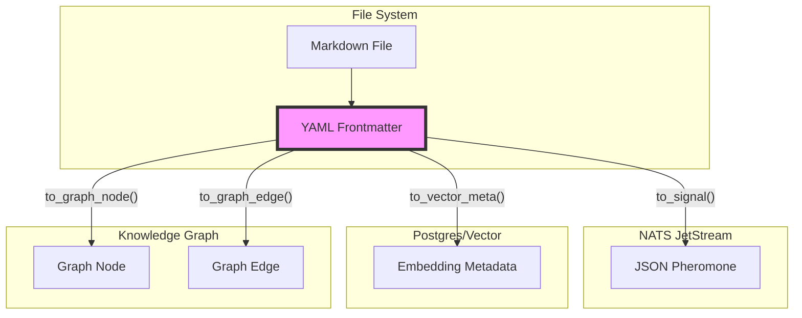

# 💎 Unified Hexagonal Adapter: The Fractal Holon Protocol

> **BLUF**: A single, polymorphic data structure (The Hexagon) that adapts to every state of matter in the system (File, Signal, Vector, Graph) without losing fidelity.
> **Goal**: Enable "Fractal Holarchy Stigmergy" where the Intent (Gherkin) drives the Implementation (Code) across all boundaries.

---

## 1. The Design: The Hexagonal Holon

We define a **Single Source of Truth (SSOT)** Pydantic model that encapsulates the 6 dimensions of any object in the Hive.

### The 6 Dimensions (The Hexagon)

| Dimension | Name | Concept | Fields |
| :--- | :--- | :--- | :--- |
| **North** | **ONTOS** | **Identity** | `id` (UUID), `type` (Concept/Artifact), `owner` (Agent/Role) |
| **South** | **TELOS** | **Purpose** | `meme` (Slogan), `bluf` (Summary), `viral_factor` (0.0-1.0) |
| **East** | **CHRONOS** | **Time** | `created`, `urgency` (Priority), `decay` (TTL), `status` |
| **West** | **TOPOS** | **Space** | `address` (Fractal 1.2.3), `links` (Weighted Edges) |
| **Up** | **LOGOS** | **Logic** | `hash` (Content SHA), `schema_v`, `signature` (Cryptographic) |
| **Down** | **PATHOS** | **Quality** | `sentiment`, `quality_score` (0-100), `review_status` |

### The Adapter Pattern (Polymorphism)

The `HexagonalHeader` class shapeshifts to fit the medium:

1.  **Crystalline (Files)**: `to_yaml()` -> Human-readable Frontmatter.
2.  **Liquid (NATS)**: `to_signal()` -> Lightweight JSON Pheromone.
3.  **Sedimentary (Vector DB)**: `to_vector_meta()` -> Flat Metadata for filtering.
4.  **Holographic (Knowledge Graph)**: `to_graph_node()` -> Node Properties & Edges.

---

## 2. Comparative Analysis: Why This?

We evaluated 3 alternative architectural styles against the HFO core values: **Fractal Holarchy**, **Stigmergy**, and **Intent-Based**.

### Alternative A: The Monolith (Protobuf/Avro)
*The "Google/Enterprise" Approach.*
*   **Design**: Strict binary schemas (proto files). High efficiency, strong typing.
*   **Pros**: Extremely fast, type-safe, compact.
*   **Cons**: **Opaque to Humans**. You cannot open a Markdown file and read the header. Requires compilation steps.
*   **Verdict**: 🔴 **Rejected**. Violates "Intent-Based Programming" (Humans must be able to read/write the intent in plain text).

### Alternative B: The Anarchy (Schemaless JSON)
*The "Startup/MVP" Approach.*
*   **Design**: Just dump whatever JSON dict into the header/payload.
*   **Pros**: Zero friction, infinite flexibility.
*   **Cons**: **Metadata Drift**. "Urgency" becomes "priority" becomes "importance". Impossible to build a reliable GraphRAG or Stigmergy system because agents speak different dialects.
*   **Verdict**: 🔴 **Rejected**. Violates "Stigmergy" (Requires a shared language/pheromone to coordinate).

### Alternative C: The Silo (DTO vs DAO)
*The "Traditional Clean Architecture" Approach.*
*   **Design**: Separate models for FileHeader, NATSMessage, and DBRow. Mappers convert between them.
*   **Pros**: Optimized for each storage engine. Decoupled.
*   **Cons**: **Fractal Breakage**. The "Intent" gets lost in translation. Adding a field requires updating 3 models and 3 mappers. High cognitive load.
*   **Verdict**: 🔴 **Rejected**. Violates "Fractal Holarchy" (The part should represent the whole, everywhere).

### The Winner: Hexagonal Adapter
*   **Fractal**: The `hexagon` block is identical in the File, the Signal, and the DB.
*   **Stigmergic**: It carries the coordination signals (`urgency`, `decay`) natively.
*   **Intent-Based**: It wraps the Human Intent (The Face) with Machine Logic (The Hexagon).

---

## 3. Intent Definition (Gherkin)

```gherkin
Feature: Hexagonal Adapter Protocol
  As a Swarmlord
  I want a unified metadata structure
  So that my intent survives the transition from Mind to Code to Memory

  Scenario: Phase Transition (File -> Signal -> Graph)
    Given I have a design file "brain/mission_alpha.md"
    And the file has a valid "Hexagonal Header"
    When the "Observer" agent reads the file
    Then it can instantly convert it to a "NATS Signal" (Liquid)
    And the "Assimilator" can convert that Signal to a "Graph Node" (Holographic)
    And the "Ontos" (Identity) and "Telos" (Purpose) remain identical across all 3 states
```

## 4. Visual Architecture


