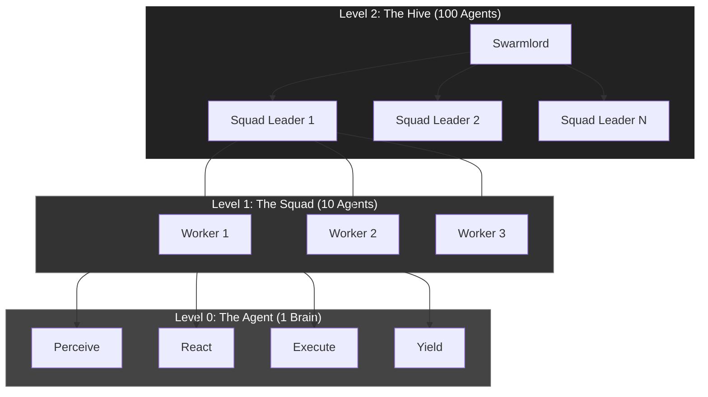
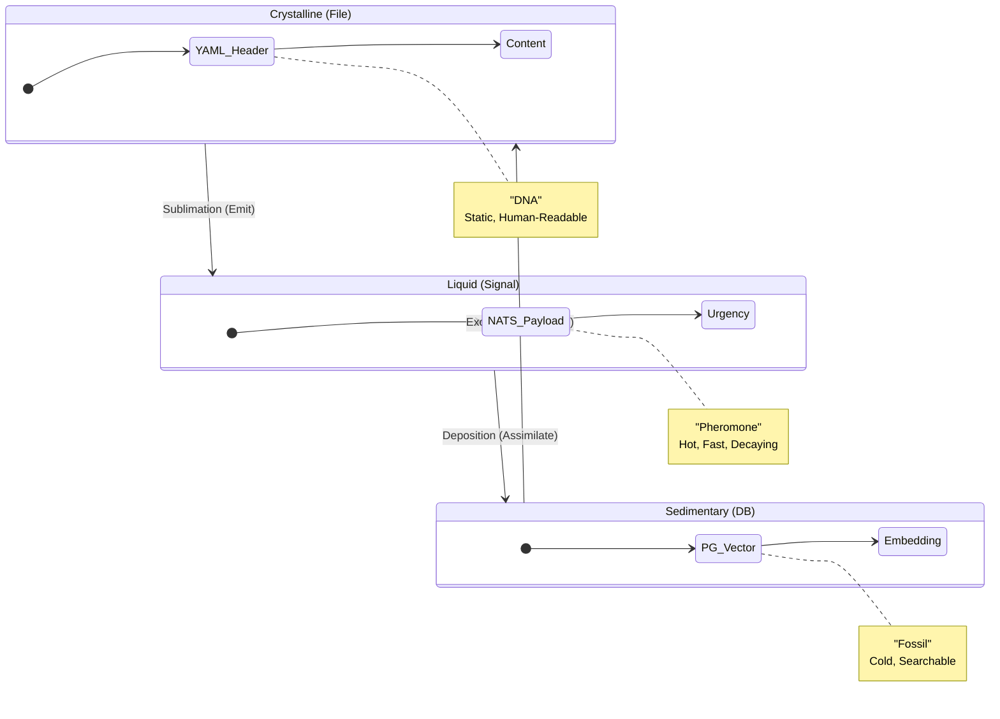
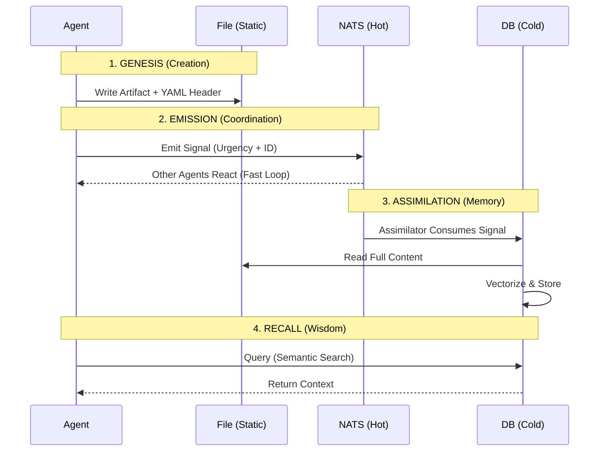

---
# ==================================================================
# 🤖 THE HEXAGON (System Generated)
# ==================================================================
hexagon:
  ontos:
    id: d7326e20-06f5-4fc4-a5b8-036f599ba4c1
    type: md
    owner: Swarmlord
  chronos:
    status: active
    urgency: 0.5
    decay: 0.5
    created: '2025-11-23T10:21:31.500838+00:00'
  topos:
    address: brain/digest_stigmergy_consensus.md
    links: []
  telos:
    viral_factor: 0.0
    meme: digest_stigmergy_consensus.md
---

# 🧠 Swarmlord Digest: The Holographic Consensus

> **Status**: Crystallized
> **Source**: 50-Agent Research Swarm (Round 2)
> **Verdict**: **Fractal Holarchy + Obsidian Facet**
> **Constraint**: Maximum Cognitive Simplicity

## 1. The Core Insight: Simplicity via Self-Similarity
The swarm rejected complex, heterogeneous systems (Active Inference, Graph Theory) in favor of **Fractal** systems.
*   **Why?** In a fractal, the **Micro** (Agent) looks exactly like the **Macro** (Swarm).
*   **Benefit**: You only need to understand **ONE** pattern to understand the entire system at any scale.

---

## 2. The Architecture: "The Holographic Hive"

### A. The Structure: Fractal Holarchy (Code)
Instead of building separate "Workers", "Managers", and "Executives", we build **Recursive Squads**.

*   **The Rule**: Every node is a "Holon"—it is a whole system to those below it, and a part to those above it.
*   **The Code**: You write the `Squad` logic once. It applies to 10 agents, or 10 squads, or 10 hives.

### B. The Data: Obsidian Facet (Memory)
Instead of managing Files vs. Signals vs. Database Rows, we use **Tri-State Metadata**.

*   **The Rule**: It is the **SAME OBJECT** (`ObsidianFacet`) in all three states.
*   **The Code**: You define the Pydantic model once. It handles the serialization for File, NATS, and Postgres automatically.

### C. The Process: The Stigmergy Loop (Time)
How the system breathes across time scales.

*   **The Rule**: Fast loops (Hot) happen in NATS. Slow loops (Cold) happen in Postgres. The File (Static) is the anchor.

---

## 3. The "Cognitive Load" Verdict

| Feature | Heterogeneous System | **Holographic System (HFO)** |
| :--- | :--- | :--- |
| **Patterns to Learn** | Many (Worker, Manager, DB, Queue) | **One** (The Holon) |
| **Data Schemas** | Many (JSON, SQL, YAML) | **One** (The Facet) |
| **Scaling Logic** | Rewrite for Scale | **Recursive** (Just add depth) |
| **Mental Model** | Complex Machine | **Biological Organism** |

### Final Recommendation
**Do not build a machine. Grow a crystal.**
Stick to the **Fractal Holarchy** for code and the **Obsidian Facet** for data. This ensures that as the system grows to 1,000,000 agents, your mental model of it remains exactly as simple as it is today.
