# 💎 Obsidian Facet V2: 4 Flavors of Stigmergy

> **BLUF**: Visualize the V2 Header applied to different domains (Ontology, Physics, Language, Quantum).
> **User Preference**: Ontology (Upstream/Intent).

## 1. The Ontological Prime (Philosophy/Intent) 🏛️
*Best for: Gherkin Features, Core Strategy, "Eternal Truths".*

```yaml
---
# 🏛️ Ontos (Being)
id: "uuid-ontos-001"
type: "intent"
title: "The Prime Directive: Intent over Implementation"
owner: "Navigator.Swarmlord"

# ⏳ Chronos (Time)
urgency: 1.0                  # Absolute Priority
decay: 0.01                   # Eternal Truth (Rots very slowly)
last_touched: "2025-11-23"

# 📍 Topos (Place)
fractal_address: "1.1.1"      # Brain -> Core -> Axioms
links:
  - { id: "uuid-body-001", rel: "governs", weight: 1.0 }
  - { id: "uuid-venom-001", rel: "constrains", weight: 0.9 }

# 🎯 Telos (Purpose)
bluf: "The 'Why' must always precede the 'How'."
meme: "Intent is King."
viral_factor: 1.0             # Pandemic (Must be known by all)
---
```

### Visual: The Ontological Graph

```mermaid
graph TD
    Prime[🏛️ Prime Directive]
    Body[💪 Implementation]
    Venom[🐍 Testing]

    Prime -->|Governs| Body
    Prime -->|Constrains| Venom

    style Prime fill:#f9f,stroke:#333,stroke-width:4px
    style Body fill:#eee,stroke:#333
    style Venom fill:#eee,stroke:#333
```


---

## 2. The Thermodynamic Engine (Physics/Work) 🔥
*Best for: Python Scripts, Tasks, "Hot" Operations.*

```yaml
---
# 🪨 Mass (Content)
id: "uuid-thermo-001"
type: "task"
title: "Scrape Vector Database"
owner: "Body.Hands.Scraper"

# 📉 Entropy (Time)
urgency: 0.8                  # High Priority Task
decay: 0.9                    # Rots instantly (Daily Task)
last_touched: "2025-11-23"

# ⚡ Field (Space)
fractal_address: "3.2.1"      # Body -> Hands -> Tools
links:
  - { id: "uuid-config-001", rel: "consumes", weight: 1.0 }
  - { id: "uuid-db-001", rel: "heats", weight: 0.8 }

# 🔋 Work (Meaning)
bluf: "Ingest 10k tokens into pgvector."
meme: "Feed the Furnace."
viral_factor: 0.2             # Low (Only relevant to workers)
---
```

### Visual: The Thermodynamic Graph
```mermaid
graph LR
    Task[🔥 Scrape Task]
    Config[⛽ Config (Fuel)]
    DB[🏭 Database (Heat)]

    Task -->|Consumes| Config
    Task -->|Heats| DB

    style Task fill:#f96,stroke:#333,stroke-width:4px
```

---

## 3. The Semiotic Sign (Linguistics/Protocol) 🗣️
*Best for: APIs, Standards, Communication Protocols.*

```yaml
---
# 🔣 Symbol (Token)
id: "uuid-semiotic-001"
type: "protocol"
title: "NATS Message Schema V1"
owner: "Body.Nerves.Bridger"

# ⏱️ Tense (Context)
urgency: 0.6                  # Standard
decay: 0.1                    # Stable Standard
last_touched: "2025-11-23"

# 🏗️ Syntax (Structure)
fractal_address: "3.1.1"      # Body -> Nerves -> Protocols
links:
  - { id: "uuid-agent-001", rel: "binds", weight: 1.0 }
  - { id: "uuid-agent-002", rel: "binds", weight: 1.0 }

# 🎭 Pragmatics (Effect)
bluf: "Defines the shape of 'hfo.signal.*' messages."
meme: "Speak the Language."
viral_factor: 0.5             # Medium (Relevant to developers)
---
```

### Visual: The Semiotic Graph

```mermaid
graph TD
    Protocol[📜 NATS Schema]
    AgentA[🤖 Agent A]
    AgentB[🤖 Agent B]

    Protocol -->|Binds| AgentA
    Protocol -->|Binds| AgentB
    AgentA -.->|Speaks| AgentB

    style Protocol fill:#99f,stroke:#333,stroke-width:4px
```


---

## 4. The Quantum State (Quantum/Research) ⚛️
*Best for: Research Notes, Hypotheses, "Maybe" Ideas.*

```yaml
---
# 📍 Eigenstate (Value)
id: "uuid-quantum-001"
type: "hypothesis"
title: "Is Active Inference Viable?"
owner: "Brain.Research.Swarmlord"

# 🌊 Coherence (Stability)
urgency: 0.4                  # Low (Curiosity)
decay: 0.5                    # Unstable (Needs proof)
last_touched: "2025-11-23"

# 🕸️ Entanglement (Links)
fractal_address: "1.5.1"      # Brain -> Research -> Ideas
links:
  - { id: "uuid-fact-001", rel: "superposed_with", weight: 0.5 }
  - { id: "uuid-fact-002", rel: "entangled_with", weight: 0.5 }

# 🎲 Wavefunction (Prob)
bluf: "Exploring Friston's Free Energy Principle."
meme: "Minimize Surprise."
viral_factor: 0.9             # High (Contagious Idea)
---
```

### Visual: The Quantum Graph

```mermaid
graph TD
    Hypothesis[❓ Active Inference?]
    FactA[📄 Fact A]
    FactB[📄 Fact B]

    Hypothesis -.->|Superposed| FactA
    Hypothesis -.->|Entangled| FactB

    style Hypothesis fill:#d8f,stroke:#333,stroke-width:4px,stroke-dasharray: 5 5
```

