# 🏛️ Hive Fleet Obsidian: File Structure Governance (Hybrid Protocol)

> **Status**: Draft (Paused for Stigmergy Research)
> **Context**: Combines "The Holocron" (Central Registry) with "The Pheromone" (Stigmergic Headers) to eliminate "aislop" and enable emergent organization.

## 🦅 Executive Summary

This architecture implements a **"Trust but Verify"** system for file management within the Hive.
1.  **The Spine (Static)**: A central `intent/registry.yaml` defines the *allowed* shape of the Hive.
2.  **The Signal (Dynamic)**: Every file carries a **Stigmergic Header** (YAML frontmatter) defining its intent and owner.
3.  **The Immune System**: Three layers of "Immunizer" agents enforce these rules, ensuring that entropy (aislop) is detected and neutralized immediately.

---

## 🧩 The Three Pillars

### 1. The Holocron (Registry Spine)
*   **Location**: `intent/registry.yaml`
*   **Purpose**: The Single Source of Truth (SSOT) for directory structure.
*   **Rule**: If a directory isn't in the Holocron, it doesn't exist. Agents cannot create new root-level folders without updating the Holocron first.

### 2. The Pheromone (Stigmergic Headers)
*   **Location**: Top of every file (Markdown, Python, etc.).
*   **Purpose**: Self-describing metadata for emergent organization.
*   **Format**:
    ```yaml
    # ---
    # type: agent_logic | memory_node | intent_def
    # domain: ingestion | core | research
    # owner: Swarmlord | Observer
    # status: active | archive | draft
    # ---
    ```

### 3. The Immunizers (Guardians)
*   **🛡️ Pre-Commit Guard (Static)**: Runs on `git commit`. Rejects files missing headers or violating the Registry.
*   **🛡️ Active Hive Guard (Runtime)**: A background daemon (Temporal Workflow). Scans the drive every 5 minutes. Moves "aislop" (files in root or wrong folders) to a `quarantine/` folder.
*   **🛡️ Gatekeeper (Agent Tool)**: The `create_file` tool itself checks the Registry before writing.

---

## 📊 Visualizations

### Diagram 1: The Governance Architecture
*How the components interact to maintain order.*

```mermaid
graph TD
    subgraph "The Law (Intent)"
        Holocron[("📜 Holocron\n(intent/registry.yaml)")]
    end

    subgraph "The Wild (Implementation)"
        FileA["📄 File A\n(Has Header)"]
        FileB["📄 File B\n(No Header)"]
        FileC["📄 File C\n(Wrong Folder)"]
    end

    subgraph "The Immune System"
        Gatekeeper{"🛡️ Gatekeeper\n(Tool Level)"}
        ActiveGuard(("🛡️ Active Guard\n(Daemon)"))
        StaticGuard["🛡️ Static Guard\n(Git Hook)"]
    end

    %% Creation Flow
    Agent[("🤖 Agent")] -->|Attempts Write| Gatekeeper
    Gatekeeper -->|Check| Holocron
    Gatekeeper -->|Allowed| FileA
    Gatekeeper -->|Blocked| Agent

    %% Cleaning Flow
    ActiveGuard -->|Scans| FileA
    ActiveGuard -->|Scans| FileB
    ActiveGuard -->|Scans| FileC

    FileA -->|Valid| Safe[("✅ Validated")]
    FileB -->|Invalid| Quarantine[("☣️ Quarantine")]
    FileC -->|Invalid| Quarantine

    %% Commit Flow
    User((User)) -->|Commit| StaticGuard
    StaticGuard -->|Check Headers| FileA
    StaticGuard -->|Reject| FileB
```



### Diagram 2: The Lifecycle of a File
*From Agent intent to permanent storage.*

```mermaid
sequenceDiagram
    participant Agent
    participant Tool as 🛠️ FileTool
    participant Registry as 📜 Registry
    participant FS as 📂 FileSystem
    participant Guard as 🛡️ ActiveGuard

    Note over Agent, Registry: Phase 1: Creation (Prevention)
    Agent->>Tool: create_file("src/new_logic.py")
    Tool->>Registry: Validate Path Allowed?
    alt Path Invalid
        Registry-->>Tool: ❌ Denied (Not in Holocron)
        Tool-->>Agent: Error: Path forbidden.
    else Path Valid
        Registry-->>Tool: ✅ Approved
        Tool->>FS: Write File
    end

    Note over FS, Guard: Phase 2: Maintenance (Cure)
    loop Every 5 Minutes
        Guard->>FS: Scan Files
        FS-->>Guard: File List
        Guard->>Guard: Check Stigmergic Headers
        alt Header Missing
            Guard->>FS: Move to /quarantine/no_header/
        else Wrong Domain
            Guard->>FS: Move to /quarantine/drift/
        end
    end
```



### Diagram 3: The Stigmergic Header Spec
*The DNA of a file.*


