# 🧠 Cognitive Scaffolding: Understanding the Obsidian Facet V2

> **Goal**: Move beyond "Hot/Cold" into "Living/Holographic" mental models.
> **Core Concept**: The YAML Header is not just metadata; it is the **Soul** of the file.

## 🧠 BLUF (Bottom Line Up Front)
We use three analogies to explain the V2 Header:
1.  **The RPG Item** (Gamification): Stats, Durability, and Set Bonuses.
2.  **The Biological Cell** (Systems): DNA, ATP, and Receptors.
3.  **The Radioactive Isotope** (Physics): Half-life, Radiation, and Lattice.

---

## 1. The RPG Item Analogy (Gamification) ⚔️
*Imagine every file is a Legendary Item in an inventory.*

| Facet Component | RPG Equivalent | Intuition |
| :--- | :--- | :--- |
| **Crystal** (`id`, `type`) | **Name & Class** | "Thunderfury, Blessed Blade of the Windseeker". It is unique. |
| **Mountain** (`urgency`, `decay`) | **Durability & DPS** | If you don't repair it (`last_touched`), it breaks. High DPS (`urgency`) means you equip it often. |
| **Web** (`links`, `fractal_address`) | **Set Bonus** | "Part of the Obsidian Set (1/5)". It knows it belongs to a greater whole. |
| **Virus** (`meme`, `viral_factor`) | **Curse/Enchantment** | "Radiates 10 Holy Damage". It affects things around it automatically. |

> **The Shift**: In V1, files were just "Loot". In V2, they have **Durability** (Decay) and **Auras** (Viral Factor).

### Visual: The Legendary Item
```mermaid
graph TD
    Item[⚔️ Thunderfury (File)]
    Stats[📊 Stats (Mountain)]
    Set[🛡️ Set Bonus (Web)]
    Aura[✨ Aura (Virus)]

    Item --> Stats
    Item --> Set
    Item --> Aura

    Stats -->|Decay| Broken[💔 Broken Item]
    Set -->|Link| Other[🛡️ Other Set Items]
    Aura -->|Viral| Player[🧑 Player Attention]
```

---

## 2. The Biological Cell Analogy (Living System) 🦠
*Imagine every file is a Cell in the Hive Body.*

| Facet Component | Biological Equivalent | Intuition |
| :--- | :--- | :--- |
| **Crystal** | **Nucleus** | Contains the identity. Immutable. |
| **Mountain** | **ATP / Telomeres** | The energy level. If it hits zero, the cell undergoes apoptosis (Archiving). |
| **Web** | **Receptors** | How it signals neighbors. `fractal_address` is its tissue type (e.g., "Liver Cell"). |
| **Virus** | **mRNA / Pheromones** | The signal it pumps out. High `viral_factor` means it's screaming "DANGER" or "FOOD". |

> **The Shift**: In V1, files were "Dead Tissue". In V2, they are **Metabolizing** (Decaying) and **Signaling** (Viral).

### Visual: The Living Cell

```mermaid
graph LR
    Cell((🦠 Cell))
    Nucleus((🧬 Nucleus))
    ATP[⚡ ATP Level]
    Receptor[📡 Receptor]
    Signal[📢 Pheromone]

    Cell --> Nucleus
    Cell --> ATP
    Cell --> Receptor
    Cell --> Signal

    ATP -->|Low| Apoptosis[💀 Death/Archive]
    Receptor -->|Bind| Neighbor((🦠 Neighbor))
    Signal -->|High Viral| Swarm[🐝 Swarm]
```


---

## 3. The Radioactive Isotope Analogy (Physics) ☢️
*Imagine every file is an atom in a reactor.*

| Facet Component | Physics Equivalent | Intuition |
| :--- | :--- | :--- |
| **Crystal** | **Proton Count** | Defines the element (e.g., Uranium-235). |
| **Mountain** | **Half-Life** | `decay` is literally the half-life. Unstable ideas rot fast; stable truths last forever. |
| **Web** | **Covalent Bonds** | How it holds onto other atoms. `fractal_address` is its position in the crystal lattice. |
| **Virus** | **Radiation** | The energy it emits. High `viral_factor` = High Sieverts. It "burns" if you get too close (demands attention). |

> **The Shift**: In V1, files were "Inert Matter". In V2, they are **Radiating** information into the NATS stream.

### Visual: The Reactor

```mermaid
graph TD
    Atom((☢️ Atom))
    Decay[📉 Half-Life]
    Bond[🔗 Bond]
    Rad[🔥 Radiation]

    Atom --> Decay
    Atom --> Bond
    Atom --> Rad

    Decay -->|Stable| Lead[🪨 Lead/Archive]
    Bond -->|Structure| Crystal[💎 Crystal Lattice]
    Rad -->|Heat| Reactor[🏭 Reactor Core]
```


---

## 4. The Holographic Principle 🌈
*Why "Fractal Address"?*

In a normal photograph, if you cut it in half, you lose half the image.
In a **Hologram**, if you cut it in half, **each half still contains the whole image** (just blurrier).

*   **Normal File**: `design.md`. If you lose the folder `brain/`, you don't know where this goes.
*   **Holographic File**: `fractal_address: 1.4.2`. Even if this file is floating alone in the void, it knows:
    1.  I am part of the **Brain** (1).
    2.  I am inside **Architecture** (4).
    3.  I am a **Stigmergy** component (2).

**This allows the Hive to "Heal" the directory structure from the files themselves.**
