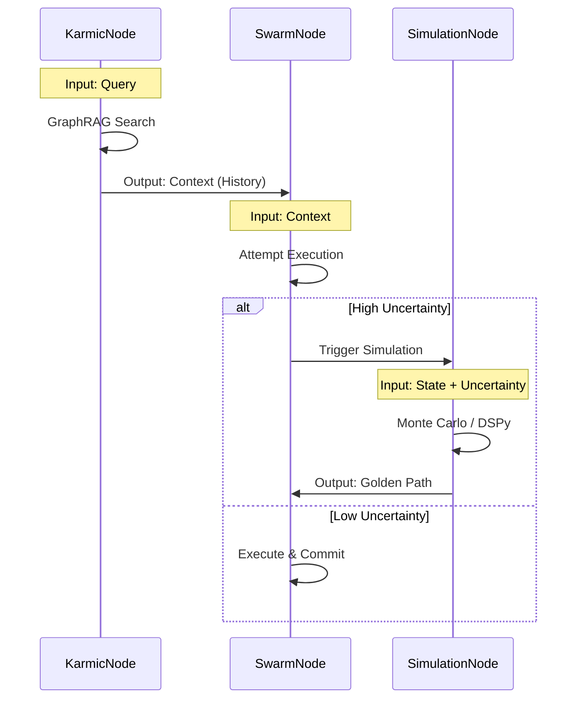
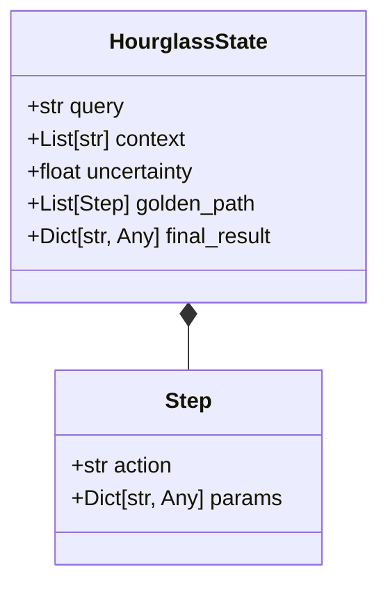

# 🛠️ Implementation: Obsidian Horizon Hourglass (LangGraph)

## ⚡ BLUF
This document maps the **Geometric Spatial State-Action Model** to a concrete **LangGraph** implementation. The 3D cones become Nodes, and the "Flip" becomes a conditional edge transition. It uses a recursive graph structure where the "Future" node can spawn sub-graphs for simulation.

---

## 1. The Graph Architecture

The high-level flow of the Hourglass within LangGraph.

```mermaid
graph TD
    Start([Start]) --> KarmicNode
    KarmicNode[Karmic Node (Past)] -->|Context| SwarmNode
    SwarmNode[Swarm Node (Present)] -->|Uncertainty > Threshold| SimulationNode
    SwarmNode -->|Uncertainty < Threshold| End([End])
    SimulationNode[Simulation Node (Future)] -->|Golden Path| SwarmNode

    style KarmicNode fill:#f9f,stroke:#333
    style SwarmNode fill:#bfb,stroke:#333
    style SimulationNode fill:#bbf,stroke:#333
```

## 2. Node Logic & Data Flow

How data transforms as it moves through the Hourglass.



## 3. State Management (Pydantic)

The `HourglassState` object that persists across the graph.



## 💻 Code Structure (Draft)

```python
from langgraph.graph import StateGraph, END
from typing import TypedDict, List

class HourglassState(TypedDict):
    query: str
    context: List[str]
    uncertainty: float
    golden_path: List[str]
    final_result: str

def karmic_node(state: HourglassState):
    # Z < 0: Retrieve from GraphRAG
    print("🔻 Gravity: Pulling from Karmic Web...")
```
    return {"context": ["Precedent A", "Precedent B"]}

def swarm_node(state: HourglassState):
    # Z = 0: Execute in Neck
    if state.get("golden_path"):
        print("⚡ Executing Golden Path from Future...")
        return {"final_result": "Success via Flip"}

    print("⚡ Executing Standard Path...")
    # Simulate uncertainty check
    if state["uncertainty"] > 0.8:
        return {"uncertainty": 0.9} # Trigger Flip
    return {"final_result": "Success via Gravity"}

def simulation_node(state: HourglassState):
    # Z > 0: Monte Carlo Simulation
    print("🔺 The Flip: Simulating Future Timelines...")
    # ... DSPy logic here ...
    return {"golden_path": ["Step 1", "Step 2"], "uncertainty": 0.0}

# The Graph
workflow = StateGraph(HourglassState)
workflow.add_node("karmic_web", karmic_node)
workflow.add_node("swarm_web", swarm_node)
workflow.add_node("simulation_web", simulation_node)

workflow.set_entry_point("karmic_web")

workflow.add_edge("karmic_web", "swarm_web")

def check_flip(state):
    if state["uncertainty"] > 0.8:
        return "flip"
    return "end"

workflow.add_conditional_edges(
    "swarm_web",
    check_flip,
    {
        "flip": "simulation_web",
        "end": END
    }
)

workflow.add_edge("simulation_web", "swarm_web") # Collapse back to Present
```

## 🔄 Next Steps
1.  Implement `body/hands/hourglass_graph.py` using this template.
2.  Connect `KarmicNode` to `memory/semantic/library`.
3.  Connect `SimulationNode` to `dspy` module.
