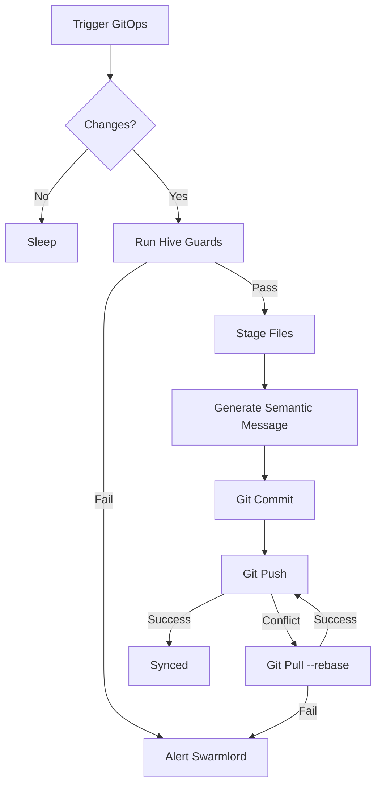
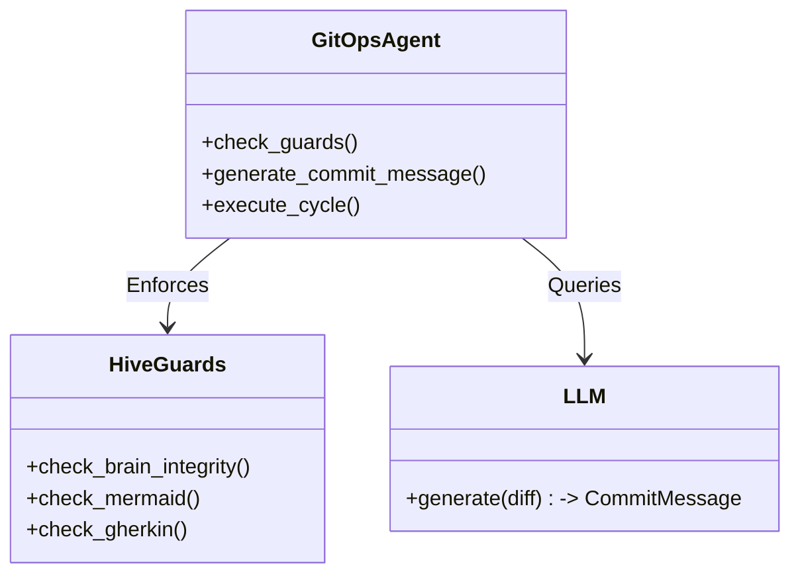
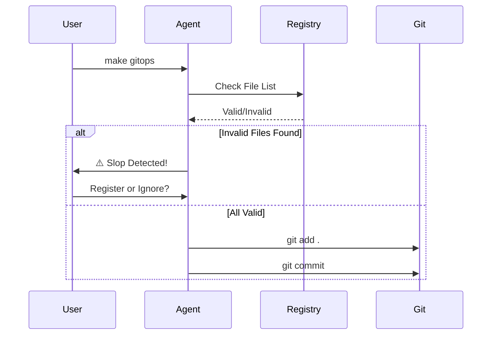

# 🔄 GitOps Automation Protocol

## ⚡ BLUF (Bottom Line Up Front)
The **GitOps Automation Protocol** replaces brittle Makefiles with an intelligent **GitOps Agent**. This agent enforces **Hive Guards** (linting, tests, integrity checks) before every commit, uses LLMs to generate **Semantic Commit Messages**, and implements a **Resilient Push Strategy** (Rebase/Retry) to ensure the Hive stays synchronized with the Cloud. It is the immune system of the repository's history.

## 📊 Protocol Matrix

| Component | Requirement | Implementation | Failure Consequence |
| :--- | :--- | :--- | :--- |
| **Pre-Commit** | Must pass `make guards` | `GitOpsAgent.check_guards()` | Commit Aborted |
| **Message** | Conventional Commits (feat/fix/etc) | `GitOpsAgent.generate_message()` | Fallback to generic message |
| **Sync** | Rebase on conflict | `GitOpsAgent.push_with_resilience()` | Manual intervention required |
| **Slop** | No unregistered files | `GitOpsAgent.scan_slop()` | Warning / Abort |

## 🧠 Protocol Visualization

### View 1: The GitOps Cycle
*The standard operating procedure for code synchronization.*

### View 2: The Agent Architecture
*How the GitOps Agent is constructed.*

### View 3: The Slop Defense
*Preventing unauthorized or low-quality code from entering the history.*

