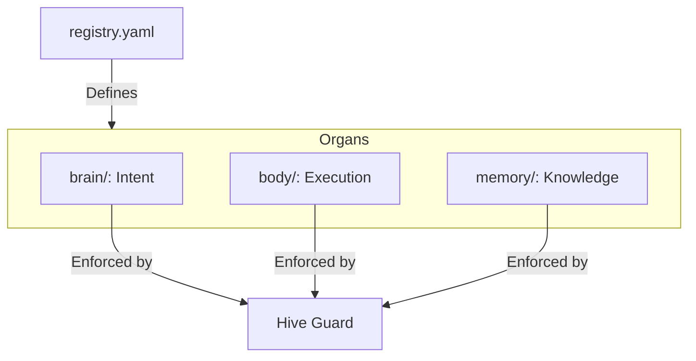
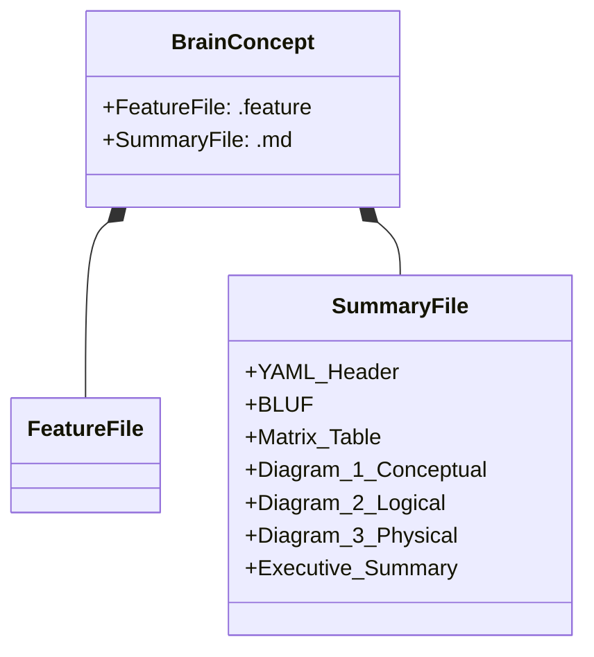
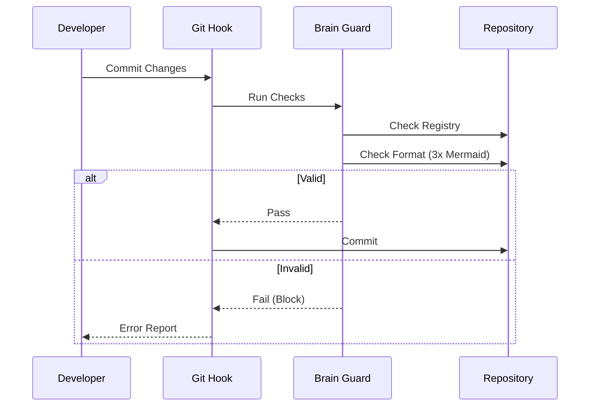

# 📜 Holonic File Governance

## ⚡ BLUF (Bottom Line Up Front)
The **Holocron** (`brain/registry.yaml`) is the absolute law of the Hive. If a file is not registered, it is "Slop" and will be purged. All Brain concepts must follow the **Swarmlord of Webs** format: Gherkin for Intent, and a rich Markdown document (YAML + BLUF + Matrix + 3xMermaid) for Visualization.

## 📊 Governance Matrix

| Component | Requirement | Enforcer | Failure Consequence |
| :--- | :--- | :--- | :--- |
| **Registry** | All files must be listed in `registry.yaml` or `concepts.yaml` | `guard_brain.py` | File is flagged as Slop |
| **Intent** | Every concept needs a `.feature` file | `guard_brain.py` | Concept marked Invalid |
| **Visuals** | Every concept needs a `.md` with 3+ Mermaid diagrams | `guard_brain.py` | Concept marked Invalid |
| **Header** | YAML Frontmatter with Status/Domain | `guard_brain.py` | Metadata extraction fails |

## 🧠 Concept Visualization

### View 1: The Holocron Hierarchy
*This diagram shows the relationship between the Registry and the Organs.*

### View 2: The Swarmlord of Webs Format
*This diagram illustrates the required structure of a Brain Concept.*

### View 3: The Governance Flow
*This sequence diagram shows how the Immunizer enforces the rules.*

## 🦅 Executive Summary
Hive Fleet Obsidian (Gen 51) operates on **Intent-Based Engineering**. This means the "Brain" is not just a folder of notes; it is a compiled database of requirements.

To ensure this database remains high-quality, we enforce **Holonic File Governance**.
1.  **The Registry**: `brain/registry.yaml` and `brain/concepts.yaml` act as the "DNA" of the project. If a file isn't in the DNA, it's a tumor.
2.  **The Format**: We demand high-density information. Text is cheap; Diagrams and Matrices are valuable. The **Swarmlord of Webs** format ensures that every concept is viewed from multiple angles (Conceptual, Logical, Physical) before it is accepted.
3.  **The Guard**: The `guard_brain.py` script is the immune system. It ruthlessly blocks commits that don't meet these standards.
