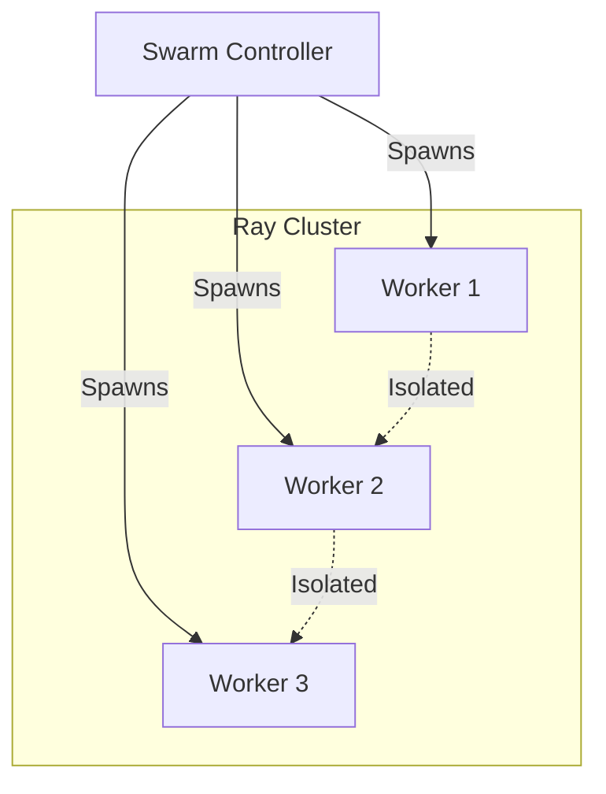
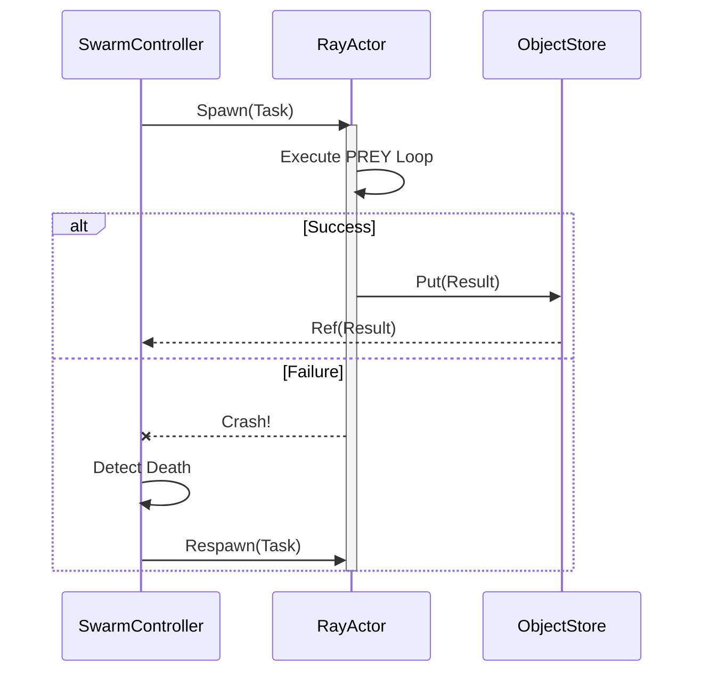
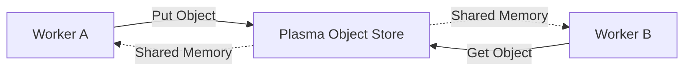

# 🐍 Hydra Protocol: Technical Specification

## ⚡ BLUF (Bottom Line Up Front)
The **Hydra Protocol** is the technical implementation of the Antifragile Strategy. It leverages **Ray Actors** to provide process isolation, distributed state management, and automatic supervision. It is the "Muscle" of the Hive, allowing it to execute thousands of concurrent tasks without a single point of failure.

## 📊 Tech Stack Matrix

| Component | Technology | Role |
| :--- | :--- | :--- |
| **Compute** | Ray Core | Distributed Actor Management |
| **State** | Ray Object Store | Shared Memory (Zero-Copy) |
| **Language** | Python 3.10+ | Logic Execution |
| **Supervision** | Ray Dashboard | Monitoring & Metrics |

## 🧠 Concept Visualization

### View 1: The Actor Model (Conceptual)
*Isolated units of state and computation.*

### View 2: The Supervision Tree (Logical)
*How the Controller manages the Workers.*

### View 3: Distributed Object Store (Physical)
*Zero-copy memory sharing.*

## 🦅 Executive Summary
The **Hydra Protocol** is implemented using **Ray Actors**. Each agent is an isolated process.
*   **Supervision**: A `SwarmController` monitors worker health.
*   **Regeneration**: Failed actors are killed and respawned.
*   **Parallelism**: True concurrent execution via Ray's distributed object store.
