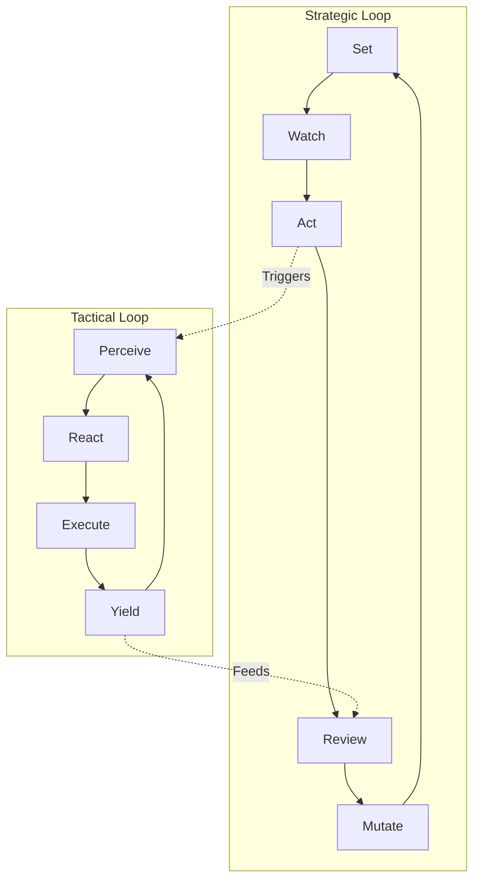
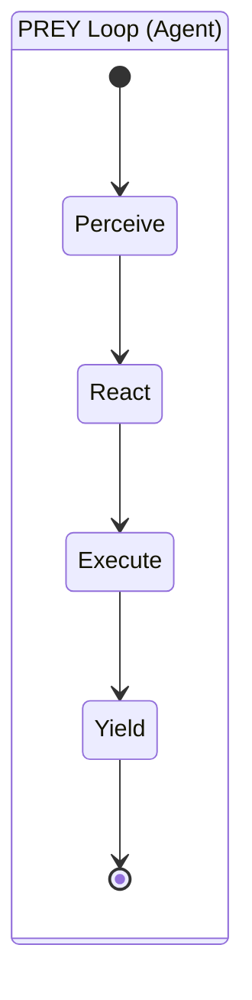
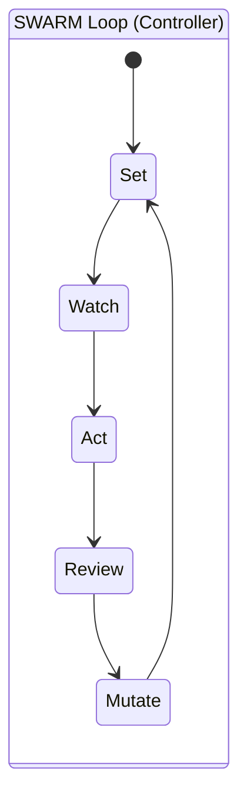

# 🔄 Cognitive Loops: PREY & SWARM

## ⚡ BLUF (Bottom Line Up Front)
Hive Fleet Obsidian operates on two primary cognitive loops. The **PREY Loop** (Perceive-React-Execute-Yield) is the tactical OODA loop for individual agents. The **SWARM Loop** (Set-Watch-Act-Review-Mutate) is the strategic loop for Squads and Swarms. These loops are nested: a SWARM loop orchestrates multiple PREY loops.

## 📊 Loop Comparison Matrix

| Feature | PREY Loop | SWARM Loop |
| :--- | :--- | :--- |
| **Level** | Atomic (L0) | Holonic (L1+) |
| **Timeframe** | Seconds | Minutes/Hours |
| **Focus** | Task Execution | Coordination & Strategy |
| **Output** | Artifacts | Directives |
| **Analogue** | Reflexes | Planning |

## 🧠 Concept Visualization

### View 1: The Nested Loops (Conceptual)
*The Swarm Loop drives the Prey Loop.*

### View 3: The Canonical SWARM Workflow (Implementation)
*The specific "1-1-1-N-N-1" flow for the Research Swarm.*

1.  **User (1)**: Provides the Mission Intent.
2.  **Set (1)**: **Navigator** breaks Mission into $N$ Tasks.
3.  **Watch (1)**: **Observer** validates the Plan.
4.  **Act (N)**: **Shapers/Disruptors** execute Tasks in parallel (Map).
5.  **Review (N)**: **Immunizer Council** (Size $N$) reviews Findings and synthesizes Digest (Reduce).
6.  **Mutate (1)**: **Evolutionary Forge** optimizes Prompts/State based on Digest.
7.  **Output**: 1 Intent + 1 Digest Artifact saved in Memory.

### View 2: The PREY State Machine (Logical)
*The internal logic of a single agent.*

### View 3: The SWARM State Machine (Logical)
*The internal logic of a controller.*

## 🦅 Executive Summary
HFO uses two distinct cognitive loops depending on the level of the Fractal Holarchy.
1.  **PREY Loop** (Atomic): Fast, tactical, tool-using.
2.  **SWARM Loop** (Holonic): Slow, strategic, orchestrating.
