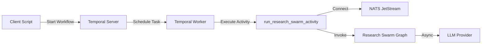
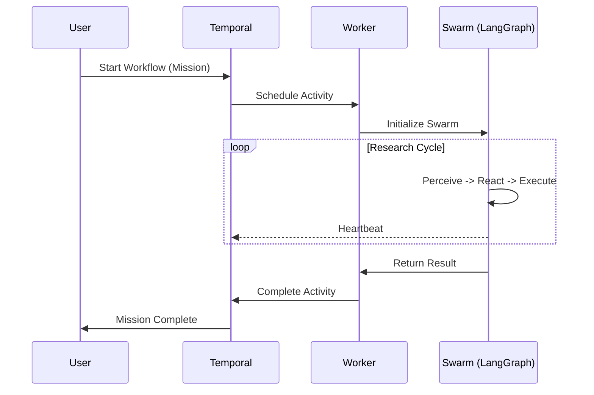
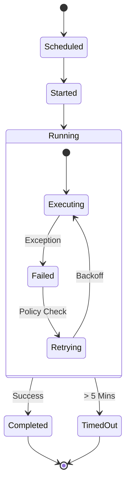

# ⏳ Temporal Orchestration (The Backbone)

## ⚡ BLUF (Bottom Line Up Front)
**Temporal.io** provides the **Durable Execution Layer** for Hive Fleet Obsidian. It wraps the fragile, probabilistic LangGraph logic in a deterministic, retry-safe envelope. This ensures that long-running missions (hours/days) survive process crashes, network blips, and API timeouts without losing state.

## 📊 Matrix: Orchestration Roles

| Component | Role | Responsibility | Failure Mode |
| :--- | :--- | :--- | :--- |
| **Workflow** | **Conductor** | Defines policy (Retries, Timeouts) and sequence. | **Deterministic**: Replays history to restore state. |
| **Activity** | **Musician** | Executes "dirty" code (NATS, API, Files). | **Idempotent**: Can be retried safely. |
| **Worker** | **Stage** | Provides compute resources for execution. | **Replaceable**: If it dies, another takes over. |
| **Client** | **Audience** | Triggers workflows and queries results. | **Decoupled**: Can disconnect and reconnect later. |

## 🏗️ Architecture

### 1. The Wrapper Pattern (Structural)
We do not rewrite the LangGraph logic. We **wrap** it.

### 2. Execution Flow (Sequence)
How a mission flows from intent to completion.

### 3. Failure Recovery (State Machine)
How the system handles chaos.

## 🛡️ Stabilization Guarantees

*   **Retries**: If NATS fails or the LLM times out, Temporal retries the Activity (up to 3 times).
*   **Timeouts**: If the Swarm hangs for >5 minutes, Temporal kills it.
*   **Async**: Fully non-blocking `asyncio` implementation to ensure high throughput.

## 📋 Implementation Details

*   **File**: `body/temporal/swarm_workflow.py`
*   **Queue**: `research-swarm-queue`
*   **Config**: Uses `Config.TEMPORAL_ADDRESS` from SSOT.
