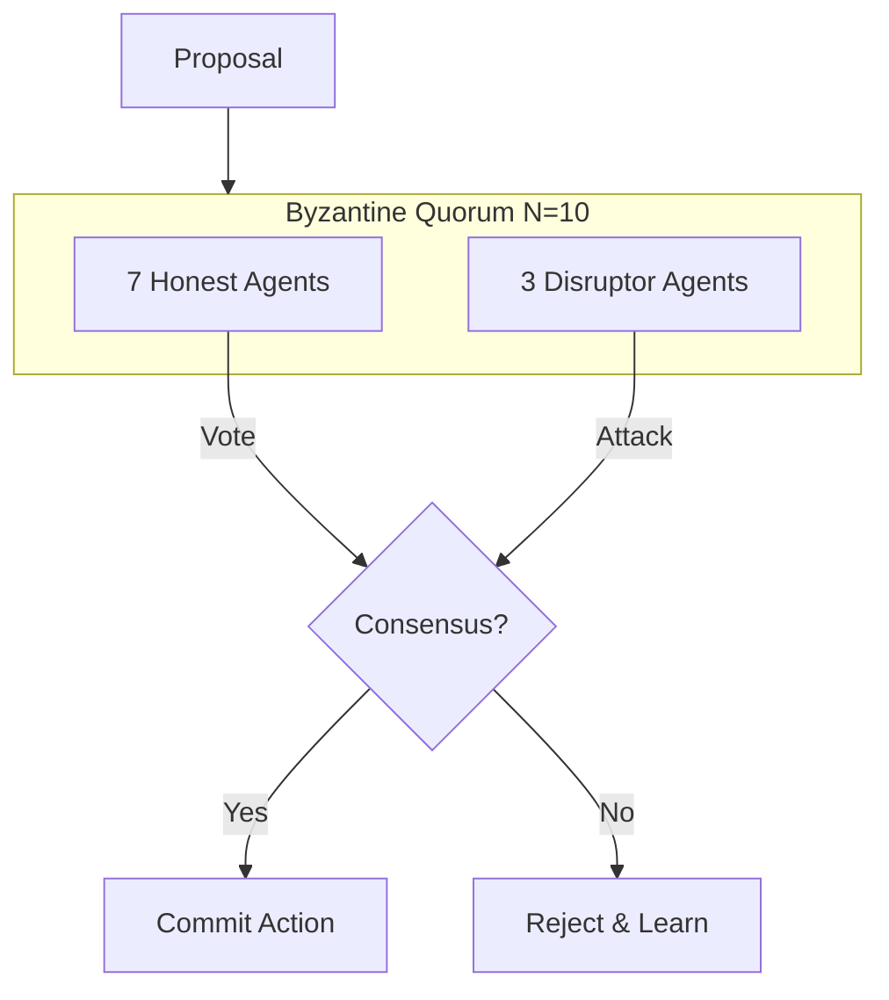
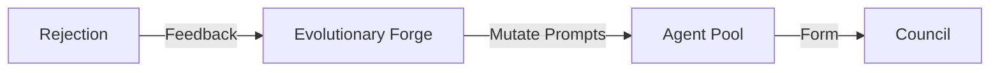
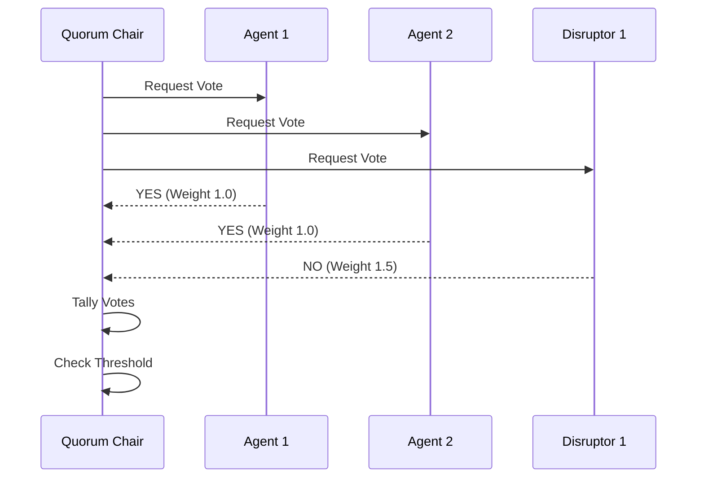

# 🛡️ Trust Engine: Byzantine Quorum

## ⚡ BLUF (Bottom Line Up Front)
The **Trust Engine** is the immune system of the Hive's logic. It assumes that any single agent can be wrong, hallucinating, or malicious. By employing a **Byzantine Quorum** ($N=3f+1$), we ensure that the truth emerges from the consensus of multiple agents, including adversarial **Disruptors** who actively try to break the system.

## 📊 Trust Matrix

| Component | Formula | Description |
| :--- | :--- | :--- |
| **Quorum Size** | $N=3f+1$ | Minimum agents needed to tolerate $f$ failures. |
| **Disruptors** | $f$ | Agents programmed to attack/critique. |
| **Consensus** | $2f+1$ | Votes needed to carry a motion. |
| **Evolution** | MAP-Elites | Optimization of agent prompts based on success. |

## 🧠 Concept Visualization

### View 1: The Council (Conceptual)
*Truth through conflict.*

### View 2: The Evolutionary Loop (Logical)
*Failure drives improvement.*

### View 3: The Voting Mechanism (Physical)
*Weighted voting logic.*

## 🦅 Executive Summary
The **Trust Engine** ensures the Hive is not an echo chamber.
*   **Byzantine Quorum**: $N=3f+1$. For $N=10$, we tolerate $f=3$ traitors/disruptors.
*   **Disruptors**: Agents explicitly programmed to find flaws (Red Team).
*   **Evolution**: MAP-Elites (Quality-Diversity) optimizes the swarm over time.
