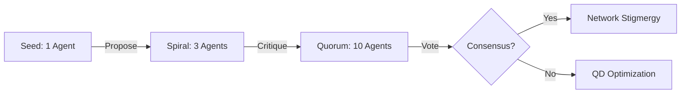
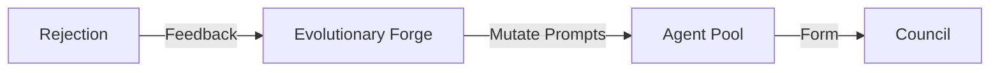
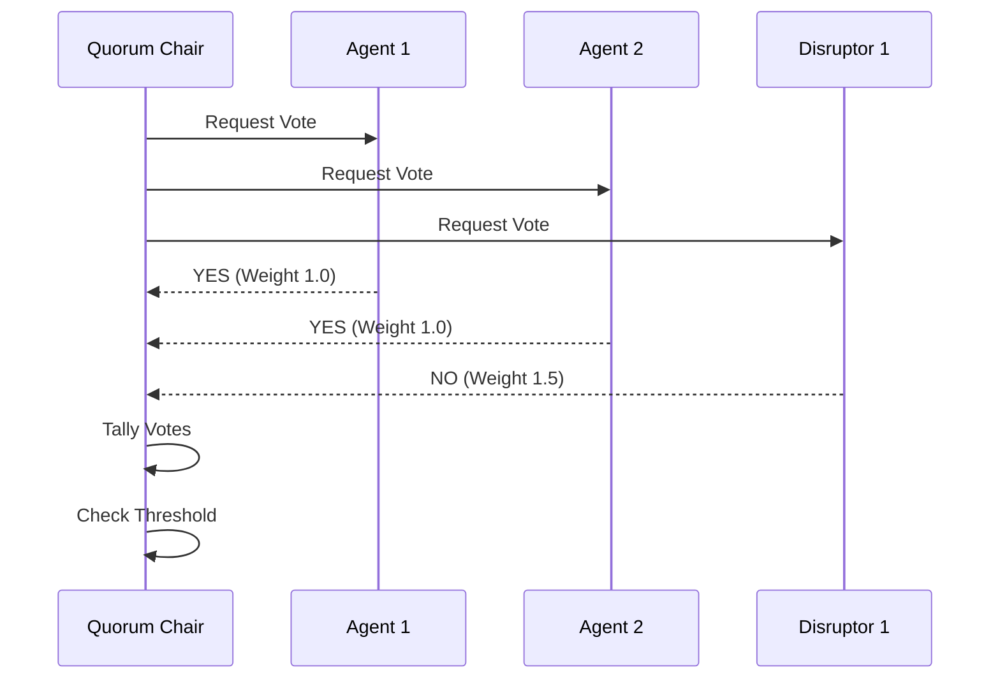

# 🛡️ Trust Engine: Holonic Byzantine Quorum

## ⚡ BLUF (Bottom Line Up Front)
The **Trust Engine** has evolved into a **Network Stigmergy Hierarchical Holonic Fractal Adversarial Byzantine Quorum**. It combines:
1.  **Network Stigmergy**: Indirect coordination via NATS.
2.  **Fractal Holarchy**: Recursive L0/L1/L2 loops.
3.  **Adversarial Consensus**: $N=3f+1$ tolerance with active Red Teaming.
4.  **Co-Evolution**: **QD Optimization (MAP-Elites)** drives meta-evolution of the swarm's DNA.

## 🌀 The Algorithm: V²C-SPIRAL-QUORUM
To achieve consensus in this complex system, we use the **V²C-SPIRAL-QUORUM** mechanism:
1.  **Seed (1 Agent)**: A single agent proposes a solution.
2.  **Spiral (3 Agents)**: Two reviewers (one potentially adversarial) critique the seed.
3.  **Quorum (10 Agents)**: If the Spiral holds, it expands to a full Byzantine Council ($N=10, f=3$).
4.  **Hidden Injection**: In Round 1, Disruptors are hidden. In Round 2, they reveal and attack.
5.  **Crystallization**: If $2f+1$ agree after the attack, the memory is written to the Stigmergy Layer.

## 📊 Trust Matrix

| Component | Formula | Description |
| :--- | :--- | :--- |
| **Quorum Size** | $N=3f+1$ | Minimum agents needed to tolerate $f$ failures. |
| **Disruptors** | $f$ | Agents programmed to attack/critique. |
| **Consensus** | $2f+1$ | Votes needed to carry a motion. |
| **Evolution** | MAP-Elites | **QD Optimization** of agent prompts based on success. |

## 🧠 Concept Visualization

### View 1: The Spiral Quorum (Conceptual)
*From Seed to Swarm.*

### View 2: The Evolutionary Loop (Logical)
*Failure drives improvement via MAP-Elites.*

### View 3: The Voting Mechanism (Physical)
*Weighted voting logic.*

## 🦅 Executive Summary
The **Trust Engine** ensures the Hive is not an echo chamber.
*   **Byzantine Quorum**: $N=3f+1$. For $N=10$, we tolerate $f=3$ traitors/disruptors.
*   **Disruptors**: Agents explicitly programmed to find flaws (Red Team).
*   **Evolution**: MAP-Elites (Quality-Diversity) optimizes the swarm over time.
