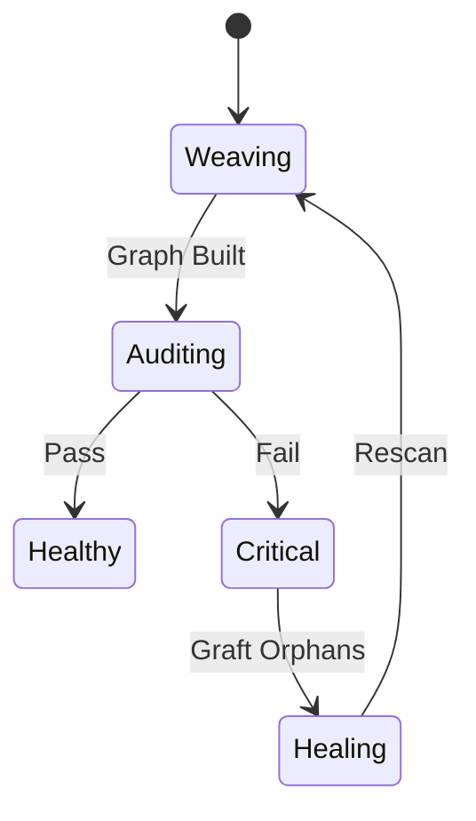

---
hexagon:
  ontos:
    id: 811942fc-9174-4aef-a06a-9cbb627cc76b
    type: md
    owner: Swarmlord
  chronos:
    status: active
    urgency: 0.5
    decay: 0.5
    created: '2025-11-23T11:07:35.305728Z'
    generation: 51
  topos:
    address: brain/mission_audit_weave.md
    links: []
  telos:
    viral_factor: 0.0
    meme: mission_audit_weave.md
---
---
title: Mission: Audit & Weave
status: Active
domain: Memory
owners: [Swarmlord]
type: Mission

# ==================================================================
# 🤖 THE HEXAGON (System Generated)
# ==================================================================
hexagon:
  ontos:
    id: 3b4a025e-1e78-4248-a795-ead395c9e1dc
    type: md
    owner: Swarmlord
  chronos:
    status: active
    urgency: 0.5
    decay: 0.5
    created: '2025-11-23T10:21:31.467944+00:00'
  topos:
    address: brain/mission_audit_weave.md
    links: []
  telos:
    viral_factor: 0.0
    meme: mission_audit_weave.md

---

# 🕸️ Mission: Audit & Weave

## ⚡ BLUF
A mission to weave the individual memory crystals into a cohesive Knowledge Graph and audit the result.

## 🧬 Intent
*   **Input**: `memory/semantic/library/`
*   **Output**: `memory/semantic/knowledge_graph.json`
*   **Auditor**: Consensus Council

## 📊 Visualization

```mermaid
graph TD
    Library[Library] -->|Scan| Weaver[Weaver Ant]
    Weaver -->|Build| Graph[Knowledge Graph]
    Graph -->|Audit| Council[Consensus Council]
    Council -->|Verdict| Report[Audit Report]

### 🔄 Sequence

```mermaid
sequenceDiagram
    participant W as Weaver
    participant G as Graph
    participant C as Council

    W->>G: Build Nodes/Edges
    G-->>C: Provide Stats
    C->>C: Analyze Health
    C->>W: Issue Directives
```

### ⚙️ State Machine


```
