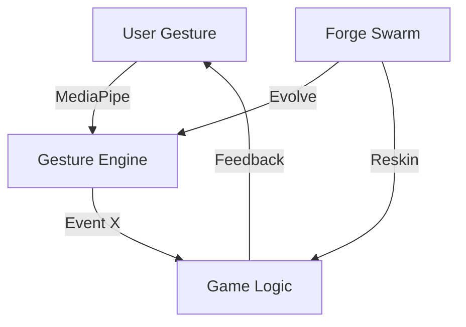
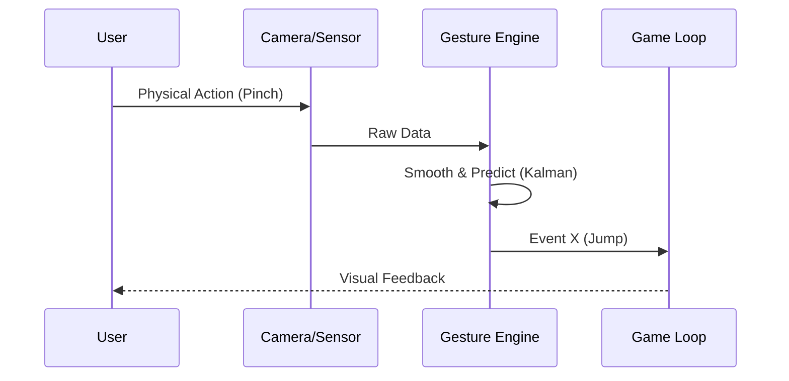
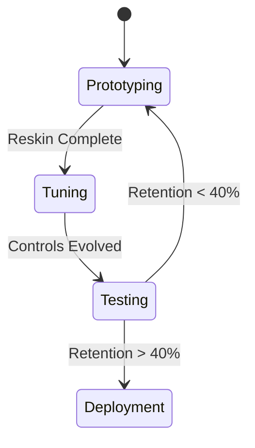

# 🎮 Mission: Gesture Game Forge

## ⚡ BLUF
A factory for rapid prototyping of Hypercasual Games powered by high-fidelity Gesture HCI (MediaPipe). Goal: Simplicity, Composability, and eventual Tool Virtualization.

## 🧬 Intent
*   **Core Philosophy**: "Simplicity and Composability".
*   **Immediate Goal**: Simple mechanical games with super well-tuned gesture controls (Pinch, Grab, Slide).
*   **Future Goal**: Total Tool Virtualization (The "Virtual Piano" leads to the "Virtual Lathe").
*   **Strategy**: Reskin open-source games + Evolutionary Tuning of controls.

## 📊 Visualization

### 🔄 Sequence

### ⚙️ State Machine

