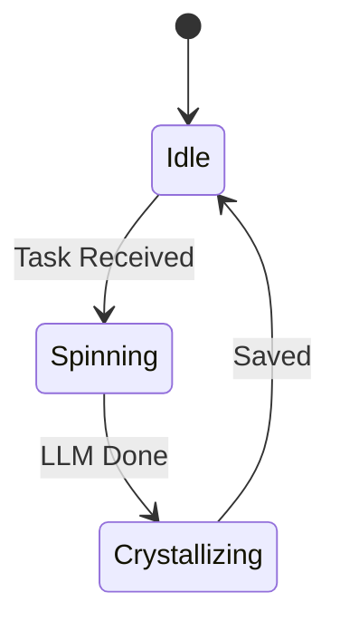

# 💎 Mission: Ingest Gems

## ⚡ BLUF
A mission to ingest the ancestral "Gems" (Gen 1-50) into the Semantic Memory.

## 🧬 Intent
*   **Source**: `eyes/archive/hfo_gem/`
*   **Destination**: `memory/semantic/library/`
*   **Method**: Swarm Spinner (Async/NATS)

## 📊 Visualization

```mermaid
graph LR
    Archive[Archive] -->|Read| Swarm[Swarm Spinner]
    Swarm -->|Extract| LLM[LLM]
    LLM -->|Crystal| Memory[Semantic Memory]

### 🔄 Sequence

```mermaid
sequenceDiagram
    participant A as Archive
    participant S as Swarm
    participant L as LLM
    participant M as Memory

    S->>A: Read File
    S->>L: Extract Concepts
    L-->>S: Structured Data
    S->>M: Save Crystal
```

### ⚙️ State Machine


```
