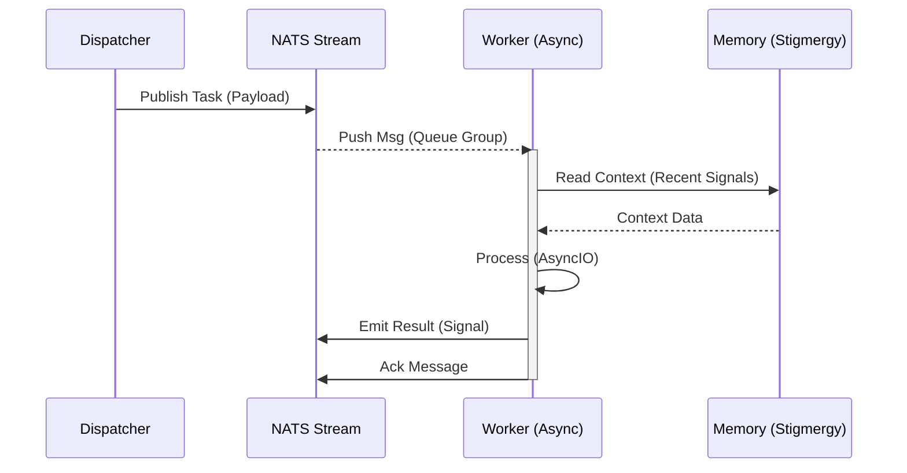
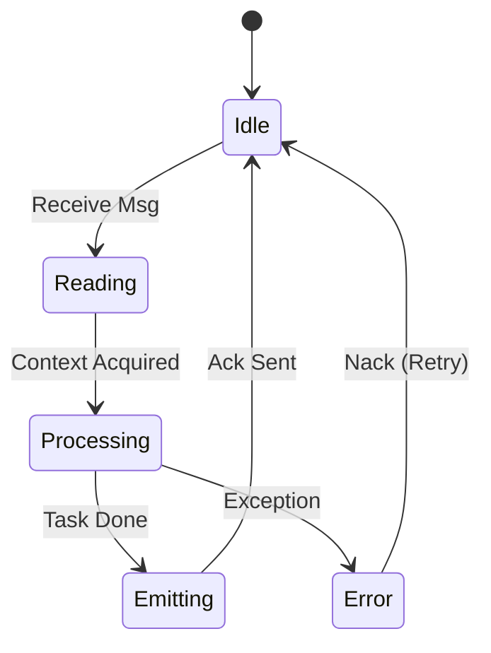

# 🐝 Async Swarm Process Pattern

## ⚡ BLUF (Bottom Line Up Front)
This is the **Golden Pattern** for high-throughput batch processing in Hive Fleet Obsidian. It replaces brittle `multiprocessing` or synchronous loops with **NATS Queue Groups** and **AsyncIO**. It was validated on 2025-11-21 with the "Swarm Spinner" ingestion of 207 gems.

## 🧬 The Anatomy of Success

### 1. The Dispatcher (The Queen)
*   **Role**: Scans the environment and identifies tasks.
*   **Action**: Publishes lightweight JSON payloads to a NATS Subject (e.g., `hfo.task.spin`).
*   **Constraint**: Does NOT wait for results. Fire and forget.

### 2. The Queue Group (The Pheromone Trail)
*   **Mechanism**: NATS JetStream `Queue Group`.
*   **Benefit**: Ensures **Load Balancing**. If you have 20 workers, NATS distributes messages round-robin. If a worker dies, the message is redelivered.

### 3. The Worker (The Ant)
*   **Architecture**: Single-threaded **AsyncIO**.
*   **Critical Rule**: NEVER use blocking calls (e.g., `requests`, `time.sleep`, synchronous `OpenAI`). ALWAYS use `aiohttp`, `asyncio.sleep`, `AsyncOpenAI`.
*   **Stigmergy**: Before acting, the worker **Reads** the recent stream history to gain context (e.g., "What did my siblings just finish?").

## 📊 Visualization

```mermaid
graph TD
    Dispatcher[Dispatcher] -->|Publish (x200)| NATS((NATS Stream))

    subgraph The Swarm (Queue Group: 'workers')
        W1[Worker 1]
        W2[Worker 2]
        W3[Worker 3]
        W4[Worker ...]
    end

    NATS -.->|Load Balance| W1
    NATS -.->|Load Balance| W2
    NATS -.->|Load Balance| W3
    NATS -.->|Load Balance| W4

    W1 -->|Async I/O| LLM[LLM API]
    W2 -->|Async I/O| LLM

    W1 -->|Emit Signal| NATS
```

### 🔄 Interaction Flow (Sequence)



### ⚙️ Worker Lifecycle (State)



## 🦅 Implementation Reference
*   **Reference Implementation**: `body/digestion/swarm_spinner.py`
*   **Key Libraries**: `nats-py`, `instructor` (Async), `asyncio`.
