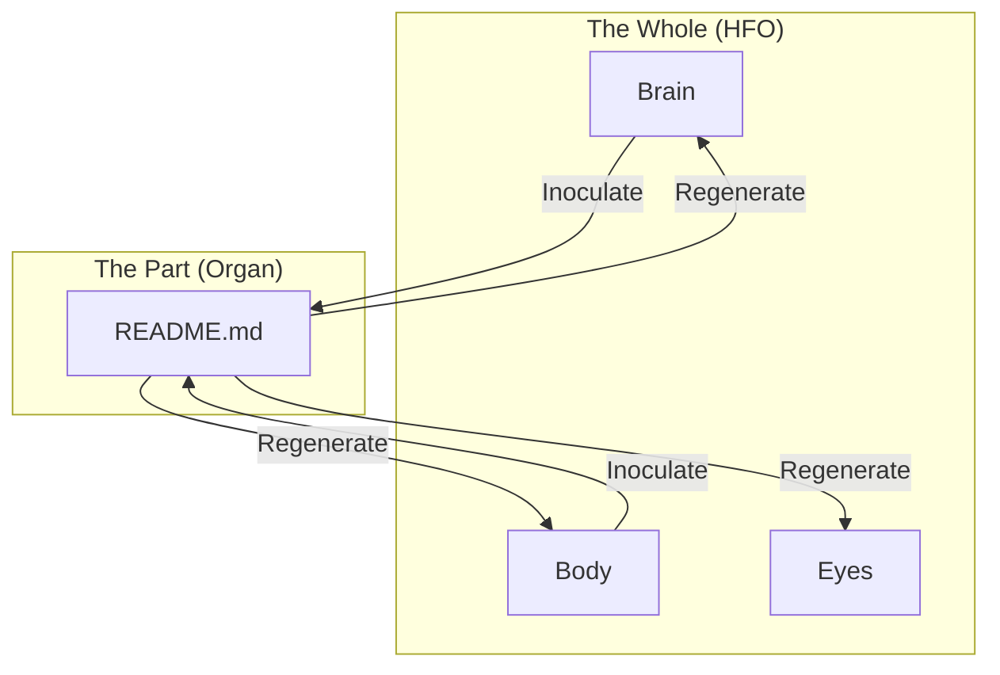

# 🧬 Fractal Holography: The Stem Cell Pattern

## ⚡ BLUF (Bottom Line Up Front)
**Fractal Holography** ensures that **every part of the system contains the blueprint for the whole**. In Hive Fleet Obsidian, this is implemented via **Stem Cell READMEs**. Every directory's `README.md` is not just documentation; it is a **DNA Packet** capable of bootstrapping the entire swarm if the central brain is lost.

## 🧬 The Biological Archetype
*   **Holography**: If you cut a hologram in half, you don't get half the image; you get the *whole* image, just fuzzier.
*   **Stem Cells**: Every cell in an embryo has the potential to become any organ.
*   **HFO Implementation**: Every `README.md` contains the **Genesis Protocol**.

## 🛠️ The DNA Packet (Inoculation)
Every `README.md` is auto-generated/inoculated with this structure:

1.  **Header**: Organ Identity (Name, Role, Icon).
2.  **HFO DNA**: The System Context (Anatomy Map).
3.  **Golden Rules**: The core axioms (Intent vs Implementation).
4.  **Golden Patterns**: The architectural standards (Async Swarm, Claim Check).
5.  **Regeneration Protocol**: The command to rebuild the hive.

### 📊 Visualization

## 🚀 Strategic Value
1.  **Antifragility**: You can delete `brain/`, `genesis.py`, and `Makefile`. As long as `body/hands/README.md` exists, an agent can read it and know how to restore the system.
2.  **Context Window Efficiency**: Agents don't need to read the whole repo. They just read the local `README.md` to understand their place in the universe.
3.  **Self-Healing**: If an organ drifts from the spec, the next "Inoculation Cycle" (running `generate_readmes.py`) will overwrite the drift with the correct DNA.

## 📜 The Standard
*   **Format**: Markdown + Mermaid + Gherkin.
*   **Constraint**: Keep it < 500 tokens per file. High Signal, Low Noise.
*   **Automation**: Managed by `body/blood/generate_readmes.py`.
