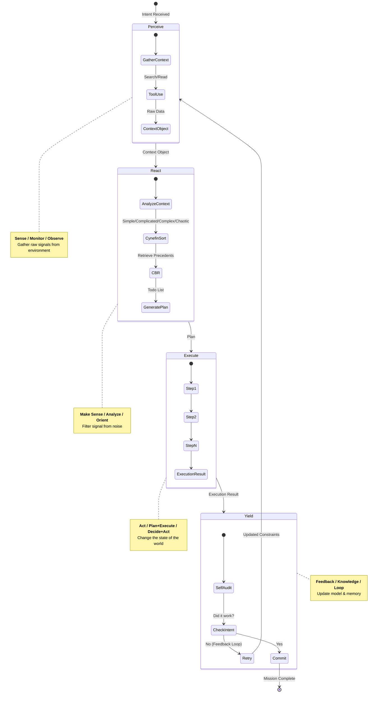

# PREY Loop Visualization

**Lineage**:
*   **OODA Loop** (Boyd): Observe → Orient → Decide → Act
*   **MAPE-K** (IBM): Monitor → Analyze → Plan → Execute (+ Knowledge)
*   **JADC2** (DoD): Sense → Make Sense → Act

