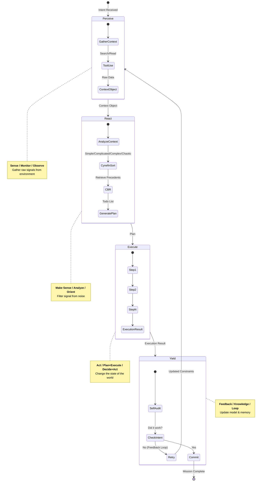

# 🦅 The PREY Loop: Agent Cognitive Architecture

> **Strategy**: OODA + Reflexion + Stigmergy
> **Gherkin**: `brain/prey_workflow.feature`
> **Status**: Active (Gen 50)

## 🧠 Philosophy
We do not build "ReAct" agents. We build **PREY** agents.
This is a formalization of the OODA loop (Observe, Orient, Decide, Act) enhanced with **Reflexion** (Self-Correction) and **Stigmergy** (Artifact Logging).

## 🔄 The Cycle

### 1. 👁️ Perceive (Observe)
*   **Input**: Task, Mission ID, Environment.
*   **Action**: Gather context. Read files. Query memory.
*   **Output**: `PerceptionObject` (Structured Context).

### 2. 🧠 React (Orient & Decide)
*   **Input**: `PerceptionObject`.
*   **Action**: Plan the approach. Select tools. Check guardrails.
*   **Output**: `ReactionObject` (The Plan).

### 3. ⚡ Execute (Act)
*   **Input**: `ReactionObject`.
*   **Action**: Run the tools. Call the LLM.
*   **Output**: `ExecutionObject` (Raw Results).

### 4. ✅ Yield (Reflexion & Share)
*   **Input**: `ExecutionObject`.
*   **Action**:
    1.  **Self-Audit**: Did I succeed? (Confidence Score).
    2.  **Log**: Write a Stigmergy Artifact (`.md` with YAML frontmatter).
    3.  **Return**: Pass result to the Swarm.
*   **Output**: `TaskResult` (Final Output).

## 🏗️ Implementation
The `PreyAgent` class in `body/hands/hydra_swarm.py` implements this loop.
Each phase is a distinct method (`_perceive`, `_react`, `_execute`, `_yield`) that can be overridden or enhanced with specific tooling.

## 📊 Visualization

