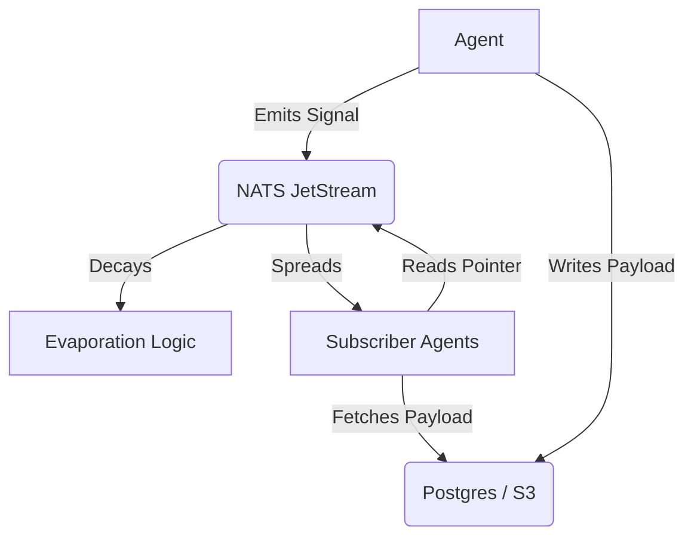

# 🦅 Rich Metadata Stigmergy: Composable Primitives

> **Status**: Recommended
> **Source**: Swarm Hunt Mission (2025-11-22)
> **Context**: HFO Gen 51 "Swarmlord of Webs"

## 🧠 Executive Summary
Based on the "Rich Metadata Hunt" (Round 2), the Swarm recommends a **Composable Primitive** approach to Stigmergy. Instead of a monolithic "Blackboard", we treat Stigmergy as a set of interacting biological forces: **Signal**, **Decay**, **Spread**, and **Payload**.

This architecture aligns with **Biomimetic Principles** (Ant Pheromones, Slime Mold) and **Industry Standards** (Event Sourcing, Claim Check).

---

## 🧱 The 4 Primitives

### 1. The Signal (Pheromone)
*   **Definition**: A lightweight, ephemeral message broadcast to the swarm.
*   **Implementation**: JSON (Pydantic Model) over NATS JetStream.
*   **Why**:
    *   **Fast**: <1ms latency.
    *   **Structured**: Enforced schema (`body/models/stigmergy.py`) prevents "data swamp".
    *   **Biomimetic**: Like a chemical scent, it carries *intent* and *intensity* but not the full payload.

### 2. The Decay (Evaporation)
*   **Definition**: The reduction of a signal's relevance over time.
*   **Implementation**: **Exponential Half-Life**.
    *   Formula: $S(t) = S_0 \cdot e^{-\lambda t}$
    *   $\lambda$ (Lambda): The decay constant (tunable per signal type).
*   **Why**:
    *   **Self-Cleaning**: Prevents infinite accumulation of stale data (Anti-Fragile).
    *   **Focus**: Forces agents to prioritize fresh, high-intensity signals.
    *   **Swarm Finding**: Nature uses rapid evaporation for "Alarm" signals and slow evaporation for "Food" trails.

### 3. The Spread (Dispersion)
*   **Definition**: The spatial or logical reach of a signal.
*   **Implementation**: **NATS Subject Hierarchies**.
    *   Format: `hfo.signal.<region>.<type>.<id>`
    *   Example: `hfo.signal.brain.idea.123` vs `hfo.signal.global.alert.999`
*   **Why**:
    *   **Bandwidth Efficiency**: Agents only subscribe to relevant "regions" (e.g., `hfo.signal.brain.>`).
    *   **Noise Reduction**: Prevents cognitive overload.
    *   **Biomimetic**: Pheromones diffuse locally; they don't teleport globally.

### 4. The Payload (Claim Check)
*   **Definition**: The heavy, persistent data associated with a signal.
*   **Implementation**: **Postgres (pgvector) + Object Store**.
    *   Signal contains a `pointer` (UUID/URL).
    *   Payload is stored in "Cold Storage".
*   **Why**:
    *   **Performance**: NATS remains fast (small messages).
    *   **Durability**: Payloads survive even if the signal evaporates.
    *   **Industry Standard**: "Claim Check Pattern" is the gold standard for high-throughput messaging.

---

## 🛠️ Recommended Architecture

## 📊 Tunable Parameters (Defaults)

| Parameter | Default | Description | Biomimetic Analogy |
| :--- | :--- | :--- | :--- |
| **Quality** | `0.5` | Confidence in the signal (0.0-1.0). | Pheromone Concentration |
| **Evaporation** | `0.05` | Decay rate per tick. | Volatility |
| **Dispersion** | `0.1` | Broadcast radius (Subject depth). | Diffusion Rate |
| **Urgency** | `normal` | Priority queueing. | Alarm Pheromone |

## ✅ Next Steps
1.  **Migrate Cold Storage**: Move from Filesystem to Postgres (`body/digestion/assimilator.py`).
2.  **Implement Decay**: Add a "Janitor" process to NATS that prunes streams based on `evaporation_rate`.
3.  **Tune Values**: Run a "Parameter Sweep" swarm to find the optimal $\lambda$ for different task types.
