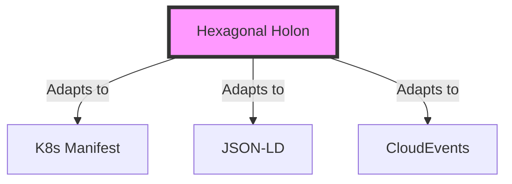

# 🔬 SOTA Analysis: Universal Metadata Protocols

> **Objective**: Identify the optimal data structure for a "Fractal Holarchy" that spans Files, Signals, Vectors, and Graphs.
> **Constraint**: Must support **Stigmergy** (Environment-based coordination) and **Intent** (Human-readable).

---

## 1. The Hexagonal Holon (The "Obsidian" Custom)
*The proposed design: A polymorphic Pydantic model with 6 strict dimensions.*

*   **Structure**: `Ontos` (Identity), `Telos` (Purpose), `Chronos` (Time), `Topos` (Space), `Logos` (Logic), `Pathos` (Quality).
*   **Philosophy**: **Biomimicry**. It treats data like a biological cell—it has a nucleus (ID), energy (Chronos), and receptors (Topos).
*   **Pros**:
    *   **Perfect Fit**: Designed specifically for the "Crystalline/Liquid/Sedimentary" lifecycle.
    *   **Human-Centric**: The "Face" (YAML) is separated from the "Hexagon" (System), keeping it readable.
    *   **Fractal**: The structure is identical at L0 (Code) and L3 (Strategy).
*   **Cons**:
    *   **Not Standard**: New developers need to learn what "Ontos" means.
    *   **Maintenance**: We own the entire stack (Pydantic models, adapters).
*   **Tradeoff**: **High Cognitive Cohesion** vs. **Low External Interoperability**.

## 2. The Kubernetes Manifest (The "DevOps" Standard)
*The industry standard for declarative intent: `apiVersion`, `kind`, `metadata`, `spec`, `status`.*

*   **Structure**:
    ```yaml
    apiVersion: hfo.io/v1
    kind: Mission
    metadata: { name: "alpha", labels: { urgency: "high" } }
    spec: { goal: "..." }  # The Intent (Telos)
    status: { phase: "Active" } # The State (Chronos)
    ```
*   **Philosophy**: **Control Theory**. Explicit separation of "Desired State" (Spec) and "Actual State" (Status).
*   **Pros**:
    *   **Familiarity**: Every DevOps engineer knows this.
    *   **Tooling**: Compatible with K8s ecosystem, ArgoCD, etc.
    *   **Rigorous**: Enforces the "Intent vs. Implementation" split natively.
*   **Cons**:
    *   **Verbose**: Heavy boilerplate for simple notes.
    *   **Rigid**: Hard to model "fuzzy" concepts like "Viral Factor" or "Stigmergy Decay" without abusing `annotations`.
*   **Tradeoff**: **Operational Rigor** vs. **Creative Friction**.

## 3. The Semantic Graph (JSON-LD / RDF)
*The "Data Science" standard: Everything is a Triple (Subject-Predicate-Object).*

*   **Structure**:
    ```yaml
    "@context": "http://hfo.io/schema"
    "@type": "Mission"
    "@id": "uuid:..."
    "hfo:urgency": 0.9
    "hfo:links": [{ "@id": "...", "rel": "defines" }]
    ```
*   **Philosophy**: **Universal Graph**. Data is self-describing and globally unique.
*   **Pros**:
    *   **Graph-Native**: Trivial to ingest into Neo4j or Knowledge Graphs.
    *   **Interoperable**: The "Holy Grail" of data exchange.
*   **Cons**:
    *   **Developer Hell**: Writing JSON-LD in YAML frontmatter is painful.
    *   **Complexity**: "Context" management is a nightmare.
    *   **Overkill**: Too heavy for a simple NATS signal.
*   **Tradeoff**: **Machine Readability** vs. **Human Writeability**.

## 4. The CloudEvent (The "Signal" Standard)
*The CNCF standard for event-driven architectures.*

*   **Structure**:
    ```yaml
    specversion: "1.0"
    type: "hfo.mission.created"
    source: "/brain/navigator"
    id: "..."
    time: "2025-11-23T..."
    datacontenttype: "application/json"
    data: { ... }
    ```
*   **Philosophy**: **Message Passing**. Optimized for the "Liquid" state (NATS).
*   **Pros**:
    *   **NATS Native**: Perfect for the message bus.
    *   **Traceability**: Built for distributed tracing (OpenTelemetry).
*   **Cons**:
    *   **Ephemeral**: Designed for *events* (things that happen), not *artifacts* (things that exist).
    *   **Flat**: Doesn't handle the deep nesting of a "Fractal Holarchy" well.
*   **Tradeoff**: **Transport Efficiency** vs. **Storage Semantics**.

---

## 🏆 The Verdict: The "Hybrid Hexagon"

We choose **Option 1 (Hexagonal Holon)** but we **steal** the best parts of the others:

1.  **From K8s**: We adopt the **Spec/Status** split logic, but map it to **Telos (Intent)** and **Chronos (State)**.
2.  **From JSON-LD**: We ensure our `Topos` (Links) uses strict `rel` types so it *can* be exported to JSON-LD.
3.  **From CloudEvents**: We ensure our `to_signal()` adapter outputs a valid CloudEvent wrapper.

### Why the Hexagon Wins for HFO
*   **Fractal Holarchy** requires a structure that is **Self-Similar**.
*   K8s is for *Infrastructure*.
*   CloudEvents is for *Transport*.
*   JSON-LD is for *Data*.
*   **The Hexagon is for AGENTS**. It models **Identity, Purpose, Time, Space, Logic, and Feeling**. This is the only model that captures the *Cognitive* aspect of the Swarm.


