# 🌌 Higher-Order Stigmergy Abstractions

> **Goal**: Find the "Fundamental Force" behind the Identity-Time-Space-Meaning quad.
> **Result**: Four variants mapping the Obsidian Facet to Philosophy, Physics, Semiotics, and Quantum Mechanics.

## 🧠 BLUF (Bottom Line Up Front)
We propose **The Ontological Quadrivium** as the primary abstraction.
1.  **Ontos (Being)**: Identity.
2.  **Chronos (Time)**: Decay/Duration.
3.  **Topos (Place)**: Fractal Address.
4.  **Telos (Purpose)**: Viral Intent.

---

## 1. The Ontological Quadrivium (Philosophy) 🏛️
*The structure of Existence itself.*

| Facet | Greek Term | Concept | Application |
| :--- | :--- | :--- | :--- |
| **Identity** | **Ontos** (Being) | The Essence. That which *is*. | The UUID/Content. Immutable truth. |
| **Time** | **Chronos** (Time) | The Duration. That which *passes*. | The Decay Rate. Knowledge entropy. |
| **Space** | **Topos** (Place) | The Locus. That which *relates*. | The Fractal Address. Where it sits in the Holarchy. |
| **Meaning** | **Telos** (End) | The Purpose. That which *drives*. | The Viral Factor. The goal of the file (to be read). |

> **Why it works**: It elevates the system from "Mechanics" to "Metaphysics". It implies that every file has a "Reason for Being" (Telos).

### Visual: The Quadrivium
```mermaid
graph TD
    Center((💠 Existence))
    Ontos[Ontos (Being)]
    Chronos[Chronos (Time)]
    Topos[Topos (Place)]
    Telos[Telos (Purpose)]

    Center --> Ontos
    Center --> Chronos
    Center --> Topos
    Center --> Telos
```

---

## 2. The Thermodynamic Engine (Physics) 🔥
*The structure of Energy and Work.*

| Facet | Physics Term | Concept | Application |
| :--- | :--- | :--- | :--- |
| **Identity** | **Mass** | The Substance. | The file size/content. |
| **Time** | **Entropy** | The Disorder. | The tendency to rot/archive without work. |
| **Space** | **Field** | The Influence. | The gravitational pull on linked files. |
| **Meaning** | **Work** | The Energy. | The "Touch" required to keep it high-energy (Hot). |

> **Why it works**: It models the **Cost** of knowledge. Stigmergy is the fight against Entropy.

### Visual: The Engine

```mermaid
graph LR
    Mass[🪨 Mass] -->|Decays via| Entropy[📉 Entropy]
    Work[⚡ Work] -->|Reverses| Entropy
    Mass -->|Generates| Field[ww Field]
```


---

## 3. The Semiotic Sign (Linguistics) 🗣️
*The structure of Meaning and Communication.*

| Facet | Semiotic Term | Concept | Application |
| :--- | :--- | :--- | :--- |
| **Identity** | **Symbol** | The Token. | The Filename/ID. |
| **Time** | **Tense** | The Context. | Past/Present/Future relevance. |
| **Space** | **Syntax** | The Grammar. | How it fits in the sentence (Holarchy). |
| **Meaning** | **Pragmatics** | The Effect. | What the sign *does* to the interpreter (Virus). |

> **Why it works**: It treats the Hive as a **Language**. Agents are readers/writers of a living text.

---

## 4. The Quantum State (Quantum Mechanics) ⚛️
*The structure of Probability and Relation.*

| Facet | Quantum Term | Concept | Application |
| :--- | :--- | :--- | :--- |
| **Identity** | **Eigenstate** | The Definite Value. | The observed content. |
| **Time** | **Coherence** | The Stability. | How long the state lasts before decoherence. |
| **Space** | **Entanglement** | The Spooky Action. | Links that affect distant files instantly. |
| **Meaning** | **Wavefunction** | The Probability. | The likelihood of interaction (Viral Factor). |

> **Why it works**: It captures the **Holographic** nature. The file is a probability wave until an Agent "collapses" it by reading.

### Visual: The Quantum Hologram

```mermaid
graph TD
    Wave[🌊 Wavefunction] -->|Collapse| State[📍 Eigenstate]
    State -->|Entangled with| Other[📍 Other State]
    State -->|Decoheres over| Time[⏳ Time]
```

