# 🌋 Standard: The Obsidian Stigmergy Cycle (OSC)

> **Status**: Ratified (Gen 52)
> **Context**: The Canonical Physics of Information in Hive Fleet Obsidian.
> **Analogy**: Volcanic Glass Formation & Lithic Technology.

## 1. The Cycle Overview

The **Obsidian Stigmergy Cycle (OSC)** defines how information moves from **Energy** (Intent) to **Matter** (Storage) to **Utility** (Tools).

| Phase | Geological Process | HFO Action | State |
| :--- | :--- | :--- | :--- |
| **1. Eruption** | **Rhyolitic Melt** | **Flow** | High-Viscosity Stream (NATS). |
| **2. Quench** | **Glass Transition** | **Capture** | Amorphous Storage (Markdown/JSONL). |
| **3. Knap** | **Lithic Reduction** | **Refine** | Mechanical Extraction (Vectors). |
| **4. Haft** | **Tool Assembly** | **Craft** | Knowledge Graph Construction. |
| **5. Hydrate** | **Rind Formation** | **Age** | Accumulation of Backlinks (Wisdom). |
| **6. Devitrify** | **Crystallization** | **Decay** | Loss of Context (Bit Rot). |

---

## 2. Gherkin Specification

### Feature: Obsidian Stigmergy Cycle
    As the Swarmlord
    I want to enforce the laws of thermodynamics on information
    So that we maximize signal retention and minimize entropy

    Scenario: The Quench (Capture)
        Given a high-velocity NATS stream "Magma"
        When the stream is captured by a "Scribe" agent
        Then it must be written to disk immediately as "Glass" (Markdown/JSONL)
        And no schema validation shall be applied (Zero Crystallization)
        And the fidelity of the raw stream is preserved 100%

    Scenario: The Knap (Refinement)
        Given a stored "Obsidian Core" (File)
        When the "Assimilator" agent strikes the core
        Then it extracts "Flakes" (Vector Embeddings)
        And the Flakes are sharp (High Semantic Density)
        And the Core remains intact as the Source of Truth

    Scenario: The Hydration (Aging)
        Given an existing "Obsidian Core"
        When other agents link to it
        Then its "Hydration Rind" (Backlink Count) increases
        And files with thick rinds are prioritized for Retrieval
        And files with zero rind are candidates for Devitrification (Archival)

---

## 3. Visual Architecture

```mermaid
stateDiagram-v2
    direction LR

    state "🔥 Magma (NATS)" as Magma
    state "⬛ Obsidian Core (File)" as Core
    state "🗡️ Flake (Vector)" as Flake
    state "🏹 Tool (Graph)" as Tool
    state "⚪ Snowflake (Rot)" as Rot

    Magma --> Core: ⚡ Quench (Capture)
    Core --> Flake: 🔨 Knap (Refine)
    Flake --> Tool: 🔗 Haft (Craft)
    Core --> Core: 💧 Hydrate (Backlinks)
    Core --> Rot: ❄️ Devitrify (Time + Neglect)
```

## 4. Implementation Guidelines

1.  **Never Crystallize the Stream**: Do not force NATS messages into a rigid SQL schema. That is "Rhyolite" (Grainy Rock). We want "Obsidian" (Glass).
2.  **Knap, Don't Polish**: We don't need to clean up the raw logs. We just need to extract the valuable vectors from them.
3.  **Hydration is Value**: The value of a file is not its content, but its connections. A file with no links is just a rock.
