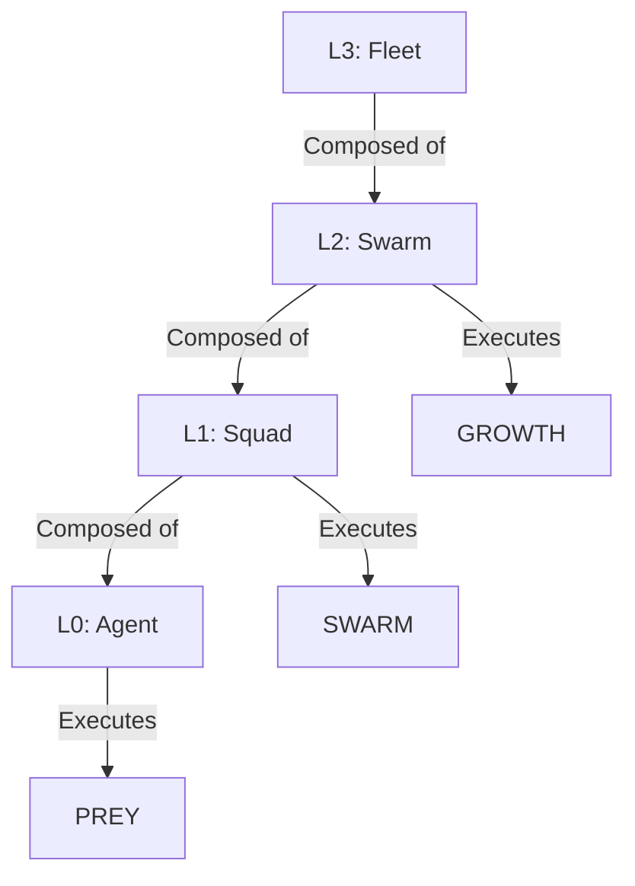

# 🕸️ Fractal Holarchy Strategy

## ⚡ BLUF (Bottom Line Up Front)
The **Fractal Holarchy** is the organizational structure of Hive Fleet Obsidian. It allows infinite scaling by ensuring that every unit (Holon) is a self-contained system with its own OODA loop. The structure is recursive: Agents form Squads, Squads form Swarms, Swarms form Fleets.

## 📊 Holonic Levels Matrix

| Level | Name | Scale | Time Horizon | Loop Type |
| :--- | :--- | :--- | :--- | :--- |
| **L0** | Atomic Agent | 1 Unit | Seconds | PREY (Tactical) |
| **L1** | Squad | 10 Units | Minutes | SWARM (Operational) |
| **L2** | Swarm | 100 Units | Hours | GROWTH (Strategic) |
| **L3** | Fleet | 1000 Units | Days | HIVE (Grand Strategy) |

## 🧠 Concept Visualization

### View 1: The Recursive Structure (Conceptual)
*How smaller units build larger units.*



### View 2: The Command Chain (Logical)
*How orders flow down and reports flow up.*

```mermaid
graph TD
    subgraph L2 [L2: The Swarm (Hours)]
        Nav2[Navigator L2] -->|Mission| Squad1
        Nav2 -->|Mission| Squad2
    end

    subgraph L1 [L1: The Squad (Minutes)]
        Squad1 -->|Task| Agent1
        Squad1 -->|Task| Agent2
        Nav1[Navigator L1]
    end

    subgraph L0 [L0: The Agent (Seconds)]
        Agent1[Agent: PREY Loop]
        Agent2[Agent: PREY Loop]
    end

    %% Fractal Nature
    L2 -.->|Contains| L1
    L1 -.->|Contains| L0
```

### View 3: Temporal Dilation (Physical)
*How time slows down at higher levels.*

```mermaid
gantt
    title Temporal Dilation across Holarchy
    dateFormat s
    axisFormat %S

    section L0 (Agent)
    PREY Loop : 0, 5
    PREY Loop : 5, 5

    section L1 (Squad)
    SWARM Loop : 0, 60

    section L2 (Swarm)
    GROWTH Loop : 0, 3600
```



## 🦅 Executive Summary
The **Fractal Holarchy** ensures that the Hive scales infinitely without losing coherence. Every unit (Holon) is a complete system with its own OODA loop (PREY/SWARM).
*   **L0 (Atomic)**: Single Agent (Seconds).
*   **L1 (Squad)**: 10 Agents (Minutes).
*   **L2 (Swarm)**: 100 Agents (Hours).
