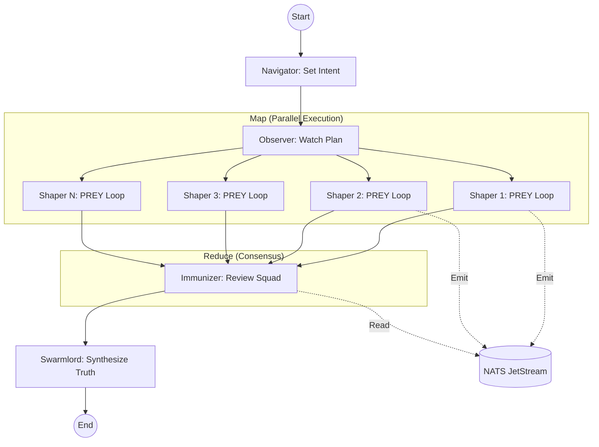
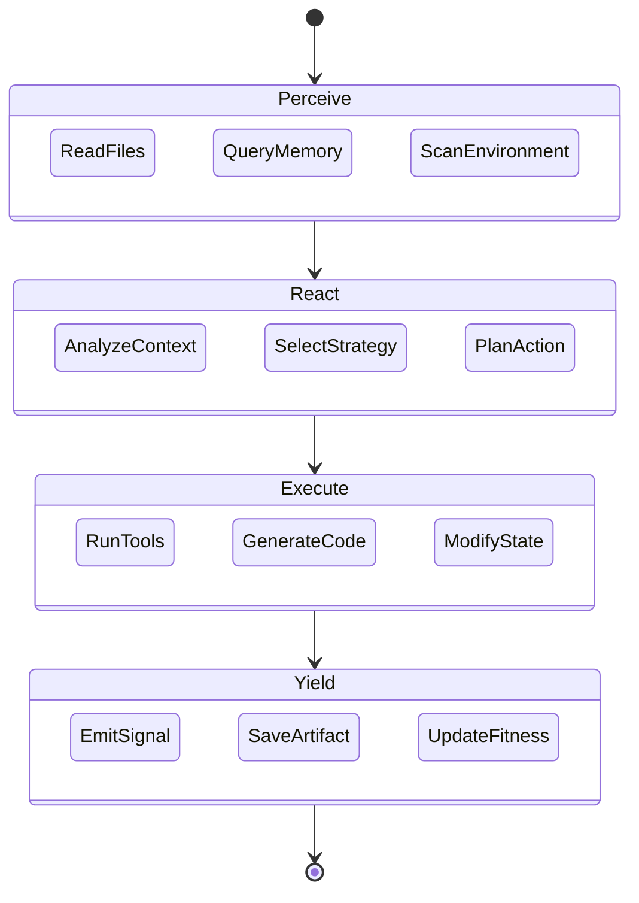
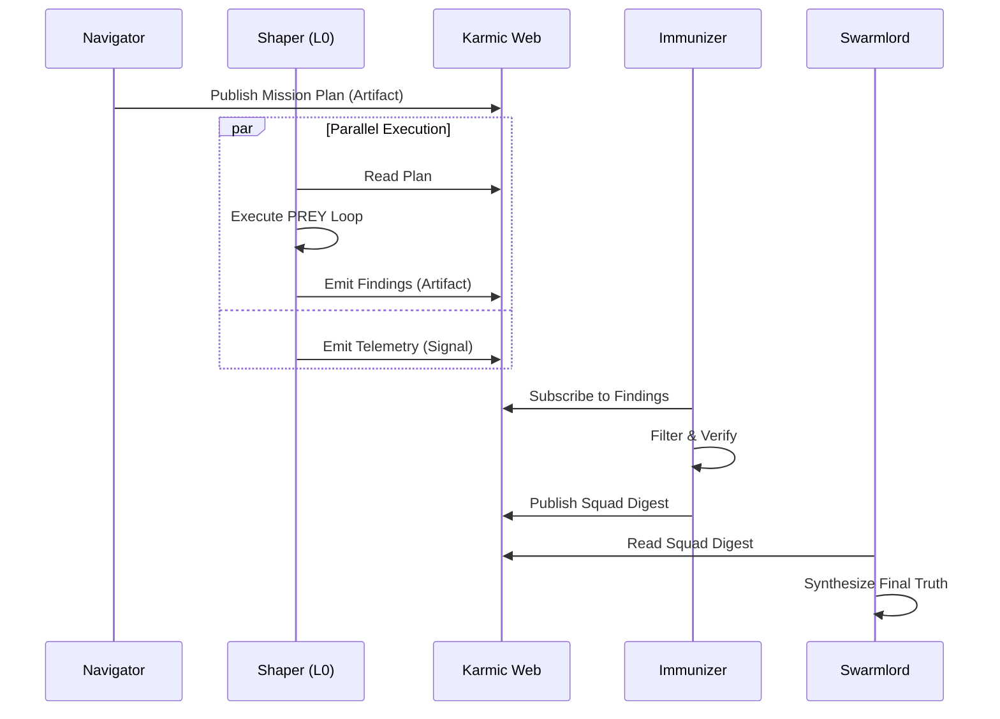

# 🕸️ Fractal Holarchy Strategy

## ⚡ BLUF (Bottom Line Up Front)
The **Fractal Holarchy** is the organizational structure of Hive Fleet Obsidian. It allows infinite scaling by ensuring that every unit (Holon) is a self-contained system with its own OODA loop. The structure is recursive: Agents form Squads, Squads form Swarms, Swarms form Fleets.

## 📊 Holonic Levels Matrix

| Level | Name | Scale | Time Horizon | Loop Type |
| :--- | :--- | :--- | :--- | :--- |
| **L0** | Atomic Agent | 1 Unit | Seconds | PREY (Tactical) |
| **L1** | Squad | 10 Units | Minutes | SWARM (Operational) |
| **L2** | Swarm | 100 Units | Hours | GROWTH (Strategic) |
| **L3** | Fleet | 1000 Units | Days | HIVE (Grand Strategy) |

## 🦅 Swarmlord Digest: The Current Architecture (Gen 51)
*As of 2025-11-22, the Research Swarm (`research_swarm.py`) implements a **LangGraph-driven Fractal Holarchy**.*

1.  **The Brain (Navigator)**: A single Navigator node defines the "Intent" and breaks it into `N` parallel tasks (Branching Factor).
2.  **The Body (Shapers)**: `N` Agents execute in parallel using the **PREY Loop** (Perceive-React-Execute-Yield). They are stateless workers that emit signals to NATS.
3.  **The Immune System (Immunizer)**: A "Reduce" step where an Immunizer reviews the collective output of a Squad (Map-Reduce pattern) to filter hallucinations.
4.  **The Evolution (Mutate)**: The Swarmlord synthesizes the filtered Squad Digests into a Final Truth.

**Key Deviation from Theory**: Currently, we are operating primarily at **L1 (Squad)** level with a branching factor of 5-10. The L2 (Swarm) recursion is implemented as a "Loop" of L1s rather than a simultaneous tree of 100 nodes (to save compute/cost).

## 🧠 Concept Visualization

### View 1: The Execution Flow (LangGraph)
*The actual control flow implemented in `research_swarm.py`.*

### View 2: The L0 Agent Anatomy (PREY Loop)
*The internal structure of a single worker node.*

### View 3: The Stigmergic Data Flow
*How information moves through the system without direct agent-to-agent coupling.*

## 🦅 Executive Summary
The **Fractal Holarchy** ensures that the Hive scales infinitely without losing coherence. Every unit (Holon) is a complete system with its own OODA loop (PREY/SWARM).
*   **L0 (Atomic)**: Single Agent (Seconds).
*   **L1 (Squad)**: 10 Agents (Minutes).
*   **L2 (Swarm)**: 100 Agents (Hours).
