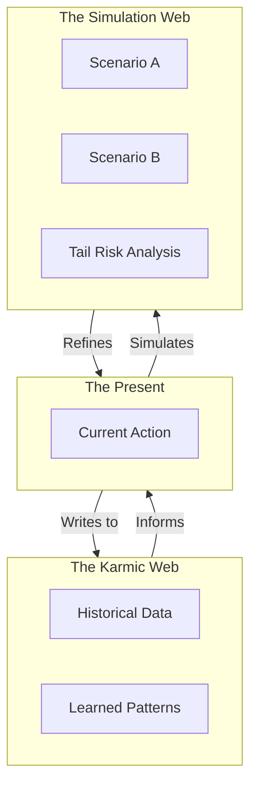
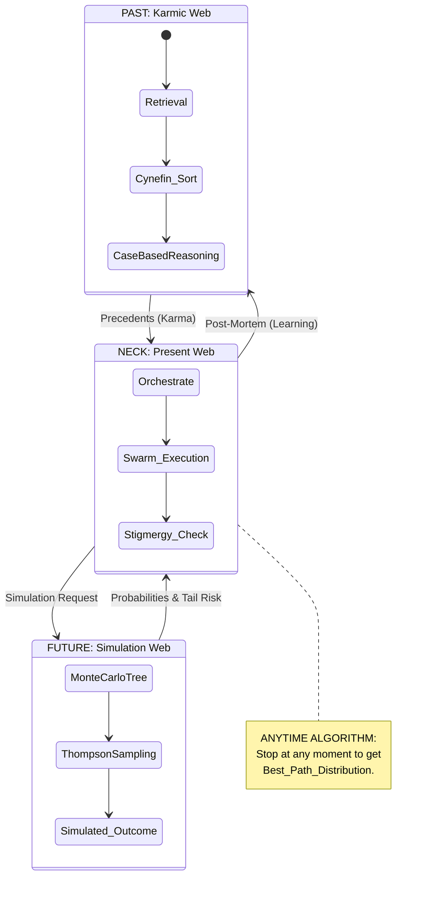
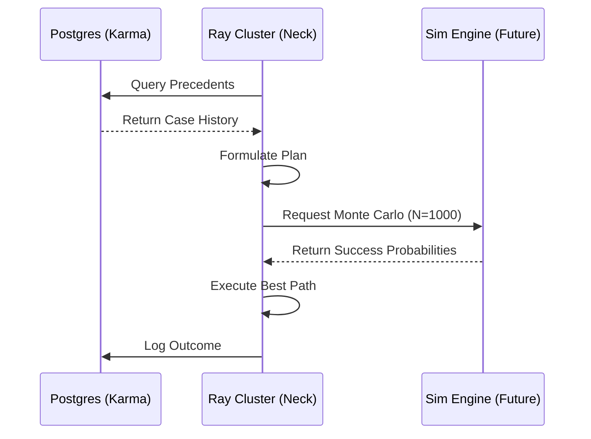

# ⏳ Obsidian Hourglass Strategy

## ⚡ BLUF (Bottom Line Up Front)
The **Obsidian Hourglass** is the core temporal traversal algorithm of Hive Fleet Obsidian. It allows the Swarm to act as an **Anytime Algorithm**, instantly querying the **Past (Karmic Web)** for precedents, executing in the **Present (Neck)**, and simulating the **Future (Simulation Web)** to minimize tail risk. It is the "Ship" that navigates the State-Action space.

## 📊 Temporal Domain Matrix

| Domain | Component | Function | Technology |
| :--- | :--- | :--- | :--- |
| **Past** | Karmic Web | Retrieval & Case-Based Reasoning | GraphRAG (Postgres) |
| **Present** | The Neck | Real-time Orchestration | Ray / Temporal |
| **Future** | Simulation Web | Monte Carlo & Predictive Modeling | DSPy / Simulation |

## 🧠 Concept Visualization

### View 1: The Hourglass Shape (Conceptual)
*The flow of information through time.*

### View 2: The Anytime Algorithm (Logical)
*How the algorithm yields results at any moment.*

### View 3: Data Flow Architecture (Physical)
*The movement of data between storage and compute.*

## 🦅 Executive Summary
The **Obsidian Hourglass** is the core spatial traversal strategy for Hive Fleet Obsidian. It represents the flow of information through time:
1.  **PAST (Karmic Web)**: Retrieval of precedents and case-based reasoning.
2.  **PRESENT (Neck)**: Real-time orchestration and execution.
3.  **FUTURE (Simulation Web)**: Monte Carlo simulations and predictive modeling.

It is an **Anytime Algorithm**, meaning it can be stopped at any moment to yield the best current path distribution.
