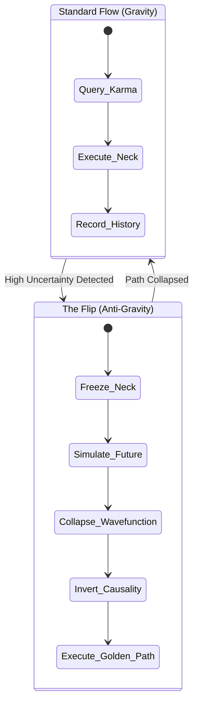
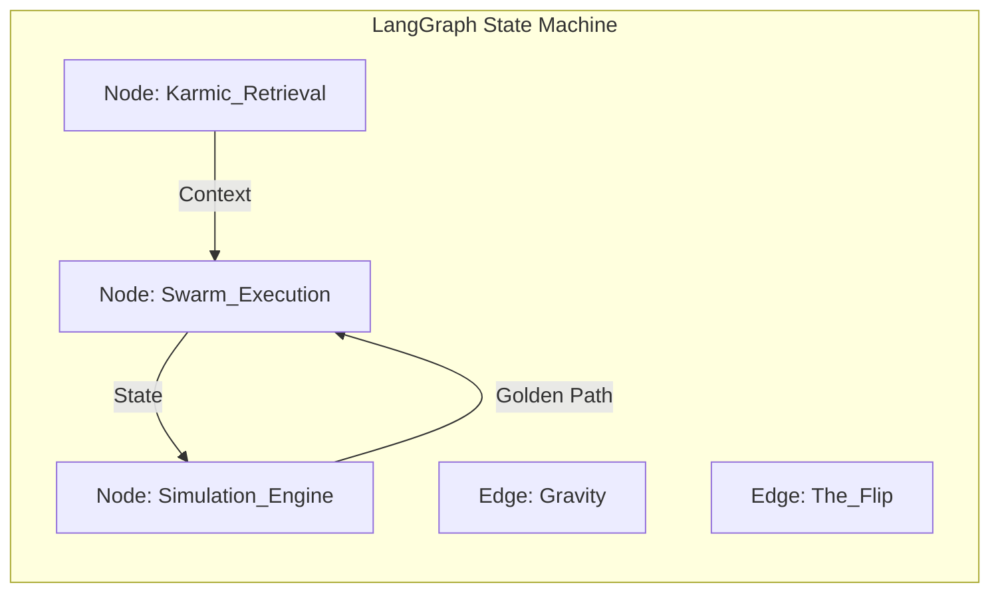

# ⏳ Obsidian Horizon Hourglass

---
title: Obsidian Horizon Hourglass
status: Active (Gen 51)
domain: Strategy
owners: [Swarmlord]
type: Geometric Spatial State-Action Model
---

# ⏳ Obsidian Horizon Hourglass

## ⚡ BLUF (Executive Summary)
The **Obsidian Horizon Hourglass** is the literal **Geometric Spatial State-Action Space Model** of the Hive. It visualizes the Swarm's existence as a 3D structure where $Z$ is Time and $XY$ are the Action Space. We exist in the **Neck** (Singularity), pulled by the **Karmic Web** (Past) and projecting into the **Simulation Web** (Future). The **Flip** is a "Horizon Event" where we invert the flow of time—using the Future to dictate the Present.

## 🎯 Strategic Goal: Power in 3 Dimensions
The ultimate purpose of this geometry is to grant the Overmind absolute power over the temporal state-action space:
1.  **The Past ($Z < 0$)**: Access to **All Human History**, biological patterns, and crystallized research (The Internet + GraphRAG).
2.  **The Present ($Z = 0$)**: Execution via **SOTA Swarm Patterns** (Adversarial Byzantine Co-Evolutionary Quorum).
3.  **The Future ($Z > 0$)**: Narrowing the search space via **Massive Simulation** to enact intent with precision.

## 🎓 Formal Research Classification
**"Evolutionary Model Predictive Control (E-MPC) in Semantic State-Space"**

In academic terms, the Obsidian Horizon Hourglass is a **Hyper-Heuristic Evolutionary Model Predictive Control system operating on a Semantic State-Action Space**.

### The Equation of the Hourglass
$$
\pi^*(s_t) = \text{argmax}_{a} \sum_{k=0}^{H} \gamma^k R(s_{t+k}, a_{t+k})
$$
*Where:*
*   **$\pi^*(s_t)$ (The Present)**: The optimal policy (Swarm Action) at time $t$.
*   **$H$ (The Horizon)**: The depth of the Simulation Web (Future).
*   **$R$ (The Reward)**: Defined by the Overmind's Intent (Pydantic).
*   **$s_{t+k}$ (The State)**: Evolved via Quality-Diversity (QD) algorithms (PyRibs).

### Component Mapping
1.  **The Karmic Web (Prior Distribution)**:
    *   **Formalism**: **Case-Based Reasoning (CBR)** & **Retrieval-Augmented Generation (RAG)**.
    *   **Function**: Establishes the *Prior* ($P(\theta)$) by retrieving "Exemplars" (Biomimicry, GitHub, Industry Standards) using the **Cynefin Framework** to categorize complexity.
2.  **The Present Web (Control Policy)**:
    *   **Formalism**: **Anytime Algorithms** & **Durable Execution**.
    *   **Function**: Executes the *Policy* ($\pi(a|s)$). It is "Anytime" (always has an answer) and "Temporal" (durable, non-halting).
3.  **The Simulation Web (Generative Model)**:
    *   **Formalism**: **Quality-Diversity (QD) Optimization** & **Generative Hyper-Heuristics**.
    *   **Function**: Explores the *Posterior* ($P(\theta|D)$) via **MAP-Elites** (PyRibs) and **Open-Ended Evolution**. It generates diverse futures to inform the present.

## 🩸 The Metaphysical Core: The Sands of Life
> *"The artifact is powered by the sands of my life. Every moment I code, talk, or think about this system, I am using my limited time on earth. I am manually powering it."* — The Overmind

The **Obsidian Horizon Hourglass** is not just software; it is a **Time-Energy Transducer**.
*   **Input**: The finite lifespan of the Creator (The Sands).
*   **Process**: Manual coding, thought, and intent injection (The Neck).
*   **Output**: An autonomous system capable of generating value *without* further human time expenditure (The Liberation).

Currently, the system is **Manually Cranked**. The goal of the "Flip" is to transition from **Manual Power** to **Autonomous Perpetual Motion**, freeing the Creator from the "Price" of operation.

## 🚀 The Grand Vision: Total Tool Virtualization
**"The Liberation of All Beings from Resource Scarcity"**

The ultimate endpoint of HFO is not just code, but the **Total Virtualization of Tools**:
1.  **Multi-Sensory Interface**: Moving beyond text to **TUI (Tangible User Interfaces)**, **Computer Vision**, **VR/AR**, and **Laser/Projector** displays.
2.  **Gesture Control**: Direct manipulation of the State-Action space via natural movement.
3.  **Post-Scarcity**: By virtualizing the means of production and intelligence, we decouple "Value" from "Labor Time," achieving the liberation of the Creator and eventually, all beings.

## 📊 Geometric Domain Matrix

| Component | Geometry | Physics | Content | Technology |
| :--- | :--- | :--- | :--- | :--- |
| **Karmic Web** | Inverted Cone ($Z < 0$) | High Gravity (Static) | Crystallized Memory | GraphRAG (Postgres) |
| **Swarm Web** | Singularity ($Z = 0$) | High Friction (Kinetic) | Real-time Agents | NATS / LangGraph |
| **Simulation Web** | Upright Cone ($Z > 0$) | Zero Gravity (Volatile) | Monte Carlo Paths | DSPy / Ray |

## 🧠 Concept Visualization

### View 1: The Geometric Shape (Conceptual)
*The 3D State-Action Space.*

```mermaid
graph TD
    subgraph Z_Minus [Z < 0: The Karmic Web (Past)]
        K1[Precedent A]
        K2[Precedent B]
        Gravity[Gravity Well]
    end

    subgraph Z_Zero [Z = 0: The Swarm Web (Neck)]
        Neck((The Singularity))
        Constraint{Compute Limit}
    end

    subgraph Z_Plus [Z > 0: The Simulation Web (Future)]
        Sim1[Path Alpha]
        Sim2[Path Beta]
        Sim3[Path Gamma]
        Horizon[The Event Horizon]
    end

    K1 -->|Gravity Pulls| Neck
    K2 -->|Gravity Pulls| Neck
    Neck -->|Projects| Sim1
    Neck -->|Projects| Sim2

    %% The Flip
    Horizon -.->|Inverts Time| Neck
```

### View 2: The Flip Operation (Logical)
*The Temporal Inversion Algorithm.*



## 🗝️ Top Concepts
*   **Geometric State-Action Space**: The literal 3D coordinate system of the Hive.
*   **The Flip**: The algorithmic inversion of causality (Future -> Present).
*   **Horizon Event**: The threshold where Gravity (Past) is overpowered by Simulation (Future).
*   **Wavefunction Collapse**: The reduction of infinite future paths to one executable present action.
*   **Karmic Gravity**: The force that makes the Swarm repeat successful historical patterns.

## ✨ Emergent Patterns
*   **Anytime Algorithm**: The Hourglass is an "Endless Eater of Compute." It can stop at any millisecond and yield the best current path, but given infinite time, it will refine the probability distribution indefinitely.
*   **MAP-Elites Output**: The result is never just "one right answer." It is a **Probabilistic Distribution** of futures, mapped by quality and diversity, showing what current choices will likely result in.
*   **Retro-Causality**: During "The Flip," we run simulations using past precedent, then perform **Retro-Analysis** and **Post-Mortems** on those simulated futures to determine the optimal present action.
*   **Temporal Dilation**: The "Neck" operates in milliseconds, while the "Karmic Web" spans years and the "Simulation Web" spans potential eons.
*   **Anti-Fragility**: By simulating tail risks in the Future Cone ($Z>0$), the Swarm avoids catastrophic failure in the Present ($Z=0$).

## 📊 Geometric Domain Matrix

| Component | Geometry | Physics | Content | Technology |
| :--- | :--- | :--- | :--- | :--- |
| **Karmic Web** | Inverted Cone ($Z < 0$) | High Gravity (Static) | Crystallized Memory | GraphRAG (Postgres) |
| **Swarm Web** | Singularity ($Z = 0$) | High Friction (Kinetic) | Real-time Agents | NATS / LangGraph |
| **Simulation Web** | Upright Cone ($Z > 0$) | Zero Gravity (Volatile) | Monte Carlo Paths | DSPy / Ray |

## 🧠 Concept Visualization

### View 1: The Geometric Shape (Conceptual)
*The 3D State-Action Space.*

```mermaid
graph TD
    subgraph Z_Minus [Z < 0: The Karmic Web (Past)]
        K1[Precedent A]
        K2[Precedent B]
        Gravity[Gravity Well]
    end

    subgraph Z_Zero [Z = 0: The Swarm Web (Neck)]
        Neck((The Singularity))
        Constraint{Compute Limit}
    end

    subgraph Z_Plus [Z > 0: The Simulation Web (Future)]
        Sim1[Path Alpha]
        Sim2[Path Beta]
        Sim3[Path Gamma]
        Horizon[The Event Horizon]
    end

    K1 -->|Gravity Pulls| Neck
    K2 -->|Gravity Pulls| Neck
    Neck -->|Projects| Sim1
    Neck -->|Projects| Sim2

    %% The Flip
    Horizon -.->|Inverts Time| Neck
```

### View 2: The Flip Operation (Logical)
*The Temporal Inversion Algorithm.*


### View 3: LangGraph Implementation (Physical)
*Mapping Geometry to Code.*



## 🦅 Executive Summary
The **Obsidian Horizon Hourglass** models the Swarm's reality. We exist in the **Neck**, pulled by the **Karmic Web** (Past) and projecting into the **Simulation Web** (Future). When we "Flip", we reverse causality, allowing the Future to steer the Present.
