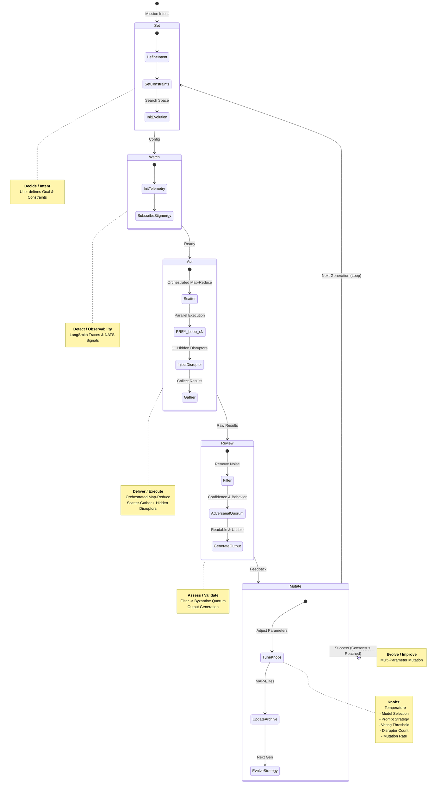

# SWARM Loop Visualization (Level 1)

**Lineage**:
*   **D3A** (Targeting): Decide → Detect → Deliver → Assess
*   **Byzantine Fault Tolerance**: 3f+1 Consensus
*   **Evolutionary Computation**: MAP-Elites / Quality-Diversity

