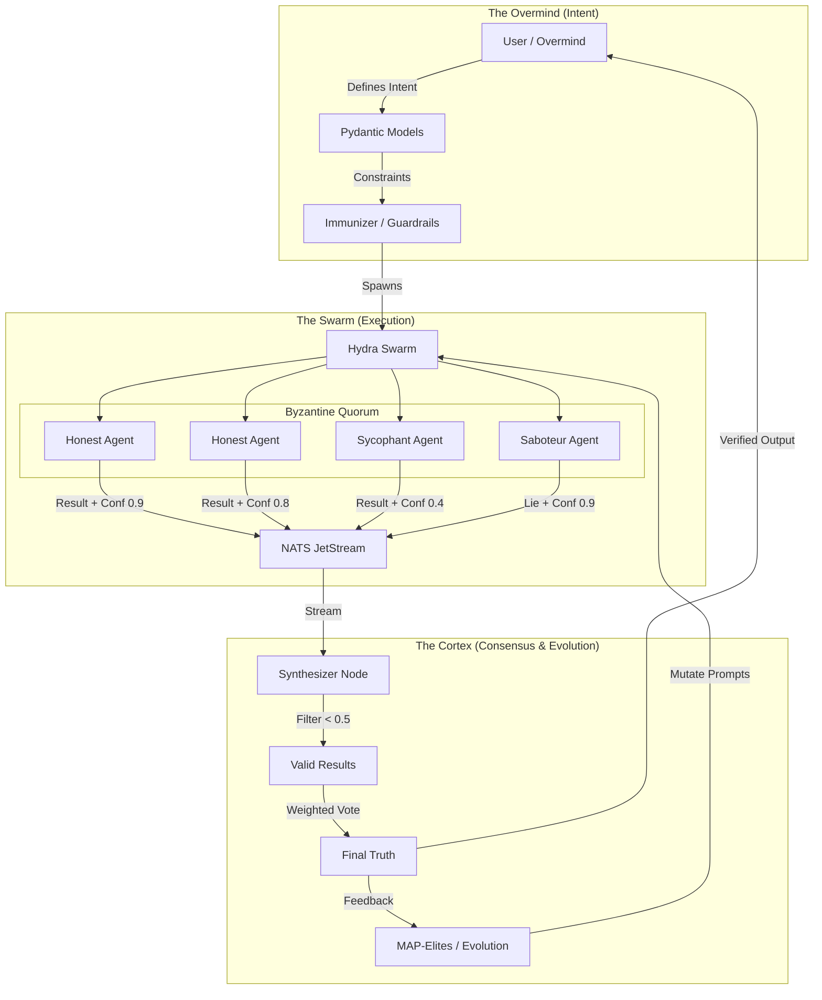

# 🛡️ HFO Trust Engine: The Cognitive Exoskeleton

> **Vision**: A System 2 thinking engine built from unreliable System 1 components.
> **Metaphor**: A "Cognitive Exoskeleton Symbiote" that protects fragile human intent with rigid, verified execution.

## 🧠 Core Philosophy: Trust via Architecture

HFO does not rely on a "better model." It relies on a **resilient architecture** that assumes individual model failure. It implements a **Co-evolutionary Adversarial Byzantine Quorum** with **Confidence Weighting**.

### 🏗️ The Architecture

## 🧩 Key Components

| Component | Function | SOTA Parallel |
| :--- | :--- | :--- |
| **Adversarial** | **Disruptor Agents** attack plans to find flaws. | Constitutional AI / Red Teaming |
| **Byzantine Quorum** | **Synthesizer** filters and votes on results. | Multi-Agent Debate / Ensemble Methods |
| **Co-evolutionary** | **Ribs (MAP-Elites)** evolves prompts based on success. | OpenEnded Learning / Prompt Breeding |
| **Confidence Weighting** | **Pydantic Signals** enforce `confidence: float`. | Uncertainty Quantification |

## 🧬 The Symbiosis

1.  **Cognitive**: Processes information via OODA/PREY loops.
2.  **Exoskeleton**: Provides rigid Pydantic/Temporal defense around fragile intent.
3.  **Symbiote**: Requires User Intent (DNA) to live, but handles the metabolic cost (Compute).
