# 💎 Unified Dual-Split Headers: Human vs. Machine

> **BLUF**: A "Bicameral" Header design. One YAML block, two distinct sections.
> **Goal**: Optimize the **Human Layer** for readability/intuition and the **Machine Layer** for automation/graphing.
> **Theme**: Ontology, Biology, Topology, Cognition.

## 1. The Ontological Split (Story vs. Truth) 🏛️
*The "Scripture and Law" model. Best for Intent-Based Engineering.*

```yaml
---
# ==================================================================
# 👤 HUMAN LAYER (The Narrative)
# ==================================================================
title: "Mission Alpha: First Contact"
bluf: "We are establishing first contact to verify the system works."
intent: "Ensure the Swarm can speak before it tries to walk."
context: "Pre-requisite for the 'Walking' milestone."

# ==================================================================
# 🤖 MACHINE LAYER (The Ontology)
# ==================================================================
ontology:
  ontos: { id: "uuid-v4", type: "intent" }
  chronos: { urgency: 1.0, decay: 0.0, status: "active" }
  topos: { address: "1.1.0", links: [{id: "uuid-target", rel: "requires"}] }
  telos: { viral_factor: 1.0, vector_id: "vec-001" }
---
```

### Visual: The Bicameral Mind

```mermaid
graph TD
    Header[YAML Header]
    Human[👤 Human Layer]
    Machine[🤖 Machine Layer]

    Header --> Human
    Header --> Machine

    Human -->|Reads| Narrative[Story & Context]
    Machine -->|Parses| Ontology[Quadrivium Data]

    style Human fill:#eef,stroke:#333
    style Machine fill:#fee,stroke:#333
```


---

## 2. The Biological Split (Phenotype vs. Genotype) 🧬
*The "Body and DNA" model. Best for Evolutionary Systems.*

```yaml
---
# ==================================================================
# 👤 PHENOTYPE (What it looks like)
# ==================================================================
name: "Scout Agent"
role: "Explorer"
behavior: "Moves fast, looks for novelty, reports back."
warning: "Do not deploy in hostile environments without escort."

# ==================================================================
# 🤖 GENOTYPE (What it is)
# ==================================================================
dna:
  id: "uuid-v4"
  lineage: ["uuid-parent-a", "uuid-parent-b"]
  mutation_rate: 0.1
  metabolism: { cost: 0.5, energy: "solar" }
  viral_payload: { meme: "Explore", infectivity: 0.8 }
---
```

### Visual: The Genetic Expression

```mermaid
graph LR
    Genotype[🤖 Genotype] -->|Expresses| Phenotype[👤 Phenotype]

    Genotype -->|Contains| DNA[ID, Lineage, Mutation]
    Phenotype -->|Displays| Traits[Role, Behavior]

    style Genotype fill:#dfd,stroke:#333
    style Phenotype fill:#ddf,stroke:#333
```


---

## 3. The Topological Split (View vs. Graph) 🕸️
*The "Map and Coordinates" model. Best for GraphRAG.*

```yaml
---
# ==================================================================
# 👤 VIEW LAYER (The Map)
# ==================================================================
breadcrumbs: "Brain > Core > Missions"
summary: "The entry point for all swarm operations."
tags: ["mission", "core", "critical"]

# ==================================================================
# 🤖 GRAPH LAYER (The Coordinates)
# ==================================================================
node:
  id: "uuid-v4"
  type: "vertex"
  fractal_address: "1.1.0"
  edges:
    - { to: "uuid-target", type: "directed", weight: 1.0 }
    - { to: "uuid-other", type: "bidirectional", weight: 0.5 }
---
```

### Visual: The Holographic Projection

```mermaid
graph TD
    Graph[🤖 Graph Layer] -->|Projects| View[👤 View Layer]

    Graph -->|Defines| Edges[Connections]
    View -->|Renders| Breadcrumbs[Navigation]

    style Graph fill:#fdd,stroke:#333
    style View fill:#dff,stroke:#333
```


---

## 4. The Cognitive Split (System 1 vs. System 2) 🧠
*The "Intuition and Logic" model. Best for Hybrid AI/Human Teams.*

```yaml
---
# ==================================================================
# 👤 SYSTEM 1 (Fast / Intuition)
# ==================================================================
gist: "The main loop."
meme: "Keep it spinning."
vibe: "Critical, High Energy."

# ==================================================================
# 🤖 SYSTEM 2 (Slow / Logic)
# ==================================================================
logic:
  id: "uuid-v4"
  constraints: ["max_latency < 10ms", "uptime > 99%"]
  dependencies: ["uuid-lib-a", "uuid-lib-b"]
  embeddings: "vector-ref-123"
---
```

### Visual: The Dual Process

```mermaid
graph TD
    Input[Stimulus]
    Sys1[👤 System 1: Fast]
    Sys2[🤖 System 2: Slow]

    Input --> Sys1
    Input --> Sys2

    Sys1 -->|Reacts| Action[Quick Response]
    Sys2 -->|Analyzes| Plan[Deep Strategy]

    style Sys1 fill:#ffd,stroke:#333
    style Sys2 fill:#ddf,stroke:#333
```


## 💡 Recommendation

For **HFO**, I recommend **Variation 1 (The Ontological Split)**.

It perfectly balances your desire for **Human Readability** (The Narrative) with the strict **Ontological Requirements** (The Quadrivium) needed for the Swarm. It allows you to write "The Story" while the machine maintains "The Truth".
