# 💎 The Unified Obsidian Header: One Structure to Rule Them All

> **BLUF**: A single, universal YAML schema (The "Holon Header") that applies to **every** file in the system (Code, Docs, Configs). It unifies Identity, Time, Space, and Purpose into a fractal standard.
> **Directive**: "Design once, propagate everywhere."

## 1. The Universal Schema (The "Quadrivium")

Every file in Hive Fleet Obsidian **MUST** start with this exact YAML structure. No exceptions.

```yaml
---
# 🏛️ ONTOS (Identity & Type)
id: "uuid-v4-string"          # Unique Holon ID
type: "intent"                # Options: intent, code, doc, config, test
title: "Clear Descriptive Title"
owner: "Organ.Role"           # e.g., Brain.Navigator, Body.Builder

# ⏳ CHRONOS (Time & State)
status: "active"              # Options: active, draft, deprecated, frozen
urgency: 0.8                  # 0.0 (Low) to 1.0 (Critical)
decay: 0.5                    # 0.0 (Eternal) to 1.0 (Rotting)
last_touched: "YYYY-MM-DD"    # ISO 8601 Date

# 📍 TOPOS (Space & Structure)
fractal_address: "1.2.3"      # The Holonic Hierarchy (Brain=1, Body=2...)
links:                        # The Knowledge Graph Edges
  - { id: "uuid-target", rel: "implements", weight: 1.0 }
  - { id: "uuid-related", rel: "relates_to", weight: 0.5 }

# 🎯 TELOS (Purpose & Meaning)
bluf: "One sentence summary of WHY this exists."
meme: "The sticky idea or slogan."
viral_factor: 0.7             # 0.0 (Niche) to 1.0 (Pandemic)
tags: ["tag1", "tag2"]        # Semantic clustering
---
```

---

## 2. Fractal Propagation: How it Works Everywhere

This single structure adapts to the content without changing its shape.

### Case A: The Intent (Brain) 🧠
*File: `brain/mission_alpha.feature`*

```yaml
---
# 🏛️ ONTOS
type: "intent"
title: "Mission Alpha: First Contact"
owner: "Brain.Navigator"

# ⏳ CHRONOS
status: "active"
urgency: 1.0 (Mission Critical)
decay: 0.0 (Eternal Intent)

# 📍 TOPOS
fractal_address: "1.1.0" (Brain Root)
links:
  - { id: "uuid-script", rel: "requires", weight: 1.0 }

# 🎯 TELOS
bluf: "Establish communication with the user."
meme: "First Impressions Matter."
---
```

### Case B: The Implementation (Body) 💪
*File: `body/hands/communicator.py`*

```yaml
---
# 🏛️ ONTOS
type: "code"
title: "Communicator Script"
owner: "Body.Hands"

# ⏳ CHRONOS
status: "active"
urgency: 0.8 (Execution)
decay: 0.5 (Needs Maintenance)

# 📍 TOPOS
fractal_address: "2.3.1" (Body -> Hands -> Script)
links:
  - { id: "uuid-mission", rel: "implements", weight: 1.0 }

# 🎯 TELOS
bluf: "Python script to send messages via NATS."
meme: "Talk is Cheap, Code is Real."
---
```

### Case C: The Memory (Log) 📜
*File: `memory/logs/session_01.md`*

```yaml
---
# 🏛️ ONTOS
type: "doc"
title: "Session 01 Log"
owner: "Memory.Scribe"

# ⏳ CHRONOS
status: "frozen" (Historical)
urgency: 0.1 (Archive)
decay: 0.0 (History doesn't change)

# 📍 TOPOS
fractal_address: "4.1.1" (Memory -> Logs -> Entry)
links:
  - { id: "uuid-mission", rel: "records", weight: 1.0 }

# 🎯 TELOS
bluf: "Record of the first successful boot."
meme: "It's Alive."
---
```

---

## 3. The Unified Graph (Visualized)

Because every file shares the same `links` and `fractal_address` schema, we can generate a single, unified Holonic Map.

```mermaid
graph TD
    %% Nodes
    Intent[🧠 Intent: Mission Alpha<br/>Address: 1.1.0]
    Code[💪 Code: Communicator.py<br/>Address: 2.3.1]
    Log[📜 Log: Session 01<br/>Address: 4.1.1]

    %% Edges (Defined in YAML 'links')
    Intent -->|Requires| Code
    Code -->|Implements| Intent
    Log -->|Records| Intent
    Log -->|Records| Code

    %% Styling
    style Intent fill:#f9f,stroke:#333,stroke-width:4px
    style Code fill:#9f9,stroke:#333,stroke-width:2px
    style Log fill:#eee,stroke:#333,stroke-width:1px
```



## 5. The Fractal Address System (Topos)

The `fractal_address` allows us to map the entire system without needing a central database.


## 6. The Viral Propagation (Telos)

The `viral_factor` determines how aggressively a Holon should be replicated or cached.

```mermaid
graph LR
    High[High Viral Factor (1.0)]
    Low[Low Viral Factor (0.1)]

    High -->|Replicates to| Cache[Fast Cache]
    High -->|Replicates to| Edge[Edge Nodes]

    Low -->|Stays in| Archive[Deep Storage]
```

## 4. Implementation Strategy

1.  **Genesis Update**: Update `genesis.py` to generate this exact header for all new files.
2.  **Guard Update**: Update `make guards` to validate this exact schema (4 sections, specific keys).
3.  **Grapher**: The `Assimilator` agent simply reads `links` from any file type to build the graph.
