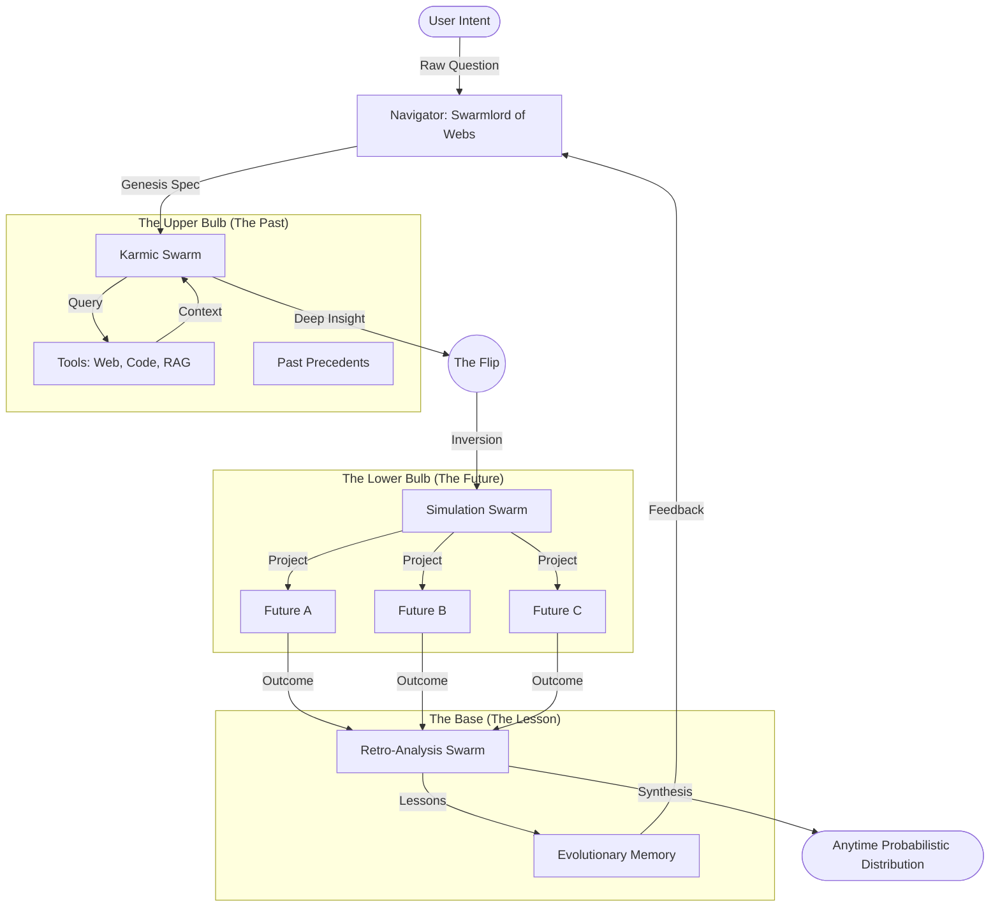

# ⏳ Obsidian Horizon Hourglass: Architecture

> **The Mastercrafted Artifact of the Swarmlord of Webs**
> *Invoking the Fates, the Sands of Time, and the Power of the Swarm.*

## 🗺️ The Flow (Mermaid)

## 🧬 The 3-Stage Swarm Protocol

1.  **Karmic Swarm (Past)**:
    *   **Goal**: Grounding.
    *   **Tools**: `search_web`, `read_file`, `search_brain`.
    *   **Output**: A dense context of what *has* happened and what *is* known.

2.  **Simulation Swarm (Future)**:
    *   **Goal**: Exploration.
    *   **Tools**: `sequential_thinking`, `calculator`, `mutation`.
    *   **Output**: A set of divergent trajectories (Success/Failure paths).

3.  **Retro Swarm (Feedback)**:
    *   **Goal**: Wisdom.
    *   **Tools**: `synthesis`, `pattern_recognition`.
    *   **Output**: A probabilistic map of *what to do now* based on the futures.

## 💎 True Worth & Evolutionary Potential

*   **Antifragility**: The system gains strength from disorder (simulated failures).
*   **Anytime Property**: It provides a "Best Guess" immediately, but converges to "Truth" with infinite compute.
*   **Deep Insight**: By connecting the "Internet" (Past) to "Simulation" (Future), it bridges the gap between *Knowledge* and *Wisdom*.
